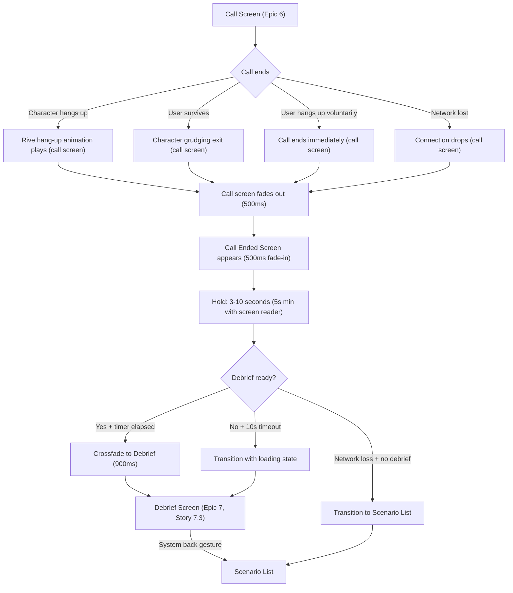

    # Call Ended Screen Design

**Author:** Dev Agent (Claude Opus 4.6)
**Date:** 2026-04-01
**Story:** 2.3 — Design Call Ended Transition Screen
**Status:** Review
**Consumed by:** Epic 7, Story 7.2 (Build Call-Ended Overlay Transition) and Epic 6, Story 6.5 (Build Voluntary Call End)

---

## Design Token Reference

All color and spacing values reference tokens from the UX Design Specification and previous stories (2.1, 2.2). This screen reuses the incoming call screen (Story 2.2) layout structure — character name, role, avatar — and adds call result elements (percentage, progress bar, theatrical phrase). Typography uses Inter exclusively.

### Colors

| Token | Hex | Usage on Call Ended Screen |
|-------|-----|----------------------------|
| `background` | `#1E1F23` | Screen background |
| `text-primary` | `#F0F0F0` | Character name, call duration, "Call Ended" text |
| `call-secondary` | `#C6C6C8` | Character role (reused from Story 2.2 incoming call) |
| `accent` | `#00E5A0` | Success variant: percentage text, progress bar fill, theatrical phrase |
| `destructive` | `#E74C3C` | Failure variant: percentage text, progress bar fill, theatrical phrase |
| `avatar-bg` | `#414143` | Character avatar background circle |
| `progress-bg` | `#38383A` | Progress bar background track (screen-specific) |

**Screen-specific token: `progress-bg` (#38383A).** This is a new token for the progress bar background track. It is slightly darker than `avatar-bg` (#414143), providing a subtle but distinct track behind the colored fill. Rationale: #414143 would blend visually with the avatar above; #38383A creates enough separation while staying in the same gray family as the design system.

**Reused from Story 2.2:** `call-secondary` (#C6C6C8) is reused for the character role text, maintaining visual continuity between the incoming call screen and the call ended screen — the user sees the same character identity presentation in both contexts.

### Typography

| Style | Font | Size | Weight/Style | Usage |
|-------|------|------|--------------|-------|
| `call-name` | Inter | 38px | Regular (400) | Character name (reused from Story 2.2) |
| `call-role` | Inter | 16px | Regular (400) | Character role (reused from Story 2.2) |
| `call-ended-duration` | Inter | 38px | Regular (400) | Call duration (e.g., "02:47") |
| `call-ended-label` | Inter | 20px | Regular (400) | "Call Ended" text below avatar |
| `call-ended-percent` | Inter | 24px | Regular (400) | Achievement percentage (e.g., "70%") |
| `call-ended-phrase` | Inter | 24px | Italic (400) | Theatrical scenario-specific phrase |

**Design rationale:** The call duration shares the same 38px size as the character name — it is a prominent data point, not secondary information. The user reads top-to-bottom: WHO called (name) → their ROLE → HOW LONG the call lasted → the CHARACTER (avatar) → RESULT (Call Ended) → HOW WELL you did (percentage + bar) → the VERDICT (theatrical phrase). Each element has a clear hierarchy through size and color.

### Spacing

| Property | Value |
|----------|-------|
| Base unit | 8px |
| Screen padding horizontal | 20px |
| Top spacer (SafeArea to name) | ~40px (same as incoming call) |
| Role to duration gap | 12px |
| Percentage to progress bar gap | 10px |
| Bottom padding | ~50px + SafeArea |
| Theatrical phrase horizontal padding | 42px (each side) |
| Touch target minimum | 44px (not applicable — no interactive elements) |

---

## Screen Layout

### Purpose

Non-interactive emotional transition screen shown for 3-10 seconds after a call ends. Serves two functions simultaneously:
1. **Emotional pause** — lets the intensity of the call settle before the debrief
2. **Latency mask** — hides the debrief LLM generation time (server-side transcript analysis)

The screen auto-transitions to the debrief with no user action. No buttons, no taps, no interactive elements. The layout mirrors the incoming call screen structure (Story 2.2) — the user recognizes the character they just spoke with, creating visual continuity between the call and its aftermath.

### Screen Layout Diagram

```
+--------------------------------------+
|          SafeArea (top)              |
|                                      |
|             ~40px gap                |
|                                      |
|           "Bethany"                  |  Inter Regular 38px
|            centered                  |  #F0F0F0
|                                      |
|           "Girlfriend"               |  Inter Regular 16px
|            centered                  |  #C6C6C8
|                                      |
|            12px gap                  |
|                                      |
|            "02:47"                   |  Inter Regular 38px
|            centered                  |  #F0F0F0
|                                      |
|                                      |
|          flex spacer                 |
|                                      |
|                                      |
|       +--------------------+         |
|       |                    |         |
|       |   Character        |         |  120x120 circle avatar
|       |    Avatar          |         |  #414143 bg, centered
|       |                    |         |
|       +--------------------+         |
|                                      |
|          "Call Ended"                |  Inter Regular 20px
|            centered                  |  #F0F0F0
|                                      |
|                                      |
|          flex spacer                 |
|                                      |
|                                      |
|            "70%"                     |  Inter Regular 24px
|            centered                  |  #E74C3C or #00E5A0
|                                      |
|            10px gap                  |
|                                      |
|       [==========---------]         |  Progress bar
|                                      |  Fill: variant, Bg: #38383A
|                                      |
|  "The mugger gave up on you"         |  Inter Italic 24px
|            centered                  |  variant color
|            42px H padding            |
|                                      |
|            ~50px bottom padding      |
|          SafeArea (bottom)           |
+--------------------------------------+
```

**Layout strategy:** Vertical column that mirrors the incoming call screen structure. The top section (name, role, duration) establishes WHO and HOW LONG. A flex spacer pushes the avatar to the middle zone. Below the avatar, "Call Ended" anchors the status. A second flex spacer separates the status from the results section at the bottom (percentage, progress bar, theatrical phrase). This creates three visual zones: identity (top), status (middle), result (bottom).

### Z-Order (Back to Front)

1. **z0:** Screen background `#1E1F23` (solid fill)
2. **z1:** Content column (all foreground elements)
3. **z2:** Character avatar circle (`#414143` background)
4. **z3:** Character avatar illustration (inside circle)
5. **z4:** Progress bar background track (`#38383A`)
6. **z5:** Progress bar fill (variant-colored)

### Character Name (Subtask 1.2 — reused from Story 2.2)

| Property | Value |
|----------|-------|
| Content | Character name from the scenario (e.g., "Bethany") |
| Font family | Inter |
| Font weight | Regular (400) |
| Font size | 38px (`call-name`) |
| Color | `#F0F0F0` (`text-primary`) |
| Text alignment | Center |
| Position | Top of content column, below SafeArea + ~40px top spacer |
| Max lines | 1 |
| Overflow | Ellipsis |

**Same specs as incoming call screen (Story 2.2).** The character name is the first thing the user sees — immediate recognition of who they just spoke with.

### Character Role (Subtask 1.2 — reused from Story 2.2)

| Property | Value |
|----------|-------|
| Content | Character's scenario role (e.g., "Girlfriend", "Mugger") |
| Font family | Inter |
| Font weight | Regular (400) |
| Font size | 16px (`call-role`) |
| Color | `#C6C6C8` (`call-secondary`) |
| Text alignment | Center |
| Position | Directly below character name, minimal gap (~4px) |
| Max lines | 1 |
| Overflow | Ellipsis |

**Same specs as incoming call screen (Story 2.2).**

### Call Duration Display (Subtask 1.3)

| Property | Value |
|----------|-------|
| Content | Dynamic — formatted as "MM:SS" (e.g., "02:47") or "H:MM:SS" for calls over 1 hour |
| Font family | Inter |
| Font weight | Regular (400) |
| Font size | 38px (`call-ended-duration`) |
| Color | `#F0F0F0` (`text-primary`) |
| Text alignment | Center |
| Position | 12px below character role |
| Max lines | 1 |

**Design rationale:** The duration at 38px — the same size as the character name — makes it a primary element. On a real phone "Call Ended" screen, the duration is prominent. Here, the large size also reinforces the emotional beat: short durations (0:30) hit harder as a visual statement.

**Format rules:**
- Under 1 hour: `MM:SS` (e.g., "02:47", "00:18")
- Over 1 hour: `H:MM:SS` (e.g., "1:02:15") — edge case, unlikely in practice
- Always show leading zero for minutes under 10 (e.g., "02:47" not "2:47")
- Always show leading zero for seconds under 10 (e.g., "02:05" not "2:5")
- Zero-length calls: display "00:00" (immediate disconnect is a valid state, not hidden)
- H:MM:SS format on 320px: "1:02:15" at Inter Regular 38px requires ~150px — fits within 280px usable width. No truncation needed.

### Character Avatar (Subtask 1.5 — reused from Story 2.2)

| Property | Value |
|----------|-------|
| Shape | Circle |
| Diameter | 120px |
| Background | `#414143` (`avatar-bg`) |
| Content | Character illustration (same as incoming call screen / scenario card) |
| Border | None |
| Position | Centered horizontally, vertically positioned between duration and bottom results via flex spacer |
| Shadow | None |

**Same specs as incoming call screen (Story 2.2), without the ring animation.** The character avatar provides visual continuity — the user sees the same face from the call that just ended. No animation plays on this screen; the avatar is static.

**Avatar fallback (image load failure):** Character's first initial as text fallback — Inter Regular 48px `#F0F0F0` centered on `#414143` circle. Same fallback as Story 2.2.

### "Call Ended" Label (Subtask 1.2)

| Property | Value |
|----------|-------|
| Content | "Call Ended" |
| Font family | Inter |
| Font weight | Regular (400) |
| Font size | 20px (`call-ended-label`) |
| Color | `#F0F0F0` (`text-primary`) |
| Text alignment | Center |
| Position | Below avatar, ~16px gap |
| Max lines | 1 |

**Design rationale:** "Call Ended" at 20px Regular is understated — it's a status label, not the hero element. The avatar above and the results below carry the emotional weight. This text confirms what happened without shouting. **Note (P-10):** The story spec suggested SemiBold (600) for this label. Regular (400) was chosen deliberately — SemiBold would compete with the larger elements (name 38px, duration 38px) and break the understated tone. This is an intentional deviation from the story guidance.

### Achievement Percentage (Subtask 1.4)

| Property | Value |
|----------|-------|
| Content | Dynamic — formatted as "N%" (e.g., "70%", "100%") |
| Font family | Inter |
| Font weight | Regular (400) |
| Font size | 24px (`call-ended-percent`) |
| Color (hung up) | `#E74C3C` (`destructive`) |
| Color (survived) | `#00E5A0` (`accent`) |
| Text alignment | Center |
| Position | Below the second flex spacer (bottom results zone) |
| Max lines | 1 |

**Design rationale:** The percentage is the first quantitative feedback the user receives. At 24px in variant color, it reads immediately: red 70% = you were close but failed. Green 100% = you made it. The color creates an instant emotional read before the brain processes the number.

**Data source:** The percentage is the `survival_pct` field from the server's `call_end` payload — the same value used in the debrief screen (Review Decision IG-5). It represents how far through the scenario the user progressed before the call ended (0-100%). On the debrief screen, this percentage is shown with additional context (score breakdown, tips).

**0% boundary (P-8):** When `survival_pct` is 0 (immediate disconnect or very early hang-up), display "0%" as text and render the progress bar with zero fill width (only the `#38383A` track is visible). This is a valid state, not an error.

### Progress Bar (Subtask 1.4)

| Property | Value |
|----------|-------|
| Position | 10px below percentage text |
| Width | Screen width - 40px (20px padding each side) |
| Height | 8px |
| Border radius | 4px (fully rounded for pill shape) |
| Background track color | `#38383A` (`progress-bg`) |
| Fill color (hung up) | `#E74C3C` (`destructive`) |
| Fill color (survived) | `#00E5A0` (`accent`) |
| Fill width | Proportional to percentage (e.g., 70% fill = 70% of bar width) |
| Fill border radius | 4px (matches track — rounded on both ends) |
| Animation | None — bar appears fully rendered (no fill animation) |

**Design rationale:** The progress bar provides an instant visual representation of the percentage. Red fill on gray track = failure with clear "how far you got." Green full bar = success. The bar is thin (8px) to stay secondary to the percentage number and theatrical phrase — it's a visual reinforcement, not the primary feedback.

### Theatrical Phrase (Subtask 1.4)

| Property | Value |
|----------|-------|
| Content | Dynamic — scenario-specific, variant-aware (see Emotional Variants section) |
| Font family | Inter |
| Font style | Italic |
| Font weight | Regular (400) |
| Font size | 24px (`call-ended-phrase`) |
| Color (hung up) | `#E74C3C` (`destructive`) |
| Color (survived) | `#00E5A0` (`accent`) |
| Text alignment | Center |
| Position | Below progress bar, with 42px horizontal padding each side |
| Max lines | 2 |
| Overflow | Ellipsis on line 2 |
| Max character count | 50 characters recommended, 70 characters hard limit |
| Line height | 1.4 (33.6px) |
| Horizontal padding | 42px (each side) — narrows text column for dramatic centering |

**Design rationale:** The theatrical phrase is the emotional punchline. At 24px Italic, it reads as a dramatic editorial statement — the italic style gives it a narrative quality, like a subtitle or stage direction. The variant color ties it visually to the percentage and progress bar above, creating a unified "result block" at the bottom of the screen.

**Data source:** The theatrical phrase comes from the server as part of the `call_end` payload. Scenario authors (Epic 3) should keep phrases under 50 characters to avoid wrapping to a second line on 320px screens (text column = 320 - 84 = 236px at 24px italic). Character limit: **50 characters recommended, 70 characters hard limit** (resolved from Open Question #2 — tighter limits would overly constrain scenario authors).

**Null/missing fallback (P-7):** If the server returns a null or empty theatrical phrase, **hide the phrase element entirely**. The lower flex spacer absorbs the freed space. Do not render empty text or a placeholder — the percentage and progress bar above provide sufficient feedback.

### Layout Specification Table (Subtask 1.6)

| Element | Position | Width | Height | Padding/Gap | Notes |
|---------|----------|-------|--------|-------------|-------|
| Screen background | Fill | 100% | 100% | — | `#1E1F23` solid |
| Top spacer | Column child 1 | — | ~40px | — | Gap between SafeArea and name |
| Character name | Column child 2 | Auto | ~46px | — | Inter Regular 38px `#F0F0F0`, centered |
| Character role | Column child 3 | Auto | ~20px | T: ~4px | Inter Regular 16px `#C6C6C8`, centered |
| Duration | Column child 4 | Auto | ~46px | T: 12px | Inter Regular 38px `#F0F0F0`, centered |
| Upper flex spacer | Column child 5 | — | Flexible | — | Distributes space above avatar |
| Character avatar | Column child 6 | 120px | 120px | — | `#414143` circle, centered |
| "Call Ended" label | Column child 7 | Auto | ~24px | T: 16px | Inter Regular 20px `#F0F0F0`, centered |
| Lower flex spacer | Column child 8 | — | Flexible | — | Distributes space above results |
| Percentage text | Column child 9 | Auto | ~30px | — | Inter Regular 24px, variant color, centered |
| Progress bar | Column child 10 | Screen - 40px | 8px | T: 10px, H: 20px | Fill: variant, track: `#38383A` |
| Theatrical phrase | Column child 11 | Screen - 84px | ~34-68px | H: 42px | Inter Italic 24px, variant color, max 2 lines |
| Bottom spacer | Column child 12 | — | ~50px | — | Before SafeArea bottom |

### Responsive Behavior (Subtask 1.7)

| Screen Width | Behavior |
|-------------|----------|
| 320px (iPhone SE) | Name 38px fits (~220px needed). Theatrical phrase may wrap to 2 lines at 40+ characters (text column = 236px). Progress bar narrower but fully functional. Flex spacers compress. |
| 375px (iPhone 14) | Primary target. All elements comfortable. Theatrical phrase fits single line for most phrases under 45 characters. Generous spacing between avatar and results. |
| 430px (iPhone Pro Max) | Extra breathing room. No layout changes. Wider progress bar and text column reduces wrapping. |

**Vertical adaptation:** Two flex spacers (above and below the avatar + "Call Ended" cluster) distribute available vertical space. On shorter screens (iPhone SE, 568pt), the spacers compress but all elements remain visible. On taller screens, more breathing room surrounds the avatar.

**Vertical overflow verification (P-3):** Total fixed element height: 40 (top spacer) + 46 (name) + 20 (role) + 12 (gap) + 46 (duration) + 120 (avatar) + 24 (label) + 30 (percentage) + 8 (progress bar) + 68 (phrase, 2 lines max) + 50 (bottom spacer) = **~464px fixed**. iPhone SE usable height: 568 - 44 (status bar) - 34 (home indicator) = **~490px**. Remaining for 2 flex spacers: ~26px total (~13px each). This is tight but functional — the spacers provide minimal but sufficient visual separation. On iPhone 14 (844px usable ~766px), spacers get ~151px each — generous.

**No breakpoints needed.** Flutter's flex layout handles all variations naturally.

---

## Emotional Variants

### "Hung Up On" Variant — Failure (Subtask 2.1)

The most common outcome. The character ended the call because the user failed to navigate the conversation successfully.

| Element | Value |
|---------|-------|
| Character name | `#F0F0F0` — unchanged between variants |
| Character role | `#C6C6C8` — unchanged between variants |
| Duration | `#F0F0F0` — unchanged between variants |
| Avatar | Same — unchanged between variants |
| "Call Ended" label | `#F0F0F0` — unchanged between variants |
| Percentage color | `#E74C3C` (`destructive`) |
| Progress bar fill | `#E74C3C` (`destructive`) |
| Theatrical phrase color | `#E74C3C` (`destructive`) |
| Theatrical phrase tone | Adversarial, dramatic, character-specific |

**Example phrases (hung up):**

| Scenario | Theatrical Phrase |
|----------|-------------------|
| Mugger | "The mugger gave up on you" |
| Waiter | "The waiter kicked you out" |
| Girlfriend | "She hung up. Again." |
| Cop | "The officer lost patience" |
| Job interviewer | "Interview terminated" |
| Landlord | "The landlord hung up on you" |

**Tone guide for scenario authors (Epic 3):**
- Third person ("The mugger..." not "You failed...")
- Past tense or present perfect
- Short and punchy (under 40 characters ideal)
- Character-specific — reflects their personality, not generic failure messaging
- No exclamation marks — understated delivery has more impact
- No emojis or special characters

### "Survived" Variant — Success (Subtask 2.2)

Rare outcome. The user successfully navigated the entire scenario. The character's exit was grudging acceptance, not frustration.

| Element | Value |
|---------|-------|
| Character name | `#F0F0F0` — unchanged between variants |
| Character role | `#C6C6C8` — unchanged between variants |
| Duration | `#F0F0F0` — unchanged between variants |
| Avatar | Same — unchanged between variants |
| "Call Ended" label | `#F0F0F0` — unchanged between variants |
| Percentage color | `#00E5A0` (`accent`) |
| Progress bar fill | `#00E5A0` (`accent`) |
| Theatrical phrase color | `#00E5A0` (`accent`) |
| Theatrical phrase tone | Grudgingly positive, character-specific |

**Example phrases (survived):**

| Scenario | Theatrical Phrase |
|----------|-------------------|
| Mugger | "The mugger walked away empty-handed" |
| Waiter | "You actually got your food" |
| Girlfriend | "She's still on the line. Barely." |
| Cop | "The officer let you off" |
| Job interviewer | "They'll call you back" |
| Landlord | "The landlord backed down" |

**Tone guide for scenario authors (Epic 3):**
- Same structural rules as failure variant
- Grudgingly positive — NOT congratulatory (no "Great job!" or "You did it!")
- The character's perspective, not the app's perspective
- Implies the user barely scraped by, even on success
- Matches the "no success toasts, no confetti" rule from UX spec

### Variant Difference Summary (Subtask 2.3)

| Element | Changes Between Variants? | Details |
|---------|---------------------------|---------|
| Screen background (`#1E1F23`) | No | Same for both |
| Character name | No | Same text, same color |
| Character role | No | Same text, same color |
| Call duration | No | Same format, same color |
| Character avatar | No | Same illustration |
| "Call Ended" label | No | Same text, same color |
| Percentage TEXT | Yes | Different number based on achievement |
| Percentage COLOR | Yes | `#E74C3C` (hung up) vs `#00E5A0` (survived) |
| Progress bar fill COLOR | Yes | `#E74C3C` (hung up) vs `#00E5A0` (survived) |
| Progress bar fill WIDTH | Yes | Proportional to percentage |
| Theatrical phrase TEXT | Yes | Different text per scenario per variant |
| Theatrical phrase COLOR | Yes | `#E74C3C` (hung up) vs `#00E5A0` (survived) |
| Entry transition | No | Same animation for both |
| Hold duration | No | Same 3-10 second logic for both |
| Exit transition | No | Same auto-fade to debrief for both |

**Three dynamic properties change:** percentage (value + color), progress bar (fill width + color), and theatrical phrase (text + color). All three share the same variant color — creating a unified "result block" at the bottom of the screen. Everything above (identity zone + status zone) stays constant.

### Voluntary Hang-Up — Uses Failure Variant (Review Decision IG-3)

When the user hangs up voluntarily (not the character), the **failure variant** applies:

| Element | Value |
|---------|-------|
| Percentage color | `#E74C3C` (`destructive`) |
| Progress bar fill | `#E74C3C` (`destructive`) |
| Theatrical phrase color | `#E74C3C` (`destructive`) |
| Theatrical phrase tone | Scenario-specific voluntary-exit phrases |

**Example phrases (voluntary hang-up):**

| Scenario | Theatrical Phrase |
|----------|-------------------|
| Mugger | "You hung up first" |
| Girlfriend | "You ended the call" |
| Cop | "You hung up on the officer" |

**Tone guide:** Same rules as "hung up on" variant — third person or second person, past tense, short, no exclamation marks. Scenario authors (Epic 3) provide voluntary-exit phrases alongside hung-up and survived phrases.

### Network Loss — Neutral Variant (Review Decision IG-4)

When the call ends due to network loss, a **neutral variant** applies. No percentage or progress bar is shown — the call result is unknown.

| Element | Value |
|---------|-------|
| Percentage | **Hidden** — not displayed |
| Progress bar | **Hidden** — not displayed |
| Theatrical phrase color | `#F0F0F0` (`text-primary`) — neutral, no emotional valence |
| Theatrical phrase text | "Connection lost" (hardcoded, not scenario-specific) |

**Layout adjustment:** When percentage and progress bar are hidden, the lower flex spacer expands to fill the space. The theatrical phrase "Connection lost" sits at the bottom of the screen in the same position.

**Debrief behavior:** The debrief may or may not be generated after a network loss (depends on whether the server received enough transcript). If no debrief is available when the hold timer expires, transition to the scenario list instead of the debrief screen.

### Variant Selection Logic

| `call_end` reason | Variant | Percentage shown? |
|-------------------|---------|-------------------|
| `character_hung_up` | Failure (`#E74C3C`) | Yes |
| `user_hung_up` | Failure (`#E74C3C`) | Yes |
| `survived` | Success (`#00E5A0`) | Yes |
| `network_lost` | Neutral (`#F0F0F0`) | No |

---

## Transitions and Timing

### Entry Transition — From Call Screen (Subtask 3.1)

The Call Ended screen appears after the character's exit sequence completes on the call screen.

**Entry sequence:**

| Step | Time | Action | Detail |
|------|------|--------|--------|
| 0 | 0ms | Character exit complete | Rive hang-up animation finished on call screen |
| 1 | 0-500ms | Call screen fades out | Opacity 1.0 → 0.0, 500ms, `Curves.easeIn` |
| 2 | 500ms | Screen background visible | `#1E1F23` — brief scene break (same color as both screens) |
| 3 | 500-1000ms | Call Ended content fades in | Opacity 0.0 → 1.0, 500ms, `Curves.easeOut` |
| 4 | 1000ms | Screen fully visible | All elements at full opacity |
| 5 | 1000ms | Hold timer starts | Minimum 3 seconds begins counting |

**Total entry transition:** 1000ms (500ms fade-out + 500ms fade-in)

**Design decision — Crossfade through background:** The call screen uses a blurred scenario background image, while Call Ended uses a solid `#1E1F23` fill. During the 500ms fade-out, the blurred background dissolves. Because the blurred image is dark-toned (overlaid on `#1E1F23`), the visual transition reads as a smooth darkening rather than a jarring color pop. At the midpoint (opacity ~0.5), the background is nearly indistinguishable from solid `#1E1F23`. The subsequent 500ms fade-in of Call Ended content completes the transition. The brief "blank" beat between the two screens separates the call intensity from the reflective pause.

### Hold Duration and Debrief Loading Strategy (Subtask 3.2)

**Dual-purpose timing logic:**

| Condition | Value | Purpose |
|-----------|-------|---------|
| Minimum hold | 3 seconds | Emotional pause — even if debrief is ready sooner |
| Typical hold | 3-5 seconds | Debrief generation usually completes within 5 seconds |
| Maximum hold | 10 seconds | Hard ceiling per NFR — debrief generation must not exceed this |
| Auto-transition trigger | Both: (a) minimum hold elapsed AND (b) debrief data received | Whichever condition is met LAST triggers the exit transition |

**Timing scenarios:**

| Scenario | Debrief Ready At | Hold Duration | User Experience |
|----------|-----------------|---------------|-----------------|
| Fast debrief | 1.5s | 3.0s (minimum) | Debrief ready before timer — user sees clean 3s pause |
| Typical debrief | 3.5s | 3.5s | Timer elapsed, waits 0.5s more for debrief |
| Slow debrief | 7.0s | 7.0s | Extended hold — still feels natural (emotional weight provides context for the pause) |
| Timeout debrief | >10s | 10.0s (max) | Transitions to debrief screen with loading state (edge case fallback) |

**No visual countdown or progress indicator.** The progress bar on this screen shows CALL ACHIEVEMENT, not loading progress. The user has no way to know how long the hold will last, and that's intentional.

**Canonical hold values (BS-4):** The UX spec originally stated "2-3 seconds" as an early estimate. The story spec refined this to "3-4 seconds." This design finalizes the canonical values as **3-second minimum / 10-second maximum**. The 3-second minimum provides the emotional pause needed for this screen's dual purpose. The 10-second maximum aligns with the PRD's NFR hard ceiling for debrief generation. All upstream docs should reference this design as the authoritative source for hold duration.

### Exit Transition — Auto-Fade to Debrief (Subtask 3.3)

| Step | Time | Action | Detail |
|------|------|--------|--------|
| 0 | 0ms | Both conditions met | Timer elapsed AND debrief data received |
| 1 | 0-600ms | Call Ended content fades out | Opacity 1.0 → 0.0, 600ms, `Curves.easeIn` |
| 2 | 300-900ms | Debrief screen fades in | Opacity 0.0 → 1.0, 600ms, `Curves.easeOut` (overlaps by 300ms — crossfade) |
| 3 | 900ms | Debrief fully visible | Complete debrief content visible — no loading spinners |

**Total exit transition:** 900ms (600ms crossfade with 300ms overlap)

**Debrief readiness guarantee:** The exit transition ONLY starts when the debrief data is fully loaded and the debrief screen is ready to render. The crossfade reveals a complete debrief — no loading spinners, no progressive rendering, no layout shifts.

### Fallback — Debrief Not Ready at 10 Seconds (Subtask 3.4)

| Property | Value |
|----------|-------|
| Trigger | Hold timer reaches 10 seconds AND debrief data still not received |
| Behavior | Transition to debrief screen anyway |
| Debrief screen state | Shows a minimal loading state (NOT a spinner) |
| Loading text | "Analyzing your conversation..." — Inter Regular 16px `#9A9AA5`, centered |
| Loading position | Where the debrief content will appear |
| When debrief arrives | Content fades in (300ms, `Curves.easeOut`) replacing the loading text |

**Design rationale:** This is an edge case that should almost never happen (NFR: debrief < 5s, hard ceiling 10s). The loading text "Analyzing your conversation..." maintains the product voice.

**Exception to "no loading spinners" principle (BS-7):** The product context states "when the debrief fades in, it's complete — no loading spinners, no progressive rendering." This fallback is a **documented exception** for the rare edge case where debrief generation exceeds 10 seconds. The text-only loading state (no spinner, no animation) is the least disruptive compromise. The principle holds for all normal cases (debrief < 10s); only the hard-ceiling timeout triggers this exception.

### Transition Timing Summary (Subtask 3.5)

| Transition | Duration | Easing | Notes |
|-----------|----------|--------|-------|
| Entry: call screen fade-out | 500ms | `Curves.easeIn` | Call screen content dissolves |
| Entry: Call Ended fade-in | 500ms | `Curves.easeOut` | Content appears after brief dark beat |
| Hold: minimum | 3000ms | — | Emotional pause, timer |
| Hold: maximum | 10000ms | — | Hard ceiling per NFR |
| Exit: Call Ended fade-out | 600ms | `Curves.easeIn` | Content dissolves |
| Exit: Debrief fade-in | 600ms | `Curves.easeOut` | Crossfade, 300ms overlap |

---

## Accessibility

### WCAG 2.1 AA Contrast Verification (Subtask 4.1)

| Combination | Ratio | Status |
|-------------|-------|--------|
| `text-primary` (#F0F0F0) on `background` (#1E1F23) | 13.5:1 | Pass AA & AAA |
| `call-secondary` (#C6C6C8) on `background` (#1E1F23) | 9.8:1 | Pass AA & AAA |
| `accent` (#00E5A0) on `background` (#1E1F23) | 9.1:1 | Pass AA & AAA |
| `destructive` (#E74C3C) on `background` (#1E1F23) | 5.2:1 | Pass AA |
| `destructive` (#E74C3C) on `progress-bg` (#38383A) | 3.1:1 | Pass non-text (SC 1.4.11) |
| `accent` (#00E5A0) on `progress-bg` (#38383A) | 5.5:1 | Pass AA |

All text elements pass WCAG 2.1 AA minimum contrast requirements. The progress bar fill on its track meets SC 1.4.11 (non-text contrast, 3:1 minimum) for both color variants.

**No interactive elements = no touch target requirements.** This screen has no buttons, links, or tappable areas.

### Screen Reader Announcements (Subtask 4.2)

| Element | VoiceOver/TalkBack Announcement |
|---------|--------------------------------|
| Screen (on appear) | "[Character Name], [Role]. Call Ended. Duration: [spoken duration]. Achievement: [N] percent. [Theatrical phrase]." |
| Character name | "[Character Name]" |
| Character role | "[Role]" |
| Duration | "[spoken duration]" |
| Character avatar | "Profile picture of [Character Name]" |
| "Call Ended" label | "Call Ended" |
| Percentage | "[N] percent" |
| Progress bar | "Achievement progress: [N] percent" |
| Theatrical phrase | "[Phrase text]" |

**Live region:** The entire screen content is announced as a single live region when the Call Ended screen becomes fully visible (at the 1000ms mark of the entry sequence).

**Semantic success/failure label (P-5):** The screen reader announcement must include the call outcome explicitly, not just the percentage. Announce as: "[Character Name], [Role]. Call Ended. Duration: [spoken duration]. Achievement: [N] percent — [failed/survived/connection lost]." The outcome word ("failed", "survived", "connection lost") is derived from the `call_end` reason, ensuring screen reader users understand the result without color.

**Duration spoken format:** Screen readers should announce the duration in natural speech — "two minutes forty-seven seconds" — not the raw "02:47" format. Use `accessibilityValue` with a semantic duration string.

**Auto-transition and screen reader (P-6):** If VoiceOver or TalkBack is active, the hold timer minimum extends to **5 seconds** (instead of 3 seconds) to ensure the full announcement completes before the exit transition begins. The 10-second maximum remains unchanged. Implementation: check `MediaQuery.accessibleNavigation` in Flutter to detect active screen reader.

### Reduced Motion Behavior (Subtask 4.3)

**Deferred to post-MVP.** Full animations only at launch. Can be added later without breaking changes.

### Back Navigation Blocking (P-4)

The Call Ended screen **blocks all back navigation gestures** (system back button, edge swipe). The call is over — there is no screen to return to. Implementation: use Flutter's `PopScope(canPop: false)` to prevent back navigation during the hold. The only exit path is the automatic forward transition to the debrief (or scenario list in the network-loss case).

### Navigation Context — Mermaid Flow Diagram (Subtask 4.4)



### Design Token Cross-Reference (Subtask 4.5)

| Token Used | Source | Match with UX Spec |
|------------|--------|-------------------|
| `background` #1E1F23 | UX Spec: Color System | Exact match |
| `text-primary` #F0F0F0 | UX Spec: Color System | Exact match |
| `call-secondary` #C6C6C8 | Story 2.2 (Walid's final design) | Screen-specific — reused from incoming call for continuity |
| `accent` #00E5A0 | UX Spec: Color System | Exact match |
| `destructive` #E74C3C | UX Spec: Color System | Exact match |
| `avatar-bg` #414143 | UX Spec: Core Palette | Exact match |
| `progress-bg` #38383A | This design (Walid) | Screen-specific — progress bar track |
| `call-name` 38px Regular | Story 2.2 | Reused from incoming call |
| `call-role` 16px Regular | Story 2.2 | Reused from incoming call |
| `call-ended-duration` 38px Regular | This design | Same size as name — prominent data point |
| `call-ended-label` 20px Regular | This design | Understated status label |
| `call-ended-percent` 24px Regular | This design | Achievement percentage |
| `call-ended-phrase` 24px Italic | This design | Theatrical verdict |

---

## Flutter Widget Mapping

| Design Element | Flutter Widget | Notes |
|---------------|---------------|-------|
| Screen root | `Scaffold` with `backgroundColor: #1E1F23` | No AppBar, no buttons, full-screen |
| Content layout | `Column` with `MainAxisAlignment.start` | Vertical stack matching incoming call structure |
| Top spacer | `SizedBox(height: 40)` | Gap below SafeArea |
| Character name | `Text` with Inter Regular 38px `#F0F0F0` | Centered, same as incoming call |
| Character role | `Text` with Inter Regular 16px `#C6C6C8` | Centered, ~4px below name |
| Duration | `Padding(top: 12)` + `Text` with Inter Regular 38px `#F0F0F0` | Formatted "MM:SS" |
| Upper flex spacer | `Spacer()` | Pushes avatar to middle zone |
| Character avatar | `CircleAvatar(radius: 60, backgroundColor: #414143)` | 120px diameter, same as incoming call |
| "Call Ended" label | `Padding(top: 16)` + `Text` with Inter Regular 20px `#F0F0F0` | Below avatar |
| Lower flex spacer | `Spacer()` | Pushes results to bottom zone |
| Percentage text | `Text` with Inter Regular 24px, variant color | `#E74C3C` or `#00E5A0` |
| Progress bar | `Padding(top: 10, left: 20, right: 20)` + `ClipRRect` + `LinearProgressIndicator` | height: 8px, borderRadius: 4px, bg: `#38383A`, value color: variant |
| Theatrical phrase | `Padding(left: 42, right: 42)` + `Text` with Inter Italic 24px, variant color | `maxLines: 2`, `overflow: TextOverflow.ellipsis`, `textAlign: TextAlign.center` |
| Bottom spacer | `SizedBox(height: 50)` + `SafeArea` | Bottom padding |
| Entry transition | `FadeTransition` | 500ms, `Curves.easeOut` |
| Exit transition | `FadeTransition` + crossfade | 600ms fade-out + 600ms fade-in, 300ms overlap |
| Hold timer | `Timer` or `Future.delayed` | Minimum 3s, waits for debrief data |
| Debrief readiness | `StreamSubscription` on debrief data channel | Triggers exit when data arrives AND timer elapsed |
| ~~Reduced motion check~~ | ~~`MediaQuery.disableAnimations`~~ | ~~Instant cuts when enabled~~ — **Deferred to post-MVP** |
| Screen reader | `Semantics` with live region | Combined announcement on appear |

### File Locations (per Architecture)

| File | Path |
|------|------|
| Call Ended screen | `client/lib/features/call/views/call_ended_screen.dart` |
| Color tokens | `client/lib/core/theme/app_colors.dart` |
| Typography tokens | `client/lib/core/theme/app_typography.dart` |
| Theme configuration | `client/lib/core/theme/app_theme.dart` |
| Navigation (GoRouter) | `client/lib/core/navigation/app_router.dart` |

---

## Resolved Design Decisions (formerly Open Questions)

All open questions were resolved during code review (2026-04-01):

| # | Question | Resolution | Source |
|---|----------|------------|--------|
| 1 | Hold duration: 2s vs 3s minimum? | **3 seconds minimum**, 10s maximum. See BS-4 canonical values above. | Review decision |
| 2 | Theatrical phrase max length? | **50 chars recommended, 70 chars hard limit.** Tighter limits would overly constrain scenario authors. | Review decision |
| 3 | Duration format leading zero? | **Keep leading zero** ("02:47" not "2:47"). Consistent with the MM:SS format and avoids visual width jitter between "2:47" and "12:47". | Review decision |
| 4 | Voluntary hang-up phrase? | **Failure variant (red)** with scenario-specific voluntary-exit phrases. See IG-3 section above. | Review decision IG-3 |
| 5 | Achievement % for survived? | **Uses `survival_pct` field** — survived always shows the server-provided value (typically 100%). See IG-5. | Review decision IG-5 |
