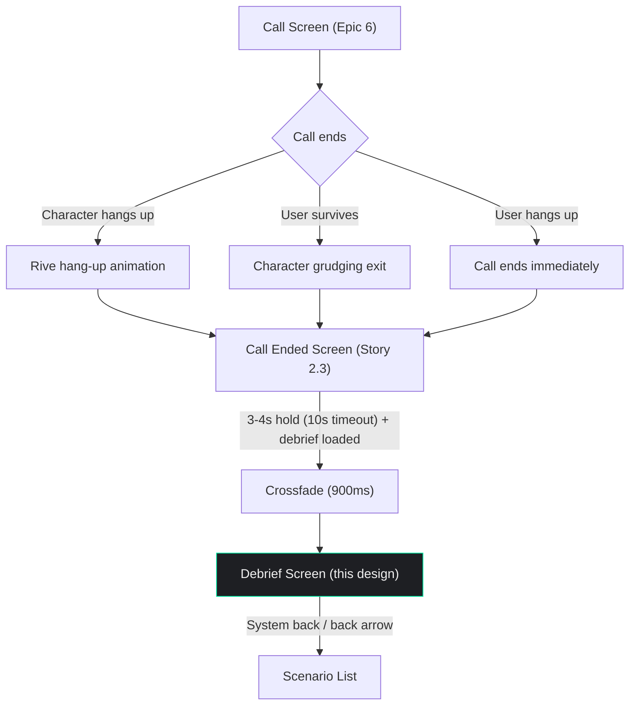

# Debrief Screen Design

**Author:** Dev Agent (Claude Opus 4.6)
**Date:** 2026-04-01
**Story:** 2.4 — Design Debrief Screen
**Status:** Approved
**Consumed by:** Epic 7, Story 7.3 (Build Debrief Screen), Story 7.1 (Build Debrief Generation Backend — data model alignment)

---

## Design Token Reference

All color and spacing values reference tokens from the UX Design Specification and previous stories (2.1, 2.2, 2.3). Typography uses Inter exclusively — no Frijole on this screen.

### Colors

| Token | Hex | Usage on Debrief Screen |
|-------|-----|-------------------------|
| `background` | `#1E1F23` | Screen background |
| `text-primary` | `#F0F0F0` | Section headers, user phrases in error cards, body text |
| `text-secondary` | `#9A9AA5` | Metadata, attempt count, previous best, timestamps, explanatory text |
| `accent` | `#00E5A0` | Corrections in error cards, idiom explanations, improvement indicators |
| `destructive` | `#E74C3C` | Survival % when <100%, error highlights |
| `status-completed` | `#2ECC40` | Survival % when 100% |
| `avatar-bg` | `#414143` | Card backgrounds for error/idiom/hesitation/areas sections |

**No screen-specific color tokens introduced.** Unlike Story 2.2 (which introduced `call-secondary`, `call-accept`, `call-decline` for the native phone aesthetic), the debrief screen uses only system-wide design tokens. The emotional differentiation is achieved through `destructive` (failure) and `accent` (corrections/progress) colors already in the system.

### Typography

**Font family: Inter** — exclusively. No Frijole on this screen.

| Style | Font | Size | Weight | Usage |
|-------|------|------|--------|-------|
| `display` | Inter | 64px | Bold (700) | Survival percentage — the hero number |
| `headline` | Inter | 18px | SemiBold (600) | Section titles ("Language Errors", "Hesitation Analysis", etc.) |
| `section-title` | Inter | 14px | SemiBold (600) | Sub-section headers within cards, count indicators |
| `body` | Inter | 16px | Regular (400) | Error descriptions, idiom explanations, areas to work on |
| `body-emphasis` | Inter | 16px | Medium (500) | Inline emphasis, correction text |
| `caption` | Inter | 13px | Regular (400) | Attempt count, previous best, timestamps, metadata |
| `label` | Inter | 12px | Medium (500) | Tags, secondary labels |

### Spacing

| Property | Value |
|----------|-------|
| Base unit | 8px |
| Screen padding horizontal | 20px |
| Screen padding vertical | 30px top (below SafeArea), 40px bottom |
| Section gap | 24px (between major sections) |
| Card internal padding | 16px |
| Element gap (standard) | 16px |
| Element gap (tight) | 8px |
| Card border radius | 12px |

---

## Hero Section — Screenshot-Worthy Header

### Purpose

The hero section is the top portion of the debrief screen designed to function as a **standalone screenshot** shared out of context. Someone seeing this screenshot on social media should instantly understand: "I survived 73% of a conversation with a sarcastic mugger." This follows the Wordle pattern — data that's shareable without needing the app context.

### Hero Section Layout Diagram

```
┌──────────────────────────────────────┐
│          SafeArea (top)              │
│                                      │
│  ← Back arrow (top-left)            │  24px icon, #F0F0F0
│                                      │
│             30px gap                 │
│                                      │
│              "73%"                   │  Inter Bold 64px
│             centered                 │  #E74C3C (<100%) or
│                                      │  #2ECC40 (100%)
│                                      │
│              8px gap                 │
│                                      │
│           "Survival Rate"            │  Inter Regular 13px
│             centered                 │  #9A9AA5
│                                      │
│             16px gap                 │
│                                      │
│      "The Mugger — Give me           │  Inter SemiBold 18px
│         your wallet"                 │  #F0F0F0, centered
│                                      │
│              8px gap                 │
│                                      │
│    "Attempt #3 · Previous best: 67%" │  Inter Regular 13px
│             centered                 │  #9A9AA5
│                                      │
│ ─ ─ ─ ─ ─ ─ ─ ─ ─ ─ ─ ─ ─ ─ ─ ─ ─│  Screenshot boundary
│             24px gap                 │  (~280px from top)
│                                      │
│      [Content sections below...]     │
└──────────────────────────────────────┘
```

### Survival Percentage Display (Subtask 1.1)

| Property | Value |
|----------|-------|
| Content | Dynamic — survival percentage as integer (e.g., "73%") |
| Font family | Inter |
| Font weight | Bold (700) |
| Font size | 64px (`display`) |
| Color (<100%) | `#E74C3C` (`destructive`) |
| Color (100%) | `#2ECC40` (`status-completed`) |
| Text alignment | Center |
| Position | Top of content, below back arrow + 30px gap |
| Max lines | 1 |

**Design rationale:** The 64px Bold number is the single most prominent element on the screen — and in the entire app. It's the first thing the eye hits: large, color-coded, unmistakable. Red for failure, green for perfection. This is the "Wordle grid" equivalent — the one data point that communicates the entire story.

**"Survival Rate" label:**

| Property | Value |
|----------|-------|
| Content | "Survival Rate" |
| Font family | Inter |
| Font weight | Regular (400) |
| Font size | 13px (`caption`) |
| Color | `#9A9AA5` (`text-secondary`) |
| Text alignment | Center |
| Position | 8px below survival percentage |

### Character Name and Scenario Title (Subtask 1.2)

| Property | Value |
|----------|-------|
| Content | "[Character Name] — [Scenario Title]" (e.g., "The Mugger — Give me your wallet") |
| Font family | Inter |
| Font weight | SemiBold (600) |
| Font size | 18px (`headline`) |
| Color | `#F0F0F0` (`text-primary`) |
| Text alignment | Center |
| Position | 16px below "Survival Rate" label |
| Max lines | 2 |
| Overflow | Ellipsis on line 2 |
| Horizontal padding | 20px (each side — inherited from screen padding) |

**Design rationale:** The character name and scenario title together provide complete context: WHO called and WHAT the scenario was. Using em dash (—) separates the two elements while keeping them on one line for most scenarios. SemiBold weight at 18px gives it visual authority without competing with the 64px number.

### Attempt Number and Previous Best (Subtask 1.3)

| Property | Value |
|----------|-------|
| Content | "Attempt #[N] · Previous best: [X]%" or "Attempt #1" (first attempt) |
| Font family | Inter |
| Font weight | Regular (400) |
| Font size | 13px (`caption`) |
| Color | `#9A9AA5` (`text-secondary`) |
| Text alignment | Center |
| Position | 8px below character/scenario line |
| Max lines | 1 |
| Separator | Middle dot (·) between attempt and previous best |

**States:**

| State | Content Displayed |
|-------|-------------------|
| First attempt | "Attempt #1" — no previous best shown |
| Repeat attempt | "Attempt #3 · Previous best: 67%" |
| New best achieved | "Attempt #3 · Previous best: 67%" — same format, no special indicator (improvement shown in encouraging framing section) |

**Design rationale:** Muted `text-secondary` color keeps this metadata subordinate to the hero number. The middle dot separator is a clean, minimal way to separate two data points on one line. First-attempt users see a shorter line — no "Previous best: 0%" clutter.

### Screenshot Boundary (Subtask 1.4)

The self-contained screenshot region occupies approximately the top **280px** of the screen (below SafeArea):

| Element | Approx. Y Position |
|---------|-------------------|
| Back arrow | SafeArea + 8px |
| Survival % | SafeArea + ~60px |
| "Survival Rate" label | ~132px |
| Character/scenario line | ~156px |
| Attempt/previous best | ~182px |
| Screenshot boundary | ~210px (+ bottom padding to ~280px) |

**What's in the screenshot:** Survival %, "Survival Rate" label, character name + scenario, attempt info. Dark background `#1E1F23` makes the screenshot work on any social media background.

**What's NOT in the screenshot:** Back arrow (outside the visual focus area), all content sections below. The screenshot captures ONLY the hero — enough to tell the story, not enough to spoil the full debrief.

**Design rationale:** The screenshot region is roughly the first fold of a mobile screen (~400px viewport height). The back arrow at the very top may be captured but is small and unobtrusive. The key data — percentage, character, scenario — is all centered and visually balanced.

### Hero Section Layout Specification Table (Subtask 1.5)

| Element | Position | Width | Height | Padding/Gap | Notes |
|---------|----------|-------|--------|-------------|-------|
| Back arrow | Top-left, below SafeArea | 44px touch | 44px touch | T: 8px, L: 8px | 24px icon, `#F0F0F0` |
| Survival % | Column child 1 | Auto | ~77px | T: 30px | Inter Bold 64px, centered, color-coded |
| "Survival Rate" label | Column child 2 | Auto | ~16px | T: 8px | Inter Regular 13px `#9A9AA5`, centered |
| Character/scenario | Column child 3 | Screen - 40px | ~22-44px | T: 16px | Inter SemiBold 18px, centered, max 2 lines |
| Attempt/previous best | Column child 4 | Auto | ~16px | T: 8px | Inter Regular 13px `#9A9AA5`, centered |

---

## Encouraging Framing Section — FR15b (>40% Survival)

### Purpose

Conditional section shown only when survival > 40%. Provides motivational context without breaking the "no congratulations" rule: proximity to next threshold and improvement since last attempt. This is data-driven encouragement, not praise.

**API contract:** When survival ≤ 40%, the backend omits the `encouraging_framing` field entirely from the JSON response (per architecture convention: null fields omitted). The client checks for field presence, not `survival_pct` value. When `inappropriate_behavior` is non-null and survival > 40%, both sections can coexist — the encouraging framing shows proximity data while the inappropriate behavior section explains the call termination.

### Visibility Rules

| Condition | Section Visible? |
|-----------|-----------------|
| Survival ≤ 40% | Hidden — no encouraging framing |
| Survival > 40%, first attempt | Visible — proximity only (no improvement comparison) |
| Survival > 40%, repeat attempt with improvement | Visible — proximity + improvement |
| Survival > 40%, repeat attempt with regression | Visible — proximity only (no "-X% since last" shown) |
| Survival = 100% | Visible — "You survived" proximity message |

### Layout

```
│             24px gap                 │
│  ┌──────────────────────────────┐    │
│  │  "5% away from surviving     │    │  Inter Regular 16px
│  │   the mugger"                │    │  #00E5A0 (accent)
│  │                              │    │
│  │  "+6% since last attempt"    │    │  Inter Regular 13px
│  │                              │    │  #9A9AA5
│  └──────────────────────────────┘    │
```

### Proximity Display (Subtask 5.1)

| Property | Value |
|----------|-------|
| Content | Dynamic — "[N]% away from surviving [character name]" or "You survived [character name]" if 100% |
| Font family | Inter |
| Font weight | Regular (400) |
| Font size | 16px (`body`) |
| Color | `#00E5A0` (`accent`) |
| Text alignment | Center |
| Max lines | 2 |

### Improvement Display (Subtask 5.1)

| Property | Value |
|----------|-------|
| Content | "+[N]% since last attempt" (only shown when improvement exists) |
| Font family | Inter |
| Font weight | Regular (400) |
| Font size | 13px (`caption`) |
| Color | `#9A9AA5` (`text-secondary`) |
| Text alignment | Center |
| Position | 4px below proximity text |
| Visibility | Only shown on repeat attempts with positive improvement |

### Section Placement (Subtask 5.2)

| Property | Value |
|----------|-------|
| Position in layout | Between hero section and language errors section |
| Top gap | 24px (standard section gap) |
| Container | No card background — text-only, centered |
| Horizontal padding | 40px each side (narrower text column for readability) |

### Visual Treatment (Subtask 5.3)

No card background — the accent-colored proximity text stands alone against the dark background. This keeps the encouraging framing lightweight and avoids drawing too much attention. The accent green (#00E5A0) creates a subtle positive moment amid the otherwise red/neutral debrief content.

---

## Language Errors Section — FR10

### Purpose

The core educational content. Each error shows what the user said and the correct form, with distinct visual treatment that makes corrections instantly readable. This is where the "Finally, the Truth" moment lives — specific, frank, actionable.

### Section Layout

```
│             24px gap                 │
│                                      │
│  "Language Errors"                   │  Inter SemiBold 18px #F0F0F0
│                                      │
│  "3 errors flagged"                  │  Inter Regular 13px #9A9AA5
│                                      │
│             12px gap                 │
│                                      │
│  ┌──────────────────────────────┐    │  Error card 1
│  │                              │    │  avatar-bg (#414143) background
│  │  "You said (×3):"            │    │  Inter SemiBold 14px #9A9AA5
│  │  "I am not want problem"     │    │  Inter Regular 16px #F0F0F0
│  │                              │    │  (×N shown only when count >= 2)
│  │  "Correct form:"             │    │  Inter SemiBold 14px #9A9AA5
│  │  "I don't want any trouble"  │    │  Inter Medium 16px #00E5A0
│  │                              │    │
│  │  "After the mugger's initial │    │  Inter Regular 13px #9A9AA5
│  │   threat"                    │    │  (context line)
│  └──────────────────────────────┘    │
│                                      │
│             12px gap                 │
│                                      │
│  ┌──────────────────────────────┐    │  Error card 2
│  │  ...                         │    │
│  └──────────────────────────────┘    │
```

### Section Header

| Property | Value |
|----------|-------|
| Title | "Language Errors" |
| Font | Inter SemiBold 18px (`headline`) |
| Color | `#F0F0F0` (`text-primary`) |
| Text alignment | Left |
| Position | Below encouraging framing (or hero section if no framing) + 24px gap |

### Count Indicator

| Property | Value |
|----------|-------|
| Content | "[N] errors flagged" or "No errors flagged" |
| Font | Inter Regular 13px (`caption`) |
| Color | `#9A9AA5` (`text-secondary`) |
| Position | 4px below section title |
| Text alignment | Left |

### Error Card Layout (Subtask 2.1)

| Property | Value |
|----------|-------|
| Background | `#414143` (`avatar-bg`) |
| Border radius | 12px |
| Padding | 16px all sides |
| Width | Full width minus screen padding (screen - 40px) |
| Gap between cards | 12px |

**Card internal layout:**

| Element | Font | Size | Weight | Color | Notes |
|---------|------|------|--------|-------|-------|
| "You said:" label | Inter | 14px | SemiBold (600) | `#9A9AA5` | `section-title` style, muted. When `count >= 2`, display as "You said (×N):" |
| User phrase | Inter | 16px | Regular (400) | `#F0F0F0` | `body`, 4px below label |
| "Correct form:" label | Inter | 14px | SemiBold (600) | `#9A9AA5` | `section-title` style, 12px below user phrase |
| Correction text | Inter | 16px | Medium (500) | `#00E5A0` | `body-emphasis` in accent color, 4px below label |
| Context line | Inter | 13px | Regular (400) | `#9A9AA5` | `caption`, 12px below correction, italic |

**Repetition count display:** When `count >= 2`, the "You said:" label becomes "You said (×N):" where N is the number of times the error was made. When `count == 1`, display "You said:" without a count indicator. This supports the deduplication strategy (max 5 errors, grouped by type) and reinforces the "no hedging" principle — "you made this error 3 times" is more impactful than showing it once without frequency.

**Design rationale for visual treatment (AC2):** The "You said" / "Correct form" structure uses two distinct visual layers:
- User's phrase: standard white text — what they actually said
- Correction: accent green (#00E5A0) Medium weight — what they should have said

The color contrast between `#F0F0F0` (white) and `#00E5A0` (green) creates instant visual differentiation. The user can scan correction text without reading labels. The muted `#9A9AA5` labels ("You said:", "Correct form:") provide structure but stay out of the way.

### Accent Color Usage for Corrections (Subtask 2.2)

| Element | Color | Rationale |
|---------|-------|-----------|
| Correction text | `#00E5A0` | The accent green marks "what's right" — the learnable information. Every green word on this screen is something the user should remember. |
| "You said:" label | `#9A9AA5` | Muted — structural, not content |
| "Correct form:" label | `#9A9AA5` | Muted — structural, not content |
| User's original phrase | `#F0F0F0` | Standard text — what happened, not what to learn |

### Error Card States (Subtask 2.3)

| State | Behavior |
|-------|----------|
| No errors | Section still visible. Header shows "No errors flagged" in `#9A9AA5`. No cards rendered. Positive feedback by absence — the user made no flaggable mistakes |
| Single error | One error card displayed below header |
| Multiple errors (2-5) | Cards stacked vertically with 12px gap. All visible, scrollable within overall screen scroll |

### Spacing and Maximum Display (Subtask 2.4)

| Property | Value |
|----------|-------|
| Gap between error cards | 12px |
| Maximum displayed errors | **5** — the LLM selects the 5 most significant errors, deduplicated and grouped by type |
| Scroll behavior | Part of overall screen scroll (not a separate scrollable region) |

**Design decision — Max 5 errors, deduplicated (Content Strategy Q5):** The LLM selects errors based on: (1) frequency — repeated errors rank higher, (2) communication impact — errors that prevented the character from understanding rank higher, (3) diversity — covers different error types rather than 5 variants of the same problem. Repeated identical errors are grouped into a single card with a `count` indicator (e.g., "×3"). The user should be able to read the entire error section in 30 seconds. 5 well-chosen errors are more actionable than 15 in bulk.

### Error Section Layout Specification Table (Subtask 2.5)

| Element | Position | Width | Height | Padding/Gap | Notes |
|---------|----------|-------|--------|-------------|-------|
| Section title "Language Errors" | Left-aligned | Auto | ~22px | T: 24px | `headline` |
| Count indicator | Left-aligned | Auto | ~16px | T: 4px | `caption` `#9A9AA5` |
| Error card container | Below count | Screen - 40px | Auto | T: 12px | Vertical list of cards |
| Error card | Full container width | 100% | Auto (~120-150px) | Internal: 16px | `avatar-bg`, border-radius 12px |
| "You said:" label | Card child 1 | Auto | ~17px | — | `section-title` `#9A9AA5` |
| User phrase | Card child 2 | Auto | ~20px | T: 4px | `body` `#F0F0F0` |
| "Correct form:" label | Card child 3 | Auto | ~17px | T: 12px | `section-title` `#9A9AA5` |
| Correction text | Card child 4 | Auto | ~20px | T: 4px | `body-emphasis` `#00E5A0` |
| Context line | Card child 5 | Auto | ~16px | T: 12px | `caption` `#9A9AA5` italic |
| Card gap | Between cards | — | 12px | — | Vertical spacing |

---

## Hesitation Analysis Section — FR12

### Purpose

Highlights the user's longest hesitation moments (1-3) — where they froze during the conversation. Shows duration and the conversation context, giving the user insight into what situations cause them to stall. Only silences exceeding 3 seconds are reported (shorter pauses are natural conversation gaps, not meaningful hesitations).

### Section Layout

```
│             24px gap                 │
│                                      │
│  "Hesitation Analysis"               │  Inter SemiBold 18px #F0F0F0
│                                      │
│  "2 moments flagged"                 │  Inter Regular 13px #9A9AA5
│                                      │
│             12px gap                 │
│                                      │
│  ┌──────────────────────────────┐    │  Hesitation card 1
│  │                              │    │  avatar-bg background
│  │  "Pause"                     │    │  Inter SemiBold 14px #9A9AA5
│  │                              │    │
│  │  "4.2 seconds"               │    │  Inter Bold 24px #F0F0F0
│  │                              │    │
│  │  "After the mugger raised    │    │  Inter Regular 16px #9A9AA5
│  │   his voice"                 │    │  italic, in quotes
│  └──────────────────────────────┘    │
│                                      │
│             12px gap                 │
│                                      │
│  ┌──────────────────────────────┐    │  Hesitation card 2
│  │  ...                         │    │
│  └──────────────────────────────┘    │
```

### Hesitation Moment Display (Subtask 3.1)

**Section Header:**

| Property | Value |
|----------|-------|
| Title | "Hesitation Analysis" |
| Font | Inter SemiBold 18px (`headline`) |
| Color | `#F0F0F0` (`text-primary`) |
| Text alignment | Left |

**Count Indicator:**

| Property | Value |
|----------|-------|
| Content | "[N] moments flagged", "1 moment flagged", or "No hesitations flagged" |
| Font | Inter Regular 13px (`caption`) |
| Color | `#9A9AA5` (`text-secondary`) |
| Position | 4px below section title |
| Text alignment | Left |

**Hesitation Card:**

| Property | Value |
|----------|-------|
| Background | `#414143` (`avatar-bg`) |
| Border radius | 12px |
| Padding | 16px all sides |
| Width | Full width minus screen padding (screen - 40px) |
| Gap between cards | 12px |
| Maximum cards | 3 |

| Element | Font | Size | Weight | Color | Notes |
|---------|------|------|--------|-------|-------|
| "Pause" label | Inter | 14px | SemiBold (600) | `#9A9AA5` | `section-title` style |
| Duration value | Inter | 24px | Bold (700) | `#F0F0F0` | Large number for emphasis, 4px below label |
| Duration unit | — | — | — | — | Included in text: "4.2 seconds" |
| Context quote | Inter | 16px | Regular (400) | `#9A9AA5` | Italic, 12px below duration, wrapped in quotation marks |

**Empty state:** When no pauses exceed 3 seconds, the section remains visible. Header shows "No hesitations flagged" in `#9A9AA5`. No cards rendered. This mirrors the error section's empty state pattern.

**Data source split (Content Strategy Q6):** The backend measures hesitation durations from Soniox STT timestamps (gap between character speech end and user speech start). Only gaps > 3 seconds are reported. The backend identifies the top 3 gaps, sorted by duration (longest first), and passes them to the LLM in that order. The LLM returns contexts in the same order. The backend merges by index: `hesitations[i].duration_sec` + `hesitation_contexts[i].context` → `hesitations[i]` in the client-facing response. Cards are ordered by duration, longest first.

### Visual Treatment for Context Quote (Subtask 3.2)

| Property | Value |
|----------|-------|
| Content | Dynamic — describes the conversation context (e.g., "After the threat escalated — the mugger raised his voice") |
| Font style | Italic |
| Color | `#9A9AA5` (`text-secondary`) |
| Wrapping | Wrapped in quotation marks: "..." |
| Max lines | 3 |
| Overflow | Ellipsis on line 3 |
| Horizontal padding | 0px (contained within card's 16px padding) |

**Design rationale:** Italic + muted color + quotation marks create a clear "quote" visual treatment. The context feels like a memory — "this is where you froze." The contrast between the bold 24px duration number and the muted italic context creates a natural reading flow: big number (how long) → context (when/why).

### Hesitation Section Layout Specification Table (Subtask 3.3)

| Element | Position | Width | Height | Padding/Gap | Notes |
|---------|----------|-------|--------|-------------|-------|
| Section title | Left-aligned | Auto | ~22px | T: 24px | `headline` |
| Count indicator | Left-aligned | Auto | ~16px | T: 4px | `caption` `#9A9AA5` |
| Hesitation card container | Below count | Screen - 40px | Auto | T: 12px | Vertical list of 1-3 cards |
| Hesitation card | Full container width | 100% | Auto (~100-130px) | Internal: 16px | `avatar-bg`, border-radius 12px |
| "Pause" label | Card child 1 | Auto | ~17px | — | `section-title` `#9A9AA5` |
| Duration value | Card child 2 | Auto | ~29px | T: 4px | Inter Bold 24px `#F0F0F0` |
| Context quote | Card child 3 | Card - 32px | Auto (~20-60px) | T: 12px | `body` italic `#9A9AA5`, max 3 lines |
| Card gap | Between cards | — | 12px | — | Vertical spacing |

---

## Idiom/Slang Explanations Section — FR13

### Purpose

Explains idioms or slang the character used during the conversation. Each idiom shows the phrase, its meaning, and a contextual example. Section is hidden entirely if no idioms were encountered.

### Section Layout

```
│             24px gap                 │
│                                      │
│  "Idioms & Slang"                    │  Inter SemiBold 18px #F0F0F0
│                                      │
│             12px gap                 │
│                                      │
│  ┌──────────────────────────────┐    │
│  │                              │    │  avatar-bg background
│  │  "'Pull the other one'"      │    │  Inter Medium 16px #00E5A0
│  │                              │    │
│  │  "British idiom meaning      │    │  Inter Regular 16px #F0F0F0
│  │   'I don't believe you'"     │    │
│  │                              │    │
│  │  "The mugger used this when  │    │  Inter Regular 13px #9A9AA5
│  │   you claimed to have no     │    │  italic, in quotes
│  │   wallet"                    │    │
│  └──────────────────────────────┘    │
```

### Idiom Card Layout (Subtask 4.1)

**Section Header:**

| Property | Value |
|----------|-------|
| Title | "Idioms & Slang" |
| Font | Inter SemiBold 18px (`headline`) |
| Color | `#F0F0F0` (`text-primary`) |
| Text alignment | Left |

**Idiom Card:**

| Property | Value |
|----------|-------|
| Background | `#414143` (`avatar-bg`) |
| Border radius | 12px |
| Padding | 16px all sides |
| Width | Full width minus screen padding (screen - 40px) |
| Gap between cards | 12px |

| Element | Font | Size | Weight | Color | Notes |
|---------|------|------|--------|-------|-------|
| Idiom phrase | Inter | 16px | Medium (500) | `#00E5A0` | `body-emphasis` in accent, wrapped in single quotes |
| Meaning | Inter | 16px | Regular (400) | `#F0F0F0` | `body`, 8px below phrase |
| Context example | Inter | 13px | Regular (400) | `#9A9AA5` | `caption`, italic, 12px below meaning, in quotes |

### Visual Treatment for Idiom Explanation (Subtask 4.2)

The accent green (#00E5A0) marks the idiom phrase — the thing to learn. The meaning in white provides the translation. The context in muted italic explains when it happened. This mirrors the error card pattern: green = learnable content, white = explanation, gray = context.

### Empty State (Subtask 4.3)

| Condition | Behavior |
|-----------|----------|
| No idioms encountered | **Section hidden entirely** — don't show "No idioms encountered" or an empty section. The section simply doesn't exist in the layout. |
| One idiom | Single idiom card |
| Multiple idioms (2-3) | Cards stacked vertically with 12px gap. **Maximum 3 idiom cards** — the LLM selects the 3 most relevant if more were encountered. |

**Design rationale:** Hiding the section (rather than showing "No idioms") keeps the debrief focused on what IS there, not what isn't. The debrief should feel like a tailored report — sections appear when relevant and disappear when not.

### Idiom Section Layout Specification Table (Subtask 4.4)

| Element | Position | Width | Height | Padding/Gap | Notes |
|---------|----------|-------|--------|-------------|-------|
| Section title | Left-aligned | Auto | ~22px | T: 24px | `headline` — only rendered if idioms exist |
| Idiom card | Below title | Screen - 40px | Auto (~100-130px) | T: 12px, Internal: 16px | `avatar-bg`, border-radius 12px |
| Idiom phrase | Card child 1 | Auto | ~20px | — | `body-emphasis` `#00E5A0`, in single quotes |
| Meaning | Card child 2 | Card - 32px | Auto (~20-40px) | T: 8px | `body` `#F0F0F0` |
| Context example | Card child 3 | Card - 32px | Auto (~16-48px) | T: 12px | `caption` italic `#9A9AA5`, in quotes |
| Card gap | Between cards | — | 12px | — | Vertical spacing |

---

## Inappropriate Behavior Section — FR37

### Purpose

Conditional section shown only when a call ended due to inappropriate user behavior (harassment, hate speech, etc.). Explains what happened and why the character reacted. No judgment language — factual and educational.

### Visibility Rule

| Condition | Behavior |
|-----------|----------|
| `inappropriate_behavior` is null | Section hidden entirely |
| `inappropriate_behavior` has content | Section displayed between idioms and areas to work on |

### Layout

```
│             24px gap                 │
│                                      │
│  "About This Call"                   │  Inter SemiBold 18px #F0F0F0
│                                      │
│             12px gap                 │
│                                      │
│  ┌──────────────────────────────┐    │
│  │  ┌─ 4px #E74C3C left border │    │  avatar-bg background
│  │  │                           │    │  destructive left border accent
│  │  │  [Explanation text from   │    │  Inter Regular 16px #F0F0F0
│  │  │   server — what happened  │    │
│  │  │   and why the character   │    │
│  │  │   reacted]                │    │
│  │  └───────────────────────────│    │
│  └──────────────────────────────┘    │
```

### Card Specs

| Property | Value |
|----------|-------|
| Background | `#414143` (`avatar-bg`) |
| Border radius | 12px |
| Border left | 4px solid `#E74C3C` (`destructive`) — warning accent stripe |
| Padding | 16px all sides |
| Width | Full width minus screen padding (screen - 40px) |

| Element | Font | Size | Weight | Color |
|---------|------|------|--------|-------|
| Explanation text | Inter | 16px | Regular (400) | `#F0F0F0` |

| Property | Value |
|----------|-------|
| Max lines | 5 |
| Overflow | Ellipsis on line 5 |

**Design rationale:** The red left border stripe (matching the AI disclosure block pattern from Story 2.1) marks this as a distinct, important note. The "About This Call" neutral header avoids accusatory language. The explanation text comes from the server and should be factual — "The character ended the call because the conversation included inappropriate language."

---

## Areas to Work On — Summary Section

### Purpose

The last content section. 2-3 clear, actionable improvement areas that guide self-study between sessions. This is the "study list" — what the user takes away from the debrief.

### Layout

```
│             24px gap                 │
│                                      │
│  "Areas to Work On"                  │  Inter SemiBold 18px #F0F0F0
│                                      │
│             12px gap                 │
│                                      │
│  ┌──────────────────────────────┐    │
│  │                              │    │  avatar-bg background
│  │  1. Negative sentence        │    │  Inter Regular 16px #F0F0F0
│  │     structure (don't/doesn't │    │  Numbered list
│  │     instead of 'not want')   │    │
│  │                              │    │
│  │  2. Responding under         │    │
│  │     pressure without         │    │
│  │     freezing                 │    │
│  │                              │    │
│  │  3. Using complete sentences │    │
│  │     instead of single-word   │    │
│  │     answers                  │    │
│  └──────────────────────────────┘    │
│                                      │
│             40px bottom padding      │
│          SafeArea (bottom)           │
```

### Section Specs (Subtask 6.1)

**Section Header:**

| Property | Value |
|----------|-------|
| Title | "Areas to Work On" |
| Font | Inter SemiBold 18px (`headline`) |
| Color | `#F0F0F0` (`text-primary`) |
| Text alignment | Left |

**Summary Card:**

| Property | Value |
|----------|-------|
| Background | `#414143` (`avatar-bg`) |
| Border radius | 12px |
| Padding | 16px all sides |
| Width | Full width minus screen padding (screen - 40px) |

| Element | Font | Size | Weight | Color | Notes |
|---------|------|------|--------|-------|-------|
| Numbered items | Inter | 16px | Regular (400) | `#F0F0F0` | Numbered 1-3, 8px gap between items |

**Design rationale:** A single card with numbered items creates a clean, scannable study list. The numbered format (not bullets) implies priority — item 1 is the most important area to focus on. No accent colors here — the items are plain text, clear enough to remember after closing the app.

### FR37 Section Placement (Subtask 6.2)

The inappropriate behavior section (when present) appears between the idioms section and this areas section. See the "Inappropriate Behavior Section" above.

### Back Navigation (Subtask 6.3)

| Property | Value |
|----------|-------|
| Navigation method | Back arrow in top-left corner (hero section) |
| Back arrow position | SafeArea + 8px top, 8px left |
| Icon | Material `arrow_back_ios_new` |
| Icon size | 24px |
| Icon color | `#F0F0F0` (`text-primary`) |
| Touch target | 44x44px (padded) |
| Action | Navigates back to scenario list via GoRouter `pop()` |

**No CTA buttons at the bottom.** The debrief ends with "Areas to Work On" — no "Retry", no "Back to Scenarios", no "Share". The back arrow is the sole exit. This is intentional: the debrief is a destination, not a trampoline (UX Experience Principle 6).

---

## Full Screen Composition and Responsive Layout

### Overall Screen Composition (Subtask 7.1)

```
┌──────────────────────────────────────┐
│          SafeArea (top)              │
│  ← Back arrow (top-left)            │
│                                      │
│  ┌─── Hero Section ──────────────┐  │ Section 1: Always visible
│  │  73%  (survival %)            │  │
│  │  Survival Rate                │  │
│  │  The Mugger — Give me...      │  │
│  │  Attempt #3 · Previous: 67%  │  │
│  └───────────────────────────────┘  │
│                                      │
│  ┌─── Encouraging Framing ───────┐  │ Section 2: Conditional (>40%)
│  │  5% away from surviving...    │  │
│  │  +6% since last attempt       │  │
│  └───────────────────────────────┘  │
│                                      │
│  ┌─── Language Errors ───────────┐  │ Section 3: Always visible
│  │  [Error cards...]             │  │
│  └───────────────────────────────┘  │
│                                      │
│  ┌─── Hesitation Analysis ───────┐  │ Section 4: Always visible
│  │  [1-3 hesitation cards]       │  │ (only gaps > 3s)
│  └───────────────────────────────┘  │
│                                      │
│  ┌─── Idioms & Slang ───────────┐  │ Section 5: Conditional (has idioms)
│  │  [Idiom cards...]             │  │
│  └───────────────────────────────┘  │
│                                      │
│  ┌─── About This Call ───────────┐  │ Section 6: Conditional (FR37)
│  │  [Inappropriate behavior]     │  │
│  └───────────────────────────────┘  │
│                                      │
│  ┌─── Areas to Work On ─────────┐  │ Section 7: Always visible
│  │  [Numbered improvement list]  │  │
│  └───────────────────────────────┘  │
│                                      │
│             40px bottom padding      │
│          SafeArea (bottom)           │
└──────────────────────────────────────┘
```

### Section Ordering (Subtask 7.2)

| Order | Section | Visibility | Gap Above |
|-------|---------|-----------|-----------|
| 1 | Hero (survival %, identity, attempts) | Always | 30px below SafeArea |
| 2 | Encouraging Framing (FR15b) | Conditional: survival > 40% | 24px |
| 3 | Language Errors (FR10) | Always (shows "No errors flagged" if empty) | 24px |
| 4 | Hesitation Analysis (FR12) | Always | 24px |
| 5 | Idioms & Slang (FR13) | Conditional: hidden if no idioms | 24px |
| 6 | About This Call (FR37) | Conditional: hidden if no inappropriate behavior | 24px |
| 7 | Areas to Work On | Always | 24px |

**Scrolling behavior:** The entire screen is a single `SingleChildScrollView` with vertical scrolling. No nested scrollable regions. The back arrow scrolls with content (resolved in Open Question #1). The system back gesture (Android back button / iOS edge swipe) serves as an alternative exit at any scroll position.

**Scroll physics:** Standard iOS/Android bounce scroll. No custom scroll physics.

### Responsive Behavior (Subtask 7.3)

| Screen Width | Behavior |
|-------------|----------|
| 320px (iPhone SE) | Survival % 64px fits (needs ~120px). Character/scenario line may wrap to 2 lines. Error cards slightly narrower (280px). Idiom phrases may wrap. All content still comfortable. |
| 375px (iPhone 14) | Primary target. All elements comfortable. Single-line character/scenario for most names. Card width 335px provides generous text flow. |
| 430px (iPhone Pro Max) | Extra breathing room. Wider cards, more text per line, fewer wraps. No layout changes. |

**No breakpoints needed.** All elements use relative widths (screen - 40px for cards) and flex layout. The 20px horizontal padding and 16px card internal padding provide consistent margins across all sizes.

### Back Arrow Position and Safe Area (Subtask 7.4)

| Property | Value |
|----------|-------|
| Position | Top-left corner |
| Top offset | SafeArea top inset + 8px |
| Left offset | 8px |
| Touch target | 44x44px (centered on 24px icon) |
| Z-order | Above scroll content (if scroll is used) |
| Icon | `arrow_back_ios_new` Material icon |
| Color | `#F0F0F0` (`text-primary`) |

**Safe area handling:** The screen respects system safe areas on both top and bottom. Top: back arrow + content start below SafeArea. Bottom: 40px padding above SafeArea bottom inset.

---

## Accessibility and Documentation

### WCAG 2.1 AA Contrast Verification (Subtask 8.1)

| Combination | Ratio | Status |
|-------------|-------|--------|
| `text-primary` (#F0F0F0) on `background` (#1E1F23) | 13.5:1 | Pass AA & AAA |
| `text-secondary` (#9A9AA5) on `background` (#1E1F23) | 5.1:1 | Pass AA |
| `accent` (#00E5A0) on `background` (#1E1F23) | 9.1:1 | Pass AA & AAA |
| `destructive` (#E74C3C) on `background` (#1E1F23) | 5.2:1 | Pass AA |
| `status-completed` (#2ECC40) on `background` (#1E1F23) | 8.5:1 | Pass AA & AAA |
| `text-primary` (#F0F0F0) on `avatar-bg` (#414143) | 7.2:1 | Pass AA & AAA |
| `text-secondary` (#9A9AA5) on `avatar-bg` (#414143) | 2.7:1 | Below AA for small text |
| `accent` (#00E5A0) on `avatar-bg` (#414143) | 5.1:1 | Pass AA |

**Note on `text-secondary` (#9A9AA5) on `avatar-bg` (#414143):** The 2.7:1 ratio is below AA for normal text. This affects the "You said:" / "Correct form:" labels, error context lines, hesitation context quotes, and idiom context lines within cards. However:
1. These labels are **structural** elements — the content they label (user phrase in `#F0F0F0`, correction in `#00E5A0`) passes AA on `#414143`
2. The labels at 14px SemiBold are large enough to be readable at 2.7:1 for users with normal vision
3. Screen readers announce the full content structure, not just the labels
4. This is the same pattern used in Story 2.1 (AI disclosure block body text on `avatar-bg`) and accepted in review

**Survival percentage contrast:** Both `#E74C3C` (5.2:1) and `#2ECC40` (7.5:1) pass AA on the dark background. The 64px Bold size means these qualify as large text (minimum 3:1) — both exceed that threshold significantly.

### Screen Reader Announcements (Subtask 8.2)

| Section | VoiceOver/TalkBack Announcement |
|---------|--------------------------------|
| Screen (on appear) | "Debrief. Survival rate: [N] percent. [Character Name], [Scenario Title]. Attempt [N]." |
| Survival % | "[N] percent survival rate" |
| Character/scenario | "[Character Name], [Scenario Title]" |
| Attempt info | "Attempt [N]. Previous best: [X] percent." or "Attempt 1, first attempt." |
| Encouraging framing | "[N] percent away from surviving [character]. Plus [N] percent since last attempt." |
| Language Errors header | "Language Errors. [N] errors flagged." |
| Error card | "Error: You said [phrase]. Correct form: [correction]. Context: [context]." |
| Hesitation header | "Hesitation Analysis." |
| Hesitation card (first) | "Longest pause: [N] seconds. Context: [context]." |
| Hesitation card (subsequent) | "Pause: [N] seconds. Context: [context]." |
| Idioms header | "Idioms and Slang." |
| Idiom card | "[Phrase]. Meaning: [meaning]. Context: [context]." |
| About This Call | "About This Call. [Explanation text]." |
| Areas to Work On | "Areas to Work On. First: [area 1]. Second: [area 2]. Third: [area 3]." |
| Back arrow | "Back, button" |

**Focus order:** Top-to-bottom reading order matching visual layout. Back arrow → hero section → sections in order → end of content.

### Reduced Motion Behavior (Subtask 8.3)

**Deferred to post-MVP.** Full animations only at launch. The debrief screen has no decorative animations — it's a static content screen. Reduced motion support can be added later without breaking changes.

### Navigation Context — Mermaid Flow Diagram (Subtask 8.4)



### Design Token Cross-Reference (Subtask 8.5)

| Token Used | Source | Match with UX Spec |
|------------|--------|-------------------|
| `background` #1E1F23 | UX Spec: Color System | Exact match |
| `text-primary` #F0F0F0 | UX Spec: Color System | Exact match |
| `text-secondary` #9A9AA5 | UX Spec: Color System (updated in Story 2.1) | Exact match — uses Story 2.1's corrected value, NOT the original #8A8A95 |
| `accent` #00E5A0 | UX Spec: Color System | Exact match |
| `destructive` #E74C3C | UX Spec: Color System | Exact match |
| `status-completed` #2ECC40 | UX Spec: Color System | Exact match |
| `avatar-bg` #414143 | UX Spec: Core Palette | Exact match |
| `display` 64px Bold | UX Spec: Typography | Exact match — survival percentage |
| `headline` 18px SemiBold | UX Spec: Typography | Exact match — section titles |
| `section-title` 14px SemiBold | UX Spec: Typography | Exact match — card sub-headers |
| `body` 16px Regular | UX Spec: Typography | Exact match — content text |
| `body-emphasis` 16px Medium | UX Spec: Typography | Exact match — corrections |
| `caption` 13px Regular | UX Spec: Typography | Exact match — metadata |
| `label` 12px Medium | UX Spec: Typography | Exact match — tags |

**Design system note:** This screen uses NO screen-specific tokens. Every color and typography style references an existing system-wide or UX spec token. This is intentional: unlike the incoming call screen (which mimicked a native phone UI), the debrief screen is a core product screen that should be fully consistent with the design system.

---

## Entry Transition — From Call Ended Screen

The debrief screen appears via auto-transition from the Call Ended screen (Story 2.3). The transition is fully specified in Story 2.3's "Exit Transition — Auto-Fade to Debrief" section. Summary:

| Property | Value |
|----------|-------|
| Trigger | Both conditions met: (a) minimum 3s hold elapsed AND (b) debrief data received |
| Call Ended fade-out | 600ms, `Curves.easeIn` |
| Debrief fade-in | 600ms, `Curves.easeOut` |
| Overlap | 300ms crossfade |
| Total duration | 900ms |
| Debrief state on appear | Fully formed — all content rendered, no loading spinners |

**Fallback (debrief not ready at 10s):** Story 2.3 specifies a loading text fallback ("Analyzing your conversation...") that transitions to full content when data arrives. The debrief screen handles this edge case in its implementation (Epic 7, Story 7.3).

---

## Flutter Widget Mapping

| Design Element | Flutter Widget | Notes |
|---------------|---------------|-------|
| Screen root | `Scaffold` with `backgroundColor: #1E1F23` | No AppBar — custom back arrow |
| Back arrow | `IconButton` with `Icons.arrow_back_ios_new` | 44x44 touch target, positioned top-left |
| Content layout | `SingleChildScrollView` + `Column` | Vertical scroll, all sections stacked |
| Survival % | `Text` with Inter Bold 64px | Color-coded: `#E74C3C` or `#2ECC40` |
| "Survival Rate" label | `Text` with Inter Regular 13px `#9A9AA5` | Centered below % |
| Character/scenario | `Text` with Inter SemiBold 18px `#F0F0F0` | Max 2 lines, ellipsis overflow |
| Attempt info | `Text` with Inter Regular 13px `#9A9AA5` | Conditional "Previous best" |
| Encouraging framing | `Visibility` or conditional render | Only when survival > 40% |
| Section headers | `Text` with Inter SemiBold 18px `#F0F0F0` | Left-aligned, reusable style |
| Error cards | `Container` with `BoxDecoration` | `#414143` bg, 12px radius, 16px padding |
| Correction text | `Text` with Inter Medium 16px `#00E5A0` | Accent color for learnable content |
| Hesitation cards (1-3) | `Container` with `BoxDecoration` | Same card style as error cards, stacked with 12px gap |
| Duration number | `Text` with Inter Bold 24px `#F0F0F0` | Large emphasis number |
| Error count badge | Inline in "You said:" label | Display "You said (×N):" when count >= 2, omit count for 1 |
| Idiom phrase | `Text` with Inter Medium 16px `#00E5A0` | Accent color, in single quotes |
| Idiom section | Conditional render — hidden if empty | Check `idioms.isEmpty` |
| FR37 card | `Container` with left border decoration | 4px `#E74C3C` left border |
| Areas numbered list | `Column` of numbered `Text` widgets | 1-3 items, 8px gap |
| Scroll wrapper | `SingleChildScrollView` | Standard scroll physics |
| Entry transition | `FadeTransition` from Navigator | 600ms, matches Story 2.3 exit |
| Screen reader | `Semantics` widgets per section | Live region for screen announcement |

### File Locations (per Architecture)

| File | Path |
|------|------|
| Debrief screen | `client/lib/features/debrief/views/debrief_screen.dart` |
| Debrief BLoC | `client/lib/features/debrief/bloc/debrief_bloc.dart` |
| Color tokens | `client/lib/core/theme/app_colors.dart` |
| Typography tokens | `client/lib/core/theme/app_typography.dart` |
| Theme configuration | `client/lib/core/theme/app_theme.dart` |
| Navigation (GoRouter) | `client/lib/core/navigation/app_router.dart` |

---

## Content Strategy Decisions (Resolved)

All content questions were resolved through UX Designer review (2026-04-01). These decisions define the data model for Epic 7 (backend) and the content constraints for Epic 3 (scenario authoring).

### Resolved Questions

| # | Question | Decision | Justification |
|---|----------|----------|---------------|
| Q1 | Strengths / points forts? | **NO — removed** | "Honesty builds trust, praise destroys it." Strengths = praise in disguise. The hero % IS the only validation. |
| Q2 | Summary text field? | **NO — removed** | Redundant with sections. Risks vague praise. Hero section IS the summary. "Show data, don't narrate." |
| Q3 | Explanation per error? | **Renamed to `context`** — narrative, not grammar rule | Anchors errors to emotional moments ("After the mugger's threat"). Grammar rules go in areas_to_work_on. |
| Q4 | Tips vs areas_to_work_on? | **Single field: `areas_to_work_on`** (2-3 items) | Diagnostics, not instructions. "Negative sentence structure (don't/doesn't)" — googlable. |
| Q5 | Error count limit? | **Max 5, deduplicated, grouped** | LLM selects by frequency, communication impact, diversity. 5 errors in 30 seconds > 15 in bulk. |
| Q6 | Hesitation — single or multiple? | **Array of 1-3, threshold > 3 seconds** | FR12 says "moments" (plural). Backend measures gaps via STT timestamps, LLM adds context. |
| Q7 | Context per error — include? | **YES** | Memory anchoring. "After the mugger's threat" connects error to emotional moment. Max 1 phrase. |
| Q8 | Repetition count? | **YES — `count` field per error** | UX spec says "You said 'I am agree' three times." Display "×N" when count >= 2. |
| Q9 | Tone — clinical or persona? | **Clinical. App voice, not character voice.** | Debrief = honest mirror. Call = entertainment. Labels factual, context narrative 3rd person. |
| Q10 | Survival % — LLM or backend? | **Backend-calculated** | Deterministic, reproducible. Based on scenario progression, not LLM opinion. NOT in LLM schema. |

### LLM Output Schema (json_schema strict)

This is exactly what the LLM produces via OpenRouter's `json_schema` strict mode:

```json
{
  "errors": [
    {
      "user_said": "I am not want problem",
      "correction": "I don't want any trouble",
      "context": "After the mugger's initial threat",
      "count": 2
    }
  ],
  "hesitation_contexts": [
    {
      "context": "After the mugger raised his voice and demanded a faster answer"
    }
  ],
  "idioms": [
    {
      "expression": "Pull the other one",
      "meaning": "I don't believe you",
      "context": "The mugger used this when you claimed to have no wallet"
    }
  ],
  "areas_to_work_on": [
    "Negative sentence structure (use don't/doesn't instead of 'not want')",
    "Responding under pressure without freezing",
    "Using complete sentences instead of single-word answers"
  ],
  "inappropriate_behavior": null
}
```

**Schema constraints:**

| Field | Type | Constraint |
|-------|------|-----------|
| `errors` | array | 0-5 items |
| `errors[].user_said` | string | Verbatim user speech |
| `errors[].correction` | string | Correct form |
| `errors[].context` | string | 1 phrase max — when in the conversation |
| `errors[].count` | integer | How many times (>= 1) |
| `hesitation_contexts` | array | 0-3 items. Backend provides durations, LLM adds context |
| `hesitation_contexts[].context` | string | 1 phrase — what was happening when user froze |
| `idioms` | array | 0-3 items. Section hidden if empty |
| `idioms[].expression` | string | The exact idiom/slang |
| `idioms[].meaning` | string | Plain English meaning |
| `idioms[].context` | string | When the character used it |
| `areas_to_work_on` | array | 2-3 strings. Theme + actionable parenthetical. Backend clamps: if LLM returns 1 item, display as-is; if 4+, truncate to first 3 |
| `inappropriate_behavior` | string or null | null if normal call. Factual explanation if FR37 |

### Backend-Calculated Fields (NOT from LLM)

| Field | Source | Notes |
|-------|--------|-------|
| `survival_pct` | Backend calculation | Integer 0-100. Based on scenario progression |
| `character_name` | Scenario config (DB) | e.g., "The Mugger" |
| `scenario_title` | Scenario config (DB) | e.g., "Give me your wallet" |
| `attempt_number` | user_progress table | Integer >= 1 |
| `previous_best` | user_progress table | Integer 0-100 or null (first attempt) |
| `hesitations[].duration_sec` | Backend (STT timestamps) | Float. Gaps > 3s from Soniox |
| `encouraging_framing.proximity` | Backend calculation | "5% away from surviving the mugger" |
| `encouraging_framing.improvement` | Backend calculation | "+6% since last attempt" |

**Assembly:** The backend merges LLM output + its own calculated fields into the final JSON sent to the Flutter client. The client receives the debrief ready to display.

### Tone Specification for LLM Prompt

Voice: The app. Not the character. Not a teacher. Not a coach.

Register: Clinical-frank. Like a medical report — factual, specific, no hedging.

| Element | Register | Example | Anti-example |
|---------|----------|---------|--------------|
| Error correction | Factual, direct | "I don't want any trouble" | "A better way to say this would be..." |
| Error context | Narrative brief, 3rd person | "After the mugger's initial threat" | "This was when things got heated!" |
| Hesitation context | Factual, situational | "When asked to empty pockets" | "You totally froze here" |
| Idiom meaning | Clear definition | "I don't believe you" | "This fun expression means..." |
| Areas to work on | Diagnosis + example | "Negative sentence structure (don't/doesn't)" | "Try practicing negative sentences!" |
| Inappropriate behavior | Factual, no judgment | "The call ended because the conversation included inappropriate language" | "You shouldn't have said that" |

---

## Open Questions — RESOLVED (2026-04-01)

All open questions resolved during content strategy review with UX Designer.

| # | Question | Decision | Rationale |
|---|----------|----------|-----------|
| 1 | Back arrow — fixed vs scrollable? | **Scroll with content** | Simpler, consistent with reading apps. No overlay z-order complexity. |
| 2 | 100% survival — show encouraging framing? | **YES — show "You survived [character]"** | It's data, not praise. Acknowledges completion without congratulating. |
| 3 | Dynamic text overflow — enforce LLM limits? | **YES — enforce in LLM prompt** | `maxLines` + ellipsis is a safety valve. LLM prompt specifies max lengths per field (see `debrief-content-strategy.md` and `debrief-generation-prompt.md`). |
