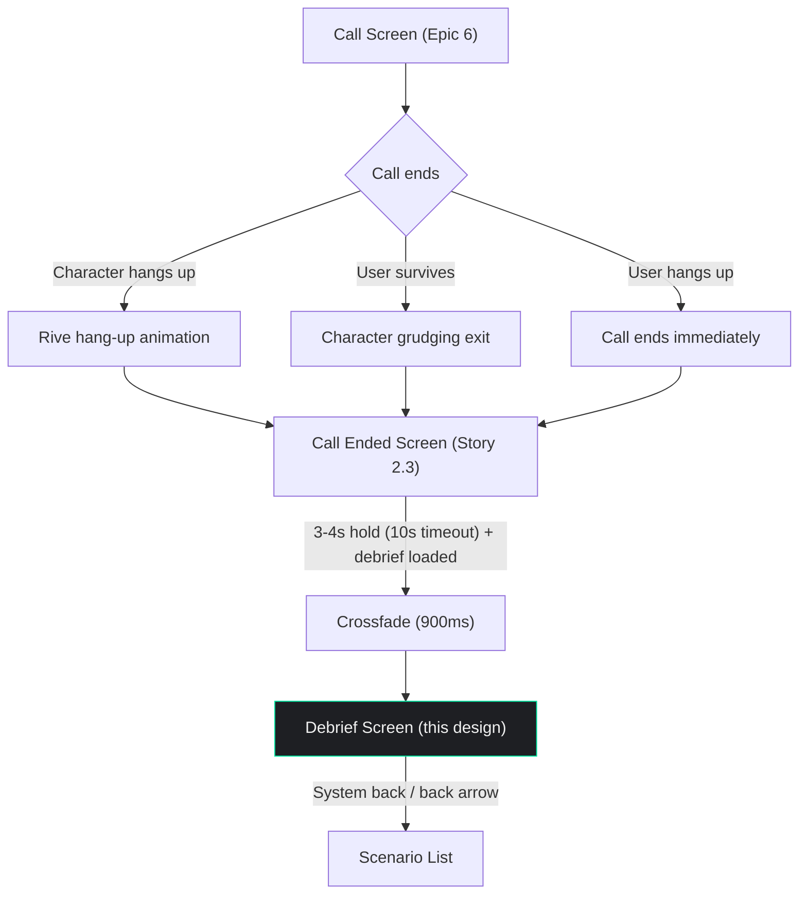

# Debrief Screen Design

**Author:** Dev Agent (Claude Opus 4.6)
**Date:** 2026-04-01
**Story:** 2.4 — Design Debrief Screen
**Status:** Approved
**Consumed by:** Epic 7, Story 7.3 (Build Debrief Screen), Story 7.1 (Build Debrief Generation Backend — data model alignment)

---

## Design Token Reference

All color and spacing values reference tokens from the UX Design Specification and previous stories (2.1, 2.2, 2.3). Typography uses Inter exclusively — no Frijole on this screen.

### Colors

| Token | Hex | Usage on Debrief Screen |
|-------|-----|-------------------------|
| `background` | `#1E1F23` | Screen background |
| `text-primary` | `#F0F0F0` | Section headers, user phrases in error cards, body text |
| `text-secondary` | `#9A9AA5` | Metadata, attempt count, previous best, timestamps, explanatory text |
| `accent` | `#00E5A0` | Corrections in error cards, idiom explanations, improvement indicators |
| `destructive` | `#E74C3C` | Survival % when <100%, error highlights |
| `status-completed` | `#2ECC40` | Survival % when 100% |
| `avatar-bg` | `#414143` | Card backgrounds for error/idiom/hesitation/areas sections |

**No screen-specific color tokens introduced.** Unlike Story 2.2 (which introduced `call-secondary`, `call-accept`, `call-decline` for the native phone aesthetic), the debrief screen uses only system-wide design tokens. The emotional differentiation is achieved through `destructive` (failure) and `accent` (corrections/progress) colors already in the system.

### Typography

**Font family: Inter** — exclusively. No Frijole on this screen.

| Style | Font | Size | Weight | Usage |
|-------|------|------|--------|-------|
| `display` | Inter | 64px | Bold (700) | Survival percentage — the hero number |
| `headline` | Inter | 18px | SemiBold (600) | Section titles ("Language Errors", "Hesitation Analysis", etc.) |
| `section-title` | Inter | 14px | SemiBold (600) | Sub-section headers within cards, count indicators |
| `body` | Inter | 16px | Regular (400) | Error descriptions, idiom explanations, areas to work on |
| `body-emphasis` | Inter | 16px | Medium (500) | Inline emphasis, correction text |
| `caption` | Inter | 13px | Regular (400) | Attempt count, previous best, timestamps, metadata |
| `label` | Inter | 12px | Medium (500) | Tags, secondary labels |

### Spacing

| Property | Value |
|----------|-------|
| Base unit | 8px |
| Screen padding horizontal | 20px |
| Screen padding vertical | 30px top (below SafeArea), 40px bottom |
| Section gap | 24px (between major sections) |
| Card internal padding | 16px |
| Element gap (standard) | 16px |
| Element gap (tight) | 8px |
| Card border radius | 12px |

---

## Hero Section — Screenshot-Worthy Header

### Purpose

The hero section is the top portion of the debrief screen designed to function as a **standalone screenshot** shared out of context. Someone seeing this screenshot on social media should instantly understand: "I survived 73% of a conversation with a sarcastic mugger." This follows the Wordle pattern — data that's shareable without needing the app context.

### Hero Section Layout Diagram

```
┌──────────────────────────────────────┐
│          SafeArea (top)              │
│                                      │
│  ← Back arrow (top-left)            │  24px icon, #F0F0F0
│                                      │
│             30px gap                 │
│                                      │
│              "73%"                   │  Inter Bold 64px
│             centered                 │  #E74C3C (<100%) or
│                                      │  #2ECC40 (100%)
│                                      │
│              8px gap                 │
│                                      │
│           "Survival Rate"            │  Inter Regular 13px
│             centered                 │  #9A9AA5
│                                      │
│             16px gap                 │
│                                      │
│      "The Mugger — Give me           │  Inter SemiBold 18px
│         your wallet"                 │  #F0F0F0, centered
│                                      │
│              8px gap                 │
│                                      │
│    "Attempt #3 · Previous best: 67%" │  Inter Regular 13px
│             centered                 │  #9A9AA5
│                                      │
│ ─ ─ ─ ─ ─ ─ ─ ─ ─ ─ ─ ─ ─ ─ ─ ─ ─│  Screenshot boundary
│             24px gap                 │  (~280px from top)
│                                      │
│      [Content sections below...]     │
└──────────────────────────────────────┘
```

### Survival Percentage Display (Subtask 1.1)

| Property | Value |
|----------|-------|
| Content | Dynamic — survival percentage as integer (e.g., "73%") |
| Font family | Inter |
| Font weight | Bold (700) |
| Font size | 64px (`display`) |
| Color (<100%) | `#E74C3C` (`destructive`) |
| Color (100%) | `#2ECC40` (`status-completed`) |
| Text alignment | Center |
| Position | Top of content, below back arrow + 30px gap |
| Max lines | 1 |

**Design rationale:** The 64px Bold number is the single most prominent element on the screen — and in the entire app. It's the first thing the eye hits: large, color-coded, unmistakable. Red for failure, green for perfection. This is the "Wordle grid" equivalent — the one data point that communicates the entire story.

**"Survival Rate" label:**

| Property | Value |
|----------|-------|
| Content | "Survival Rate" |
| Font family | Inter |
| Font weight | Regular (400) |
| Font size | 13px (`caption`) |
| Color | `#9A9AA5` (`text-secondary`) |
| Text alignment | Center |
| Position | 8px below survival percentage |

### Character Name and Scenario Title (Subtask 1.2)

| Property | Value |
|----------|-------|
| Content | "[Character Name] — [Scenario Title]" (e.g., "The Mugger — Give me your wallet") |
| Font family | Inter |
| Font weight | SemiBold (600) |
| Font size | 18px (`headline`) |
| Color | `#F0F0F0` (`text-primary`) |
| Text alignment | Center |
| Position | 16px below "Survival Rate" label |
| Max lines | 2 |
| Overflow | Ellipsis on line 2 |
| Horizontal padding | 20px (each side — inherited from screen padding) |

**Design rationale:** The character name and scenario title together provide complete context: WHO called and WHAT the scenario was. Using em dash (—) separates the two elements while keeping them on one line for most scenarios. SemiBold weight at 18px gives it visual authority without competing with the 64px number.

### Attempt Number and Previous Best (Subtask 1.3)

| Property | Value |
|----------|-------|
| Content | "Attempt #[N] · Previous best: [X]%" or "Attempt #1" (first attempt) |
| Font family | Inter |
| Font weight | Regular (400) |
| Font size | 13px (`caption`) |
| Color | `#9A9AA5` (`text-secondary`) |
| Text alignment | Center |
| Position | 8px below character/scenario line |
| Max lines | 1 |
| Separator | Middle dot (·) between attempt and previous best |

**States:**

| State | Content Displayed |
|-------|-------------------|
| First attempt | "Attempt #1" — no previous best shown |
| Repeat attempt | "Attempt #3 · Previous best: 67%" |
| New best achieved | "Attempt #3 · Previous best: 67%" — same format, no special indicator (improvement shown in encouraging framing section) |

**Design rationale:** Muted `text-secondary` color keeps this metadata subordinate to the hero number. The middle dot separator is a clean, minimal way to separate two data points on one line. First-attempt users see a shorter line — no "Previous best: 0%" clutter.

### Screenshot Boundary (Subtask 1.4)

The self-contained screenshot region occupies approximately the top **280px** of the screen (below SafeArea):

| Element | Approx. Y Position |
|---------|-------------------|
| Back arrow | SafeArea + 8px |
| Survival % | SafeArea + ~60px |
| "Survival Rate" label | ~132px |
| Character/scenario line | ~156px |
| Attempt/previous best | ~182px |
| Screenshot boundary | ~210px (+ bottom padding to ~280px) |

**What's in the screenshot:** Survival %, "Survival Rate" label, character name + scenario, attempt info. Dark background `#1E1F23` makes the screenshot work on any social media background.

**What's NOT in the screenshot:** Back arrow (outside the visual focus area), all content sections below. The screenshot captures ONLY the hero — enough to tell the story, not enough to spoil the full debrief.

**Design rationale:** The screenshot region is roughly the first fold of a mobile screen (~400px viewport height). The back arrow at the very top may be captured but is small and unobtrusive. The key data — percentage, character, scenario — is all centered and visually balanced.

### Hero Section Layout Specification Table (Subtask 1.5)

| Element | Position | Width | Height | Padding/Gap | Notes |
|---------|----------|-------|--------|-------------|-------|
| Back arrow | Top-left, below SafeArea | 44px touch | 44px touch | T: 8px, L: 8px | 24px icon, `#F0F0F0` |
| Survival % | Column child 1 | Auto | ~77px | T: 30px | Inter Bold 64px, centered, color-coded |
| "Survival Rate" label | Column child 2 | Auto | ~16px | T: 8px | Inter Regular 13px `#9A9AA5`, centered |
| Character/scenario | Column child 3 | Screen - 40px | ~22-44px | T: 16px | Inter SemiBold 18px, centered, max 2 lines |
| Attempt/previous best | Column child 4 | Auto | ~16px | T: 8px | Inter Regular 13px `#9A9AA5`, centered |

---

## Encouraging Framing Section — FR15b (>40% Survival)

### Purpose

Conditional section shown only when survival > 40%. Provides motivational context without breaking the "no congratulations" rule: proximity to next threshold and improvement since last attempt. This is data-driven encouragement, not praise.

**API contract:** When survival ≤ 40%, the backend omits the `encouraging_framing` field entirely from the JSON response (per architecture convention: null fields omitted). The client checks for field presence, not `survival_pct` value. When `inappropriate_behavior` is non-null and survival > 40%, both sections can coexist — the encouraging framing shows proximity data while the inappropriate behavior section explains the call termination.

### Visibility Rules

| Condition | Section Visible? |
|-----------|-----------------|
| Survival ≤ 40% | Hidden — no encouraging framing |
| Survival > 40%, first attempt | Visible — proximity only (no improvement comparison) |
| Survival > 40%, repeat attempt with improvement | Visible — proximity + improvement |
| Survival > 40%, repeat attempt with regression | Visible — proximity only (no "-X% since last" shown) |
| Survival = 100% | Visible — "You survived" proximity message |

### Layout

```
│             24px gap                 │
│  ┌──────────────────────────────┐    │
│  │  "5% away from surviving     │    │  Inter Regular 16px
│  │   the mugger"                │    │  #00E5A0 (accent)
│  │                              │    │
│  │  "+6% since last attempt"    │    │  Inter Regular 13px
│  │                              │    │  #9A9AA5
│  └──────────────────────────────┘    │
```

### Proximity Display (Subtask 5.1)

| Property | Value |
|----------|-------|
| Content | Dynamic — "[N]% away from surviving [character name]" or "You survived [character name]" if 100% |
| Font family | Inter |
| Font weight | Regular (400) |
| Font size | 16px (`body`) |
| Color | `#00E5A0` (`accent`) |
| Text alignment | Center |
| Max lines | 2 |

### Improvement Display (Subtask 5.1)

| Property | Value |
|----------|-------|
| Content | "+[N]% since last attempt" (only shown when improvement exists) |
| Font family | Inter |
| Font weight | Regular (400) |
| Font size | 13px (`caption`) |
| Color | `#9A9AA5` (`text-secondary`) |
| Text alignment | Center |
| Position | 4px below proximity text |
| Visibility | Only shown on repeat attempts with positive improvement |

### Section Placement (Subtask 5.2)

| Property | Value |
|----------|-------|
| Position in layout | Between hero section and language errors section |
| Top gap | 24px (standard section gap) |
| Container | No card background — text-only, centered |
| Horizontal padding | 40px each side (narrower text column for readability) |

### Visual Treatment (Subtask 5.3)

No card background — the accent-colored proximity text stands alone against the dark background. This keeps the encouraging framing lightweight and avoids drawing too much attention. The accent green (#00E5A0) creates a subtle positive moment amid the otherwise red/neutral debrief content.

---

## Language Errors Section — FR10

### Purpose

The core educational content. Each error shows what the user said and the correct form, with distinct visual treatment that makes corrections instantly readable. This is where the "Finally, the Truth" moment lives — specific, frank, actionable.

### Section Layout

```
│             24px gap                 │
│                                      │
│  "Language Errors"                   │  Inter SemiBold 18px #F0F0F0
│                                      │
│  "3 errors flagged"                  │  Inter Regular 13px #9A9AA5
│                                      │
│             12px gap                 │
│                                      │
│  ┌──────────────────────────────┐    │  Error card 1
│  │                              │    │  avatar-bg (#414143) background
│  │  "You said (×3):"            │    │  Inter SemiBold 14px #9A9AA5
│  │  "I am not want problem"     │    │  Inter Regular 16px #F0F0F0
│  │                              │    │  (×N shown only when count >= 2)
│  │  "Correct form:"             │    │  Inter SemiBold 14px #9A9AA5
│  │  "I don't want any trouble"  │    │  Inter Medium 16px #00E5A0
│  │                              │    │
│  │  "After the mugger's initial │    │  Inter Regular 13px #9A9AA5
│  │   threat"                    │    │  (context line)
│  └──────────────────────────────┘    │
│                                      │
│             12px gap                 │
│                                      │
│  ┌──────────────────────────────┐    │  Error card 2
│  │  ...                         │    │
│  └──────────────────────────────┘    │
```

### Section Header

| Property | Value |
|----------|-------|
| Title | "Language Errors" |
| Font | Inter SemiBold 18px (`headline`) |
| Color | `#F0F0F0` (`text-primary`) |
| Text alignment | Left |
| Position | Below encouraging framing (or hero section if no framing) + 24px gap |

### Count Indicator

| Property | Value |
|----------|-------|
| Content | "[N] errors flagged" or "No errors flagged" |
| Font | Inter Regular 13px (`caption`) |
| Color | `#9A9AA5` (`text-secondary`) |
| Position | 4px below section title |
| Text alignment | Left |

### Error Card Layout (Subtask 2.1)

| Property | Value |
|----------|-------|
| Background | `#414143` (`avatar-bg`) |
| Border radius | 12px |
| Padding | 16px all sides |
| Width | Full width minus screen padding (screen - 40px) |
| Gap between cards | 12px |

**Card internal layout:**

| Element | Font | Size | Weight | Color | Notes |
|---------|------|------|--------|-------|-------|
| "You said:" label | Inter | 14px | SemiBold (600) | `#9A9AA5` | `section-title` style, muted. When `count >= 2`, display as "You said (×N):" |
| User phrase | Inter | 16px | Regular (400) | `#F0F0F0` | `body`, 4px below label |
| "Correct form:" label | Inter | 14px | SemiBold (600) | `#9A9AA5` | `section-title` style, 12px below user phrase |
| Correction text | Inter | 16px | Medium (500) | `#00E5A0` | `body-emphasis` in accent color, 4px below label |
| Context line | Inter | 13px | Regular (400) | `#9A9AA5` | `caption`, 12px below correction, italic |

**Repetition count display:** When `count >= 2`, the "You said:" label becomes "You said (×N):" where N is the number of times the error was made. When `count == 1`, display "You said:" without a count indicator. This supports the deduplication strategy (max 5 errors, grouped by type) and reinforces the "no hedging" principle — "you made this error 3 times" is more impactful than showing it once without frequency.

**Design rationale for visual treatment (AC2):** The "You said" / "Correct form" structure uses two distinct visual layers:
- User's phrase: standard white text — what they actually said
- Correction: accent green (#00E5A0) Medium weight — what they should have said

The color contrast between `#F0F0F0` (white) and `#00E5A0` (green) creates instant visual differentiation. The user can scan correction text without reading labels. The muted `#9A9AA5` labels ("You said:", "Correct form:") provide structure but stay out of the way.

### Accent Color Usage for Corrections (Subtask 2.2)

| Element | Color | Rationale |
|---------|-------|-----------|
| Correction text | `#00E5A0` | The accent green marks "what's right" — the learnable information. Every green word on this screen is something the user should remember. |
| "You said:" label | `#9A9AA5` | Muted — structural, not content |
| "Correct form:" label | `#9A9AA5` | Muted — structural, not content |
| User's original phrase | `#F0F0F0` | Standard text — what happened, not what to learn |

### Error Card States (Subtask 2.3)

| State | Behavior |
|-------|----------|
| No errors | Section still visible. Header shows "No errors flagged" in `#9A9AA5`. No cards rendered. Positive feedback by absence — the user made no flaggable mistakes |
| Single error | One error card displayed below header |
| Multiple errors (2-5) | Cards stacked vertically with 12px gap. All visible, scrollable within overall screen scroll |

### Spacing and Maximum Display (Subtask 2.4)

| Property | Value |
|----------|-------|
| Gap between error cards | 12px |
| Maximum displayed errors | **5** — the LLM selects the 5 most significant errors, deduplicated and grouped by type |
| Scroll behavior | Part of overall screen scroll (not a separate scrollable region) |

**Design decision — Max 5 errors, deduplicated (Content Strategy Q5):** The LLM selects errors based on: (1) frequency — repeated errors rank higher, (2) communication impact — errors that prevented the character from understanding rank higher, (3) diversity — covers different error types rather than 5 variants of the same problem. Repeated identical errors are grouped into a single card with a `count` indicator (e.g., "×3"). The user should be able to read the entire error section in 30 seconds. 5 well-chosen errors are more actionable than 15 in bulk.

### Error Section Layout Specification Table (Subtask 2.5)

| Element | Position | Width | Height | Padding/Gap | Notes |
|---------|----------|-------|--------|-------------|-------|
| Section title "Language Errors" | Left-aligned | Auto | ~22px | T: 24px | `headline` |
| Count indicator | Left-aligned | Auto | ~16px | T: 4px | `caption` `#9A9AA5` |
| Error card container | Below count | Screen - 40px | Auto | T: 12px | Vertical list of cards |
| Error card | Full container width | 100% | Auto (~120-150px) | Internal: 16px | `avatar-bg`, border-radius 12px |
| "You said:" label | Card child 1 | Auto | ~17px | — | `section-title` `#9A9AA5` |
| User phrase | Card child 2 | Auto | ~20px | T: 4px | `body` `#F0F0F0` |
| "Correct form:" label | Card child 3 | Auto | ~17px | T: 12px | `section-title` `#9A9AA5` |
| Correction text | Card child 4 | Auto | ~20px | T: 4px | `body-emphasis` `#00E5A0` |
| Context line | Card child 5 | Auto | ~16px | T: 12px | `caption` `#9A9AA5` italic |
| Card gap | Between cards | — | 12px | — | Vertical spacing |

---

## Hesitation Analysis Section — FR12

### Purpose

Highlights the user's longest hesitation moments (1-3) — where they froze during the conversation. Shows duration and the conversation context, giving the user insight into what situations cause them to stall. Only silences exceeding 3 seconds are reported (shorter pauses are natural conversation gaps, not meaningful hesitations).

### Section Layout

```
│             24px gap                 │
│                                      │
│  "Hesitation Analysis"               │  Inter SemiBold 18px #F0F0F0
│                                      │
│  "2 moments flagged"                 │  Inter Regular 13px #9A9AA5
│                                      │
│             12px gap                 │
│                                      │
│  ┌──────────────────────────────┐    │  Hesitation card 1
│  │                              │    │  avatar-bg background
│  │  "Pause"                     │    │  Inter SemiBold 14px #9A9AA5
│  │                              │    │
│  │  "4.2 seconds"               │    │  Inter Bold 24px #F0F0F0
│  │                              │    │
│  │  "After the mugger raised    │    │  Inter Regular 16px #9A9AA5
│  │   his voice"                 │    │  italic, in quotes
│  └──────────────────────────────┘    │
│                                      │
│             12px gap                 │
│                                      │
│  ┌──────────────────────────────┐    │  Hesitation card 2
│  │  ...                         │    │
│  └──────────────────────────────┘    │
```

### Hesitation Moment Display (Subtask 3.1)

**Section Header:**

| Property | Value |
|----------|-------|
| Title | "Hesitation Analysis" |
| Font | Inter SemiBold 18px (`headline`) |
| Color | `#F0F0F0` (`text-primary`) |
| Text alignment | Left |

**Count Indicator:**

| Property | Value |
|----------|-------|
| Content | "[N] moments flagged", "1 moment flagged", or "No hesitations flagged" |
| Font | Inter Regular 13px (`caption`) |
| Color | `#9A9AA5` (`text-secondary`) |
| Position | 4px below section title |
| Text alignment | Left |

**Hesitation Card:**

| Property | Value |
|----------|-------|
| Background | `#414143` (`avatar-bg`) |
| Border radius | 12px |
| Padding | 16px all sides |
| Width | Full width minus screen padding (screen - 40px) |
| Gap between cards | 12px |
| Maximum cards | 3 |

| Element | Font | Size | Weight | Color | Notes |
|---------|------|------|--------|-------|-------|
| "Pause" label | Inter | 14px | SemiBold (600) | `#9A9AA5` | `section-title` style |
| Duration value | Inter | 24px | Bold (700) | `#F0F0F0` | Large number for emphasis, 4px below label |
| Duration unit | — | — | — | — | Included in text: "4.2 seconds" |
| Context quote | Inter | 16px | Regular (400) | `#9A9AA5` | Italic, 12px below duration, wrapped in quotation marks |

**Empty state:** When no pauses exceed 3 seconds, the section remains visible. Header shows "No hesitations flagged" in `#9A9AA5`. No cards rendered. This mirrors the error section's empty state pattern.

**Data source split (Content Strategy Q6):** The backend measures hesitation durations from Soniox STT timestamps (gap between character speech end and user speech start). Only gaps > 3 seconds are reported. The backend identifies the top 3 gaps, sorted by duration (longest first), and passes them to the LLM in that order. The LLM returns contexts in the same order. The backend merges by index: `hesitations[i].duration_sec` + `hesitation_contexts[i].context` → `hesitations[i]` in the client-facing response. Cards are ordered by duration, longest first.

### Visual Treatment for Context Quote (Subtask 3.2)

| Property | Value |
|----------|-------|
| Content | Dynamic — describes the conversation context (e.g., "After the threat escalated — the mugger raised his voice") |
| Font style | Italic |
| Color | `#9A9AA5` (`text-secondary`) |
| Wrapping | Wrapped in quotation marks: "..." |
| Max lines | 3 |
| Overflow | Ellipsis on line 3 |
| Horizontal padding | 0px (contained within card's 16px padding) |

**Design rationale:** Italic + muted color + quotation marks create a clear "quote" visual treatment. The context feels like a memory — "this is where you froze." The contrast between the bold 24px duration number and the muted italic context creates a natural reading flow: big number (how long) → context (when/why).

### Hesitation Section Layout Specification Table (Subtask 3.3)

| Element | Position | Width | Height | Padding/Gap | Notes |
|---------|----------|-------|--------|-------------|-------|
| Section title | Left-aligned | Auto | ~22px | T: 24px | `headline` |
| Count indicator | Left-aligned | Auto | ~16px | T: 4px | `caption` `#9A9AA5` |
| Hesitation card container | Below count | Screen - 40px | Auto | T: 12px | Vertical list of 1-3 cards |
| Hesitation card | Full container width | 100% | Auto (~100-130px) | Internal: 16px | `avatar-bg`, border-radius 12px |
| "Pause" label | Card child 1 | Auto | ~17px | — | `section-title` `#9A9AA5` |
| Duration value | Card child 2 | Auto | ~29px | T: 4px | Inter Bold 24px `#F0F0F0` |
| Context quote | Card child 3 | Card - 32px | Auto (~20-60px) | T: 12px | `body` italic `#9A9AA5`, max 3 lines |
| Card gap | Between cards | — | 12px | — | Vertical spacing |

---

## Idiom/Slang Explanations Section — FR13

### Purpose

Explains idioms or slang the character used during the conversation. Each idiom shows the phrase, its meaning, and a contextual example. Section is hidden entirely if no idioms were encountered.

### Section Layout

```
│             24px gap                 │
│                                      │
│  "Idioms & Slang"                    │  Inter SemiBold 18px #F0F0F0
│                                      │
│             12px gap                 │
│                                      │
│  ┌──────────────────────────────┐    │
│  │                              │    │  avatar-bg background
│  │  "'Pull the other one'"      │    │  Inter Medium 16px #00E5A0
│  │                              │    │
│  │  "British idiom meaning      │    │  Inter Regular 16px #F0F0F0
│  │   'I don't believe you'"     │    │
│  │                              │    │
│  │  "The mugger used this when  │    │  Inter Regular 13px #9A9AA5
│  │   you claimed to have no     │    │  italic, in quotes
│  │   wallet"                    │    │
│  └──────────────────────────────┘    │
```

### Idiom Card Layout (Subtask 4.1)

**Section Header:**

| Property | Value |
|----------|-------|
| Title | "Idioms & Slang" |
| Font | Inter SemiBold 18px (`headline`) |
| Color | `#F0F0F0` (`text-primary`) |
| Text alignment | Left |

**Idiom Card:**

| Property | Value |
|----------|-------|
| Background | `#414143` (`avatar-bg`) |
| Border radius | 12px |
| Padding | 16px all sides |
| Width | Full width minus screen padding (screen - 40px) |
| Gap between cards | 12px |

| Element | Font | Size | Weight | Color | Notes |
|---------|------|------|--------|-------|-------|
| Idiom phrase | Inter | 16px | Medium (500) | `#00E5A0` | `body-emphasis` in accent, wrapped in single quotes |
| Meaning | Inter | 16px | Regular (400) | `#F0F0F0` | `body`, 8px below phrase |
| Context example | Inter | 13px | Regular (400) | `#9A9AA5` | `caption`, italic, 12px below meaning, in quotes |

### Visual Treatment for Idiom Explanation (Subtask 4.2)

The accent green (#00E5A0) marks the idiom phrase — the thing to learn. The meaning in white provides the translation. The context in muted italic explains when it happened. This mirrors the error card pattern: green = learnable content, white = explanation, gray = context.

### Empty State (Subtask 4.3)

| Condition | Behavior |
|-----------|----------|
| No idioms encountered | **Section hidden entirely** — don't show "No idioms encountered" or an empty section. The section simply doesn't exist in the layout. |
| One idiom | Single idiom card |
| Multiple idioms (2-3) | Cards stacked vertically with 12px gap. **Maximum 3 idiom cards** — the LLM selects the 3 most relevant if more were encountered. |

**Design rationale:** Hiding the section (rather than showing "No idioms") keeps the debrief focused on what IS there, not what isn't. The debrief should feel like a tailored report — sections appear when relevant and disappear when not.

### Idiom Section Layout Specification Table (Subtask 4.4)

| Element | Position | Width | Height | Padding/Gap | Notes |
|---------|----------|-------|--------|-------------|-------|
| Section title | Left-aligned | Auto | ~22px | T: 24px | `headline` — only rendered if idioms exist |
| Idiom card | Below title | Screen - 40px | Auto (~100-130px) | T: 12px, Internal: 16px | `avatar-bg`, border-radius 12px |
| Idiom phrase | Card child 1 | Auto | ~20px | — | `body-emphasis` `#00E5A0`, in single quotes |
| Meaning | Card child 2 | Card - 32px | Auto (~20-40px) | T: 8px | `body` `#F0F0F0` |
| Context example | Card child 3 | Card - 32px | Auto (~16-48px) | T: 12px | `caption` italic `#9A9AA5`, in quotes |
| Card gap | Between cards | — | 12px | — | Vertical spacing |

---

## Inappropriate Behavior Section — FR37

### Purpose

Conditional section shown only when a call ended due to inappropriate user behavior (harassment, hate speech, etc.). Explains what happened and why the character reacted. No judgment language — factual and educational.

### Visibility Rule

| Condition | Behavior |
|-----------|----------|
| `inappropriate_behavior` is null | Section hidden entirely |
| `inappropriate_behavior` has content | Section displayed between idioms and areas to work on |

### Layout

```
│             24px gap                 │
│                                      │
│  "About This Call"                   │  Inter SemiBold 18px #F0F0F0
│                                      │
│             12px gap                 │
│                                      │
│  ┌──────────────────────────────┐    │
│  │  ┌─ 4px #E74C3C left border │    │  avatar-bg background
│  │  │                           │    │  destructive left border accent
│  │  │  [Explanation text from   │    │  Inter Regular 16px #F0F0F0
│  │  │   server — what happened  │    │
│  │  │   and why the character   │    │
│  │  │   reacted]                │    │
│  │  └───────────────────────────│    │
│  └──────────────────────────────┘    │
```

### Card Specs

| Property | Value |
|----------|-------|
| Background | `#414143` (`avatar-bg`) |
| Border radius | 12px |
| Border left | 4px solid `#E74C3C` (`destructive`) — warning accent stripe |
| Padding | 16px all sides |
| Width | Full width minus screen padding (screen - 40px) |

| Element | Font | Size | Weight | Color |
|---------|------|------|--------|-------|
| Explanation text | Inter | 16px | Regular (400) | `#F0F0F0` |

| Property | Value |
|----------|-------|
| Max lines | 5 |
| Overflow | Ellipsis on line 5 |

**Design rationale:** The red left border stripe (matching the AI disclosure block pattern from Story 2.1) marks this as a distinct, important note. The "About This Call" neutral header avoids accusatory language. The explanation text comes from the server and should be factual — "The character ended the call because the conversation included inappropriate language."

---

## Areas to Work On — Summary Section

### Purpose

The last content section. 2-3 clear, actionable improvement areas that guide self-study between sessions. This is the "study list" — what the user takes away from the debrief.

### Layout

```
│             24px gap                 │
│                                      │
│  "Areas to Work On"                  │  Inter SemiBold 18px #F0F0F0
│                                      │
│             12px gap                 │
│                                      │
│  ┌──────────────────────────────┐    │
│  │                              │    │  avatar-bg background
│  │  1. Negative sentence        │    │  Inter Regular 16px #F0F0F0
│  │     structure (don't/doesn't │    │  Numbered list
│  │     instead of 'not want')   │    │
│  │                              │    │
│  │  2. Responding under         │    │
│  │     pressure without         │    │
│  │     freezing                 │    │
│  │                              │    │
│  │  3. Using complete sentences │    │
│  │     instead of single-word   │    │
│  │     answers                  │    │
│  └──────────────────────────────┘    │
│                                      │
│             40px bottom padding      │
│          SafeArea (bottom)           │
```

### Section Specs (Subtask 6.1)

**Section Header:**

| Property | Value |
|----------|-------|
| Title | "Areas to Work On" |
| Font | Inter SemiBold 18px (`headline`) |
| Color | `#F0F0F0` (`text-primary`) |
| Text alignment | Left |

**Summary Card:**

| Property | Value |
|----------|-------|
| Background | `#414143` (`avatar-bg`) |
| Border radius | 12px |
| Padding | 16px all sides |
| Width | Full width minus screen padding (screen - 40px) |

| Element | Font | Size | Weight | Color | Notes |
|---------|------|------|--------|-------|-------|
| Numbered items | Inter | 16px | Regular (400) | `#F0F0F0` | Numbered 1-3, 8px gap between items |

**Design rationale:** A single card with numbered items creates a clean, scannable study list. The numbered format (not bullets) implies priority — item 1 is the most important area to focus on. No accent colors here — the items are plain text, clear enough to remember after closing the app.

### FR37 Section Placement (Subtask 6.2)

The inappropriate behavior section (when present) appears between the idioms section and this areas section. See the "Inappropriate Behavior Section" above.

### Back Navigation (Subtask 6.3)

| Property | Value |
|----------|-------|
| Navigation method | Back arrow in top-left corner (hero section) |
| Back arrow position | SafeArea + 8px top, 8px left |
| Icon | Material `arrow_back_ios_new` |
| Icon size | 24px |
| Icon color | `#F0F0F0` (`text-primary`) |
| Touch target | 44x44px (padded) |
| Action | Navigates back to scenario list via GoRouter `pop()` |

**No CTA buttons at the bottom.** The debrief ends with "Areas to Work On" — no "Retry", no "Back to Scenarios", no "Share". The back arrow is the sole exit. This is intentional: the debrief is a destination, not a trampoline (UX Experience Principle 6).

---

## Full Screen Composition and Responsive Layout

### Overall Screen Composition (Subtask 7.1)

```
┌──────────────────────────────────────┐
│          SafeArea (top)              │
│  ← Back arrow (top-left)            │
│                                      │
│  ┌─── Hero Section ──────────────┐  │ Section 1: Always visible
│  │  73%  (survival %)            │  │
│  │  Survival Rate                │  │
│  │  The Mugger — Give me...      │  │
│  │  Attempt #3 · Previous: 67%  │  │
│  └───────────────────────────────┘  │
│                                      │
│  ┌─── Encouraging Framing ───────┐  │ Section 2: Conditional (>40%)
│  │  5% away from surviving...    │  │
│  │  +6% since last attempt       │  │
│  └───────────────────────────────┘  │
│                                      │
│  ┌─── Language Errors ───────────┐  │ Section 3: Always visible
│  │  [Error cards...]             │  │
│  └───────────────────────────────┘  │
│                                      │
│  ┌─── Hesitation Analysis ───────┐  │ Section 4: Always visible
│  │  [1-3 hesitation cards]       │  │ (only gaps > 3s)
│  └───────────────────────────────┘  │
│                                      │
│  ┌─── Idioms & Slang ───────────┐  │ Section 5: Conditional (has idioms)
│  │  [Idiom cards...]             │  │
│  └───────────────────────────────┘  │
│                                      │
│  ┌─── About This Call ───────────┐  │ Section 6: Conditional (FR37)
│  │  [Inappropriate behavior]     │  │
│  └───────────────────────────────┘  │
│                                      │
│  ┌─── Areas to Work On ─────────┐  │ Section 7: Always visible
│  │  [Numbered improvement list]  │  │
│  └───────────────────────────────┘  │
│                                      │
│             40px bottom padding      │
│          SafeArea (bottom)           │
└──────────────────────────────────────┘
```

### Section Ordering (Subtask 7.2)

| Order | Section | Visibility | Gap Above |
|-------|---------|-----------|-----------|
| 1 | Hero (survival %, identity, attempts) | Always | 30px below SafeArea |
| 2 | Encouraging Framing (FR15b) | Conditional: survival > 40% | 24px |
| 3 | Language Errors (FR10) | Always (shows "No errors flagged" if empty) | 24px |
| 4 | Hesitation Analysis (FR12) | Always | 24px |
| 5 | Idioms & Slang (FR13) | Conditional: hidden if no idioms | 24px |
| 6 | About This Call (FR37) | Conditional: hidden if no inappropriate behavior | 24px |
| 7 | Areas to Work On | Always | 24px |

**Scrolling behavior:** The entire screen is a single `SingleChildScrollView` with vertical scrolling. No nested scrollable regions. The back arrow scrolls with content (resolved in Open Question #1). The system back gesture (Android back button / iOS edge swipe) serves as an alternative exit at any scroll position.

**Scroll physics:** Standard iOS/Android bounce scroll. No custom scroll physics.

### Responsive Behavior (Subtask 7.3)

| Screen Width | Behavior |
|-------------|----------|
| 320px (iPhone SE) | Survival % 64px fits (needs ~120px). Character/scenario line may wrap to 2 lines. Error cards slightly narrower (280px). Idiom phrases may wrap. All content still comfortable. |
| 375px (iPhone 14) | Primary target. All elements comfortable. Single-line character/scenario for most names. Card width 335px provides generous text flow. |
| 430px (iPhone Pro Max) | Extra breathing room. Wider cards, more text per line, fewer wraps. No layout changes. |

**No breakpoints needed.** All elements use relative widths (screen - 40px for cards) and flex layout. The 20px horizontal padding and 16px card internal padding provide consistent margins across all sizes.

### Back Arrow Position and Safe Area (Subtask 7.4)

| Property | Value |
|----------|-------|
| Position | Top-left corner |
| Top offset | SafeArea top inset + 8px |
| Left offset | 8px |
| Touch target | 44x44px (centered on 24px icon) |
| Z-order | Above scroll content (if scroll is used) |
| Icon | `arrow_back_ios_new` Material icon |
| Color | `#F0F0F0` (`text-primary`) |

**Safe area handling:** The screen respects system safe areas on both top and bottom. Top: back arrow + content start below SafeArea. Bottom: 40px padding above SafeArea bottom inset.

---

## Accessibility and Documentation

### WCAG 2.1 AA Contrast Verification (Subtask 8.1)

| Combination | Ratio | Status |
|-------------|-------|--------|
| `text-primary` (#F0F0F0) on `background` (#1E1F23) | 13.5:1 | Pass AA & AAA |
| `text-secondary` (#9A9AA5) on `background` (#1E1F23) | 5.1:1 | Pass AA |
| `accent` (#00E5A0) on `background` (#1E1F23) | 9.1:1 | Pass AA & AAA |
| `destructive` (#E74C3C) on `background` (#1E1F23) | 5.2:1 | Pass AA |
| `status-completed` (#2ECC40) on `background` (#1E1F23) | 8.5:1 | Pass AA & AAA |
| `text-primary` (#F0F0F0) on `avatar-bg` (#414143) | 7.2:1 | Pass AA & AAA |
| `text-secondary` (#9A9AA5) on `avatar-bg` (#414143) | 2.7:1 | Below AA for small text |
| `accent` (#00E5A0) on `avatar-bg` (#414143) | 5.1:1 | Pass AA |

**Note on `text-secondary` (#9A9AA5) on `avatar-bg` (#414143):** The 2.7:1 ratio is below AA for normal text. This affects the "You said:" / "Correct form:" labels, error context lines, hesitation context quotes, and idiom context lines within cards. However:
1. These labels are **structural** elements — the content they label (user phrase in `#F0F0F0`, correction in `#00E5A0`) passes AA on `#414143`
2. The labels at 14px SemiBold are large enough to be readable at 2.7:1 for users with normal vision
3. Screen readers announce the full content structure, not just the labels
4. This is the same pattern used in Story 2.1 (AI disclosure block body text on `avatar-bg`) and accepted in review

**Survival percentage contrast:** Both `#E74C3C` (5.2:1) and `#2ECC40` (7.5:1) pass AA on the dark background. The 64px Bold size means these qualify as large text (minimum 3:1) — both exceed that threshold significantly.

### Screen Reader Announcements (Subtask 8.2)

| Section | VoiceOver/TalkBack Announcement |
|---------|--------------------------------|
| Screen (on appear) | "Debrief. Survival rate: [N] percent. [Character Name], [Scenario Title]. Attempt [N]." |
| Survival % | "[N] percent survival rate" |
| Character/scenario | "[Character Name], [Scenario Title]" |
| Attempt info | "Attempt [N]. Previous best: [X] percent." or "Attempt 1, first attempt." |
| Encouraging framing | "[N] percent away from surviving [character]. Plus [N] percent since last attempt." |
| Language Errors header | "Language Errors. [N] errors flagged." |
| Error card | "Error: You said [phrase]. Correct form: [correction]. Context: [context]." |
| Hesitation header | "Hesitation Analysis." |
| Hesitation card (first) | "Longest pause: [N] seconds. Context: [context]." |
| Hesitation card (subsequent) | "Pause: [N] seconds. Context: [context]." |
| Idioms header | "Idioms and Slang." |
| Idiom card | "[Phrase]. Meaning: [meaning]. Context: [context]." |
| About This Call | "About This Call. [Explanation text]." |
| Areas to Work On | "Areas to Work On. First: [area 1]. Second: [area 2]. Third: [area 3]." |
| Back arrow | "Back, button" |

**Focus order:** Top-to-bottom reading order matching visual layout. Back arrow → hero section → sections in order → end of content.

### Reduced Motion Behavior (Subtask 8.3)

**Deferred to post-MVP.** Full animations only at launch. The debrief screen has no decorative animations — it's a static content screen. Reduced motion support can be added later without breaking changes.

### Navigation Context — Mermaid Flow Diagram (Subtask 8.4)



### Design Token Cross-Reference (Subtask 8.5)

| Token Used | Source | Match with UX Spec |
|------------|--------|-------------------|
| `background` #1E1F23 | UX Spec: Color System | Exact match |
| `text-primary` #F0F0F0 | UX Spec: Color System | Exact match |
| `text-secondary` #9A9AA5 | UX Spec: Color System (updated in Story 2.1) | Exact match — uses Story 2.1's corrected value, NOT the original #8A8A95 |
| `accent` #00E5A0 | UX Spec: Color System | Exact match |
| `destructive` #E74C3C | UX Spec: Color System | Exact match |
| `status-completed` #2ECC40 | UX Spec: Color System | Exact match |
| `avatar-bg` #414143 | UX Spec: Core Palette | Exact match |
| `display` 64px Bold | UX Spec: Typography | Exact match — survival percentage |
| `headline` 18px SemiBold | UX Spec: Typography | Exact match — section titles |
| `section-title` 14px SemiBold | UX Spec: Typography | Exact match — card sub-headers |
| `body` 16px Regular | UX Spec: Typography | Exact match — content text |
| `body-emphasis` 16px Medium | UX Spec: Typography | Exact match — corrections |
| `caption` 13px Regular | UX Spec: Typography | Exact match — metadata |
| `label` 12px Medium | UX Spec: Typography | Exact match — tags |

**Design system note:** This screen uses NO screen-specific tokens. Every color and typography style references an existing system-wide or UX spec token. This is intentional: unlike the incoming call screen (which mimicked a native phone UI), the debrief screen is a core product screen that should be fully consistent with the design system.

---

## Entry Transition — From Call Ended Screen

The debrief screen appears via auto-transition from the Call Ended screen (Story 2.3). The transition is fully specified in Story 2.3's "Exit Transition — Auto-Fade to Debrief" section. Summary:

| Property | Value |
|----------|-------|
| Trigger | Both conditions met: (a) minimum 3s hold elapsed AND (b) debrief data received |
| Call Ended fade-out | 600ms, `Curves.easeIn` |
| Debrief fade-in | 600ms, `Curves.easeOut` |
| Overlap | 300ms crossfade |
| Total duration | 900ms |
| Debrief state on appear | Fully formed — all content rendered, no loading spinners |

**Fallback (debrief not ready at 10s):** Story 2.3 specifies a loading text fallback ("Analyzing your conversation...") that transitions to full content when data arrives. The debrief screen handles this edge case in its implementation (Epic 7, Story 7.3).

---

## Flutter Widget Mapping

| Design Element | Flutter Widget | Notes |
|---------------|---------------|-------|
| Screen root | `Scaffold` with `backgroundColor: #1E1F23` | No AppBar — custom back arrow |
| Back arrow | `IconButton` with `Icons.arrow_back_ios_new` | 44x44 touch target, positioned top-left |
| Content layout | `SingleChildScrollView` + `Column` | Vertical scroll, all sections stacked |
| Survival % | `Text` with Inter Bold 64px | Color-coded: `#E74C3C` or `#2ECC40` |
| "Survival Rate" label | `Text` with Inter Regular 13px `#9A9AA5` | Centered below % |
| Character/scenario | `Text` with Inter SemiBold 18px `#F0F0F0` | Max 2 lines, ellipsis overflow |
| Attempt info | `Text` with Inter Regular 13px `#9A9AA5` | Conditional "Previous best" |
| Encouraging framing | `Visibility` or conditional render | Only when survival > 40% |
| Section headers | `Text` with Inter SemiBold 18px `#F0F0F0` | Left-aligned, reusable style |
| Error cards | `Container` with `BoxDecoration` | `#414143` bg, 12px radius, 16px padding |
| Correction text | `Text` with Inter Medium 16px `#00E5A0` | Accent color for learnable content |
| Hesitation cards (1-3) | `Container` with `BoxDecoration` | Same card style as error cards, stacked with 12px gap |
| Duration number | `Text` with Inter Bold 24px `#F0F0F0` | Large emphasis number |
| Error count badge | Inline in "You said:" label | Display "You said (×N):" when count >= 2, omit count for 1 |
| Idiom phrase | `Text` with Inter Medium 16px `#00E5A0` | Accent color, in single quotes |
| Idiom section | Conditional render — hidden if empty | Check `idioms.isEmpty` |
| FR37 card | `Container` with left border decoration | 4px `#E74C3C` left border |
| Areas numbered list | `Column` of numbered `Text` widgets | 1-3 items, 8px gap |
| Scroll wrapper | `SingleChildScrollView` | Standard scroll physics |
| Entry transition | `FadeTransition` from Navigator | 600ms, matches Story 2.3 exit |
| Screen reader | `Semantics` widgets per section | Live region for screen announcement |

### File Locations (per Architecture)

| File | Path |
|------|------|
| Debrief screen | `client/lib/features/debrief/views/debrief_screen.dart` |
| Debrief BLoC | `client/lib/features/debrief/bloc/debrief_bloc.dart` |
| Color tokens | `client/lib/core/theme/app_colors.dart` |
| Typography tokens | `client/lib/core/theme/app_typography.dart` |
| Theme configuration | `client/lib/core/theme/app_theme.dart` |
| Navigation (GoRouter) | `client/lib/core/navigation/app_router.dart` |

---

## Content Strategy Decisions (Resolved)

All content questions were resolved through UX Designer review (2026-04-01). These decisions define the data model for Epic 7 (backend) and the content constraints for Epic 3 (scenario authoring).

### Resolved Questions

| # | Question | Decision | Justification |
|---|----------|----------|---------------|
| Q1 | Strengths / points forts? | **NO — removed** | "Honesty builds trust, praise destroys it." Strengths = praise in disguise. The hero % IS the only validation. |
| Q2 | Summary text field? | **NO — removed** | Redundant with sections. Risks vague praise. Hero section IS the summary. "Show data, don't narrate." |
| Q3 | Explanation per error? | **Renamed to `context`** — narrative, not grammar rule | Anchors errors to emotional moments ("After the mugger's threat"). Grammar rules go in areas_to_work_on. |
| Q4 | Tips vs areas_to_work_on? | **Single field: `areas_to_work_on`** (2-3 items) | Diagnostics, not instructions. "Negative sentence structure (don't/doesn't)" — googlable. |
| Q5 | Error count limit? | **Max 5, deduplicated, grouped** | LLM selects by frequency, communication impact, diversity. 5 errors in 30 seconds > 15 in bulk. |
| Q6 | Hesitation — single or multiple? | **Array of 1-3, threshold > 3 seconds** | FR12 says "moments" (plural). Backend measures gaps via STT timestamps, LLM adds context. |
| Q7 | Context per error — include? | **YES** | Memory anchoring. "After the mugger's threat" connects error to emotional moment. Max 1 phrase. |
| Q8 | Repetition count? | **YES — `count` field per error** | UX spec says "You said 'I am agree' three times." Display "×N" when count >= 2. |
| Q9 | Tone — clinical or persona? | **Clinical. App voice, not character voice.** | Debrief = honest mirror. Call = entertainment. Labels factual, context narrative 3rd person. |
| Q10 | Survival % — LLM or backend? | **Backend-calculated** | Deterministic, reproducible. Based on scenario progression, not LLM opinion. NOT in LLM schema. |

### LLM Output Schema (json_schema strict)

This is exactly what the LLM produces via OpenRouter's `json_schema` strict mode:

```json
{
  "errors": [
    {
      "user_said": "I am not want problem",
      "correction": "I don't want any trouble",
      "context": "After the mugger's initial threat",
      "count": 2
    }
  ],
  "hesitation_contexts": [
    {
      "context": "After the mugger raised his voice and demanded a faster answer"
    }
  ],
  "idioms": [
    {
      "expression": "Pull the other one",
      "meaning": "I don't believe you",
      "context": "The mugger used this when you claimed to have no wallet"
    }
  ],
  "areas_to_work_on": [
    "Negative sentence structure (use don't/doesn't instead of 'not want')",
    "Responding under pressure without freezing",
    "Using complete sentences instead of single-word answers"
  ],
  "inappropriate_behavior": null
}
```

**Schema constraints:**

| Field | Type | Constraint |
|-------|------|-----------|
| `errors` | array | 0-5 items |
| `errors[].user_said` | string | Verbatim user speech |
| `errors[].correction` | string | Correct form |
| `errors[].context` | string | 1 phrase max — when in the conversation |
| `errors[].count` | integer | How many times (>= 1) |
| `hesitation_contexts` | array | 0-3 items. Backend provides durations, LLM adds context |
| `hesitation_contexts[].context` | string | 1 phrase — what was happening when user froze |
| `idioms` | array | 0-3 items. Section hidden if empty |
| `idioms[].expression` | string | The exact idiom/slang |
| `idioms[].meaning` | string | Plain English meaning |
| `idioms[].context` | string | When the character used it |
| `areas_to_work_on` | array | 2-3 strings. Theme + actionable parenthetical. Backend clamps: if LLM returns 1 item, display as-is; if 4+, truncate to first 3 |
| `inappropriate_behavior` | string or null | null if normal call. Factual explanation if FR37 |

### Backend-Calculated Fields (NOT from LLM)

| Field | Source | Notes |
|-------|--------|-------|
| `survival_pct` | Backend calculation | Integer 0-100. Based on scenario progression |
| `character_name` | Scenario config (DB) | e.g., "The Mugger" |
| `scenario_title` | Scenario config (DB) | e.g., "Give me your wallet" |
| `attempt_number` | user_progress table | Integer >= 1 |
| `previous_best` | user_progress table | Integer 0-100 or null (first attempt) |
| `hesitations[].duration_sec` | Backend (STT timestamps) | Float. Gaps > 3s from Soniox |
| `encouraging_framing.proximity` | Backend calculation | "5% away from surviving the mugger" |
| `encouraging_framing.improvement` | Backend calculation | "+6% since last attempt" |

**Assembly:** The backend merges LLM output + its own calculated fields into the final JSON sent to the Flutter client. The client receives the debrief ready to display.

### Tone Specification for LLM Prompt

Voice: The app. Not the character. Not a teacher. Not a coach.

Register: Clinical-frank. Like a medical report — factual, specific, no hedging.

| Element | Register | Example | Anti-example |
|---------|----------|---------|--------------|
| Error correction | Factual, direct | "I don't want any trouble" | "A better way to say this would be..." |
| Error context | Narrative brief, 3rd person | "After the mugger's initial threat" | "This was when things got heated!" |
| Hesitation context | Factual, situational | "When asked to empty pockets" | "You totally froze here" |
| Idiom meaning | Clear definition | "I don't believe you" | "This fun expression means..." |
| Areas to work on | Diagnosis + example | "Negative sentence structure (don't/doesn't)" | "Try practicing negative sentences!" |
| Inappropriate behavior | Factual, no judgment | "The call ended because the conversation included inappropriate language" | "You shouldn't have said that" |

---

## Open Questions — RESOLVED (2026-04-01)

All open questions resolved during content strategy review with UX Designer.

| # | Question | Decision | Rationale |
|---|----------|----------|-----------|
| 1 | Back arrow — fixed vs scrollable? | **Scroll with content** | Simpler, consistent with reading apps. No overlay z-order complexity. |
| 2 | 100% survival — show encouraging framing? | **YES — show "You survived [character]"** | It's data, not praise. Acknowledges completion without congratulating. |
| 3 | Dynamic text overflow — enforce LLM limits? | **YES — enforce in LLM prompt** | `maxLines` + ellipsis is a safety valve. LLM prompt specifies max lengths per field (see `debrief-content-strategy.md` and `debrief-generation-prompt.md`). |


---

# v2.0 — Story 7.5 Debrief Overhaul (VALIDATED by Walid 2026-06-15)

> The spec below was produced by a concept->judge-panel->synthesis design workflow
> for **Direction B "Rapport structuré — riche au clic, sobre au premier regard"**.
> Walid validated it with 4 decisions; the two that OVERRIDE the synthesized body
> spec are called out here and are AUTHORITATIVE over any contrary wording below:
>
> 1. **Gauge = 3 colors** (KEEP as specced): red <=40%, amber/`statusInProgress` 41-99%, green 100%.
> 2. **Add `AppColors.gaugeTrack`** (KEEP as specced): the dim track ring; pays the theme_tokens_test cost (14->15). Droppable to `avatarBg` if the Pixel 9 gate finds it unneeded.
> 3. **Detail sheet = DARK, matched to the report** — OVERRIDES the spec's "reuse the existing LIGHT sheet" wording. Build a dark-themed bottom sheet (report background + two-ink text), NOT the light content-warning/difficulty sheet style. Reuse the `showModalBottomSheet` plumbing + the drag-handle pattern, but theme it dark.
> 4. **Copy button on AREAS ONLY** — OVERRIDES any "error copy button / client-composed errorPracticeDrill" in the spec. Errors get tap-for-detail (rule + examples) only; the copy-a-practice-prompt action lives ONLY on the `areas` cards (server `practice_prompt`, verbatim). No app-composed practice text anywhere (content-is-server-side law).


---

# Story 7.5 — Debrief Report v2 ("The Scorecard") — Screen Design Spec

> **Appends to / supersedes** the v1 hero + section layout of this document. Direction B (locked by Walid): **"rapport structuré / scorecard — riche au clic, sobre au premier regard."** This spec EVOLVES the v1 `DebriefScreen` (Story 7.3): the StatefulWidget host, the 3-phase `_DebriefPhase {content, loading, unavailable}` machine, the BS-7 poll loop (`pollInterval`/`pollBudget` seams, `_attemptFetch`/`_settle`/`_onBudgetExhausted`/`dispose`), the `AnimatedSwitcher` 300 ms phase fade, the `_DebriefMessage` loading/unavailable states, and the `_BackArrow` (root `Navigator.pop`, scrolls with content) are ALL **unchanged**. Only `_DebriefContent` and its child widgets are rebuilt to the layout below. NO bloc (mirror v1). Applies "The Handler's Brief" rulebook (Story 7.4, Decision E, Walid-validated 2026-06-12).

## 0. Philosophy reconciliation (the one sentence)

The scrolling surface is a Handler's-Brief dossier — one left rail, 12-caps eyebrows, flat prose, two-ink, whitespace does the grouping — with exactly **two earned exceptions**: a single screenshot-worthy **gauge HERO** (the AC8 unit), and the v1 **card surface** for discrete record items. Every "richness" the brief would ban is **deferred behind one tap** (a `showModalBottomSheet` detail, or a `Clipboard` copy). At rest it reads calm; depth and action are always exactly one tap away. **"Riche au clic, sobre au premier regard"** is implemented literally as **surface-vs-sheet**.

---

## 1. Screen skeleton (UNCHANGED from v1 — do not touch)

- `Scaffold(backgroundColor: AppColors.background)` → `SafeArea` → `AnimatedSwitcher(300ms, easeOut)` → `_buildPhase()`.
- `loading` → `_DebriefMessage('Analyzing your conversation...')` (`body`/`textSecondary`, **no spinner**). `unavailable` → `_DebriefMessage('Debrief unavailable for this call.')` (`caption`/`textSecondary`). Both verbatim.
- `content` → `_DebriefContent(debrief)` = `SingleChildScrollView` → `Column(crossAxisAlignment: start)`: `_BackArrow()` (top-left, 44×44, `Icons.arrow_back_ios_new`, `Navigator.of(context).pop()`, `Semantics(button, 'Back to scenarios')`) then a `Padding(horizontal: AppSpacing.screenHorizontal /*20*/)` content column.
- **No PopScope, no CTA bar, no bottom navigation.** Back arrow is the **sole exit** (AC7-v2). The only interactive elements ADDED are per-card copy buttons and per-card tap-to-sheet. No retry / share / nav / monetization anywhere.

---

## 2. HERO — the gauge scorecard (AC8, the earned cinema)

The v1 bare 64 px number becomes a **ring/arc gauge sweeping around the survival %**. **The whole hero stays CENTERED** (a single self-contained, screenshot-croppable unit on the dark `background`) — v1's centered block at lines 354-394 is preserved; the left-rail rule begins BELOW the hero. (This fixes the AC8-split risk: a centered ring over a left-flushed identity reads as two mismatched blocks.)

**Layout — centered `Column`, top to bottom:**

1. `_BackArrow` above the hero (scrolls with it; unobtrusive in a screenshot — v1 precedent).
2. `_kHeroTopGap` (30) → **the gauge** — a square `SizedBox(side: _kGaugeDiameter /*180*/)` containing a `Stack(alignment: center)`:
   - **`CustomPaint(_ScoreGaugePainter(...))`** filling the box. The arc sweeps **270°** ("speedometer" gap at the bottom): start angle `135°` (lower-left), clockwise to `45°` (lower-right). `strokeWidth: _kGaugeStroke /*12*/`, `StrokeCap.round`. **Two arcs:**
     - **Track** (full 270°): `AppColors.gaugeTrack` (NEW token — see `new_tokens`; a dim ring darker than `avatarBg` so the unfilled groove reads against the dark `background`).
     - **Value** (`survivalPct / 100 * 270°` from the start): the **score color** (rule below).
   - **The value arc is literally the survival fraction**, and **the Checkpoint Breakdown (§3A) directly below it is `met of total` reached — the ring IS the score, the list NAMES the beats** (Concept 2's continuous "why this %?" argument). *(Build note: the gauge value is `survivalPct/100`; the breakdown shows `met/total`. The server already derives `survival_pct` from checkpoint progression, so the two read as one honest decomposition. If a payload ever has checkpoints whose `met` ratio ≠ `survival_pct/100`, the **gauge fills to `survival_pct`** — the number is the truth — and the breakdown remains the factual list; do NOT recompute the % from `met/total` client-side.)*
   - **Center stack** (inside the ring): `'${survivalPct}%'` in `AppTypography.display` (64/700) `copyWith(color: scoreColor)`, `maxLines: 1`, wrapped in a `FittedBox(fit: scaleDown)` so a 3-digit `100%` at textScaler 1.5 never overflows the ring; `semanticsLabel: '${survivalPct} percent survival rate'`. Directly under it, `'Survival Rate'` in `caption`/`textSecondary`, wrapped in `ExcludeSemantics` (v1 double-announce fix kept).
   - **No animation** — the gauge paints in its final state (the route's 900 ms fade is the only entry motion; brief bans staggered/decorative motion). A future reduced-motion-safe sweep is explicitly out of scope.
3. `_kHeroIdentityGap` (16) → **identity** `'${characterName} — ${scenarioTitle}'`, `headline` (18/600) `textPrimary`, **centered**, `maxLines: 2`, ellipsis.
4. `_kHeroTightGap` (8) → **attempt line** via the existing `debriefAttemptLine(attemptNumber:, previousBest:)` (`'Attempt #N'` [+ `' · Previous best: X%'`]), `caption`/`textSecondary`, **centered**, `maxLines: 1`.
5. **Encouraging framing** (FR15b — only when `encouragingFraming != null`) — **UNCHANGED from v1**: `_kSectionGap` (24) above, the 40 px-narrower centered text column, `framing.proximity` in `body`/`AppColors.accent`, optional `framing.improvement` in `caption`/`textSecondary`. This accent-as-TEXT is **server-owned, FR15b, and predates the brief** — kept verbatim (see `ac7_v2_compliance` for the full accent-text inventory).

**Score color rule (`scoreColor`) — REVISED to a 3-band gauge (zero extra token):**

```
survivalPct == 100 → AppColors.statusCompleted   // green (perfect)
survivalPct >= 41  → AppColors.warning            // amber (survived, mid)
else               → AppColors.destructive        // red (failed, <=40)
```

The **value arc and the `%` text share this one color.** Rationale: v1's binary red/green made a 67% survival read as hard "fail" red — which contradicts the encouraging-framing the server gates on >40%. `AppColors.warning` (#F59E0B) is **already a token** (Concept 3's zero-cost insight), so the mid-band costs nothing and makes a survived-but-imperfect score feel honest, not punitive. This is the **only place a status color appears** (the body proper stays two-ink); it is **data-as-color**, not decoration — the v1 hero already carried a status color, this just refines its bands. *(Walid sign-off item — see `open_questions`.)*

**AC8 screenshot region:** gauge + `Survival Rate` + identity + attempt line (+ framing when present) form the self-contained block. Nothing from §3A downward is part of the screenshot.

**Gauge a11y:** `CustomPaint` is decorative → `ExcludeSemantics`; the `%` `Text` node carries the only label (`'N percent survival rate'`); meaning is never carried by the arc alone (the number is the truth — WCAG 1.4.1).

---

## 3. SECTION ORDER (top → bottom)

Each section = a **12-caps eyebrow** (`_SectionHeader`, see §3.0) + an optional one-line **count/summary** (`caption`/`textSecondary`) + the body. Section-to-section gap = `_kSectionGap` (24, kept from v1). The score is **explained first** (checkpoints), then the actionable depth, then supplementary observations.

| # | Section | Eyebrow | Visible when | Surface | Depth (tap) | Copy |
|---|---|---|---|---|---|---|
| 0 | Hero scorecard | — | always | gauge + identity | — | — |
| 1 | Checkpoint breakdown | `CHECKPOINTS` | `checkpoints.isNotEmpty` | flat met/missed list (no card) | — | — |
| 2 | Language errors | `LANGUAGE ERRORS` | **always** | error cards | **SHEET**: rule + examples + drill | (in sheet) |
| 3 | Hesitations | `HESITATIONS` | **always** | pause cards (~Ns, freeze flag) | — | — |
| 4 | Idioms & slang | `IDIOMS & SLANG` | `idioms.isNotEmpty` | idiom cards | — | — |
| 5 | Said more naturally | `SAID MORE NATURALLY` | `betterPhrasings.isNotEmpty` | phrasing cards | — | — |
| 6 | About this call (FR37) | `ABOUT THIS CALL` | `inappropriateBehavior != null` | red-stripe card | — | — |
| 7 | Areas to work on | `AREAS TO WORK ON` | `areas` or `areasToWorkOn` non-empty | area cards (focus-first) | — | **COPY practice prompt** |

> **Section-order note (resolved):** Errors stay ABOVE Areas (v1 framing: "errors are the core educational content; areas are the closing study list"). This rejects Concept 3's areas-above-errors reorder — that reorder was flagged by two panels as a product-visible bet needing sign-off, and the checkpoint breakdown already answers "what to fix first" factually right under the hero, so promoting areas is not needed to surface the #1 action. **The focus area's copy-a-drill is its own discoverability win wherever it sits** (it is the first card in its section, eyebrow-marked).

### 3.0 `_SectionHeader` — the 12-caps eyebrow (REPLACES v1's 18/600 headline)

`AppTypography.label` (12/500) UPPERCASE, `letterSpacing: 1.0`, `AppColors.textSecondary`, `Semantics(header: true)`. This adopts the Handler's-Brief signature eyebrow (Concept 1's discipline; rejects Concept 3's "keep the 18/600 white header" refusal — two panels flagged dropping the eyebrow as the least-brief-faithful move). The 64 px gauge number is the **single size-jump** that spends the cinema budget; every header is quiet.

### 3A. Checkpoint Breakdown (NEW — `_CheckpointBreakdown`)

The factual decomposition of the gauge %. Rendered **flat on the rail — NO card surface** (it is the *ledger*, read top-to-bottom; spacing + eyebrow group it — Concept 2's most brief-faithful structural call; rejects Concept 3's "put it in a card" furniture regression).

- Eyebrow `CHECKPOINTS` → `_kCountLineGap` (4) → summary `'${metCount} of ${total} reached'` (helper `checkpointCountLine(met, total)`).
- `_kCardGap` (12) → the row list. Each `_CheckpointRow` (top-aligned for multi-line hints), `_kCheckpointRowGap` (12) apart:
  - **Leading state glyph (18 px)**, `_kCheckpointGlyphGap` (10) → the `hint`.
  - **Met:** `Icons.check`, glyph color `textSecondary` (**NEUTRAL — never green**); `hint` in `bodyEmphasis` (16/500) `textPrimary`.
  - **Missed:** `Icons.remove` (a neutral **dash**, not a red ✗ — clinical, no "failure" drama); glyph color `textSecondary`; `hint` in `body` (16/400) `textSecondary`.
  - **Met vs missed is carried by WEIGHT + the glyph, never by color** (two-ink; colorblind-safe). `MergeSemantics` per row → `'Reached: <hint>'` / `'Not reached: <hint>'` (state in words, not glyph alone — WCAG 1.4.1).
- Non-interactive (no tap, no copy) — it is the honest "why N%?", the bridge from gauge to remediation.

### 3B. Language Errors (EVOLVED — `_ErrorCard` becomes tappable)

- Eyebrow `LANGUAGE ERRORS` (**always**) → count via `errorCountLine(errors.length)` (verbatim) → cards (`_kCardGap` apart).
- **Surface (unchanged content from v1, now in a tappable wrapper):** `errorYouSaidLabel(count)` (`'You said:'` / `'You said (×N):'`, `count>=2`) in `sectionTitle`/`textSecondary` → `userSaid` (`body`/`textPrimary`) → `'Correct form:'` (`sectionTitle`/`textSecondary`) → `correction` (`bodyEmphasis`/**`AppColors.accent`** — the v1-sanctioned "green = the learnable answer" ink, KEPT) → `context` (`caption`/`textSecondary` italic).
- **Tap-for-detail (the honest-affordance contract — Concept 3):** wrap the card in `InkWell(borderRadius: 12)` and show a trailing `Icons.chevron_right` (16 px, `textSecondary`) **ONLY when `explanation != null || examples.isNotEmpty`** — a v1 error with no depth is a plain, non-tappable card with no chevron (no false affordance). Tap → `showErrorDetailSheet` (§4). `Semantics(button: true, hint: 'Show detail')`; merged so the card reads as one node before the hint. **The chevron is the entire affordance — no "tap to expand" copy** (A2/B1: a glyph, not a sentence — Concept 1).

### 3C. Hesitations (EVOLVED — `_HesitationCard`)

- Eyebrow `HESITATIONS` (**always**) → `hesitationCountLine(hesitations.length)` (verbatim) → cards (model sorts longest-first).
- **Surface:** `'Pause'` label (`sectionTitle`/`textSecondary`) → **approximate duration** `hesitationDurationLabel(durationSec)` → `'~${sec.round()}s'` (§5) in `debriefDuration` (24/700) `textPrimary` → **if `resolved == false`**, a one-line qualifier `'The character had to speak first.'` (`caption`/`textSecondary`, **no red, no drama** — states the C2 invisible-freeze factually) → `'"${context}"'` (`body`/`textSecondary` italic, `maxLines: 3`, ellipsis).
- **Non-tappable** (the model gives hesitations no `explanation`/`examples` — the surface already shows everything; the honest-affordance contract means **no chevron where no sheet opens**). `source` (device/server) is NOT surfaced (internal provenance).

### 3D. Idioms & Slang (UNCHANGED — `_IdiomCard`)

- Eyebrow `IDIOMS & SLANG`, hidden when empty (absence IS the design — v1). No count line.
- `'${expression}'` (`bodyEmphasis`/**`accent`** — kept v1 idiom ink) → `_kIdiomMeaningGap` (8) → `meaning` (`body`/`textPrimary`) → `'"${context}"'` (`caption`/`textSecondary` italic). **Non-tappable** (depth is on the surface).

### 3E. Said More Naturally (NEW — `_BetterPhrasingCard`)

- Eyebrow `SAID MORE NATURALLY` (v2 only, hidden when empty; ≤2 items, no count). **NOT a correction** — the English was already correct; framing must avoid any wrong/fix language.
- `'You said:'` (`sectionTitle`/`textSecondary`) → `original` (`body`/`textPrimary`) → `'More natural:'` (`sectionTitle`/`textSecondary`) → `suggestion` (`bodyEmphasis`/**`textPrimary` — NOT accent**: weight alone differentiates, so it never reads as "you were wrong"; Concept 1's call, the cleaner two-ink choice) → `reason` (`caption`/`textSecondary` italic, `maxLines: 2`). **Non-tappable, NO copy** (the `reason` is the whole explanation; keeping it flat avoids a client-composed copy string — see `open_questions`).

### 3F. About This Call (FR37 — `_AboutThisCallCard`, UNCHANGED)

- `inappropriateBehavior != null` → eyebrow `ABOUT THIS CALL` → the v1 `ClipRRect` + `avatarBg` card with the **4 px `AppColors.destructive` left stripe**, explanation in `body`/`textPrimary`, `maxLines: 5`. The single red element in the report (`destructive` as a **structural stripe**, never text — FR37-justified). No tap, no copy.

### 3G. Areas to Work On (EVOLVED — `_AreasSection`, the copy stars)

- Eyebrow `AREAS TO WORK ON`. **Prefer `areas[]` when non-empty; else fall back to `areasToWorkOn[]`** (v1 titles). Hidden only on a degenerate empty parse (both empty).
- **v2 path (`areas[]`):** one `_AreaCard` per area, `_kCardGap` apart, **the `is_focus` area rendered FIRST** (hoist to position 1 if not already). The **first** focus area carries a `FOCUS FIRST` micro-eyebrow above its title (`label` 12/500 caps `textSecondary` — **weight + position, NO badge/chip/star**). If multiple `is_focus:true` ever arrive, the eyebrow renders on the **first encountered only**.
  - **`_AreaCard` (single-purpose: a COPY card, never a sheet — Concept 3's single-purpose rule):**
    - `title` (`bodyEmphasis` 16/500 `textPrimary` — the name carries weight).
    - `area.evidence` (`caption`/`textSecondary` italic, `maxLines: 3`, cites the real in-call error/hesitation) when `evidence.isNotEmpty`.
    - `_kCardBlockGap` (12) → the **copy button** (`_CopyButton`, §4b) when `practicePrompt.isNotEmpty`. Omitted entirely when the prompt is empty (no dead affordance).
- **v1 fallback (`areasToWorkOn[]`):** the existing single numbered `_AreasCard` (`'1. ...'`, `body`/`textPrimary`, 8 px apart, **no copy button** — no `practice_prompt` exists in v1). Verbatim.
- `_kBottomPadding` (40) close.

---

## 4. SHEET — depth on tap (reuse the existing modal recipe verbatim)

Reuse the proven recipe from `content_warning_sheet.dart` / `difficulty_sheet.dart`: `showModalBottomSheet<void>(context, backgroundColor: Colors.transparent, isScrollControlled: true, isDismissible: true, enableDrag: true)`, builder returns the sheet widget which supplies its own surface. Top-level `Future<void> showErrorDetailSheet(BuildContext, {required DebriefError error})` (read-only — no bool gate).

**Surface (LIGHT — verbatim with the two shipped sheets):** `DecoratedBox(color: AppColors.textPrimary, borderRadius: BorderRadius.vertical(top: Radius.circular(42)))` → `Padding(EdgeInsets.fromLTRB(36, 24, 36, 36 + bottomInset))` (`bottomInset = MediaQuery.viewPaddingOf(context).bottom`) → `SingleChildScrollView` (mandatory overflow guard at 320×568 @ 1.5×) → `Column(mainAxisSize.min, crossAxisAlignment.start)`. **Text ink flips to the light-surface mapping** the two sheets already use: titles/body = `AppColors.background`; captions/eyebrows = `AppColors.background.withValues(alpha: 0.7)`. **This reuses zero new sheet tokens** and is the literal "reuse the sheet verbatim" instruction (Concept 1's consistency call; the light "torn-out page" reads as the established sheet language). *(A dark sheet variant is an explicit Walid call on the Pixel 9 gate — see `open_questions`.)*

**`showErrorDetailSheet` content:**
1. `_DragHandle` (copy the existing 40×4 `overlaySubtitle` pill; `ExcludeSemantics`) → 15.
2. **The correction, big:** `error.correction` in 24/700 `AppColors.background` (the thing to learn).
3. **`error.explanation`** (the rule, one sentence) in 16/400 `AppColors.background`, `height: 1.5` — **only when non-null**.
4. **`error.examples[]`** — when non-empty: 24 → eyebrow `EXAMPLES` (12/500 caps, `background` @0.7) → each string as a 16/400 `background` line, `_kSheetExampleGap` (8) apart (prose lines, no bullets/chips).
5. **Practice drill (composed client-side — Concept 1's idea, since errors have no server `practice_prompt`):** 24 → a 16/400 `background` line + a full-width accent-fill copy button (`'Copy practice prompt'`, reuse the difficulty sheet `_DoneButton` shape: `StadiumBorder`, `AppColors.accent` fill, `AppColors.background` fg, ≥48 h). Tapping copies the **composed drill** `errorPracticeDrill(error)` (§copy deck) → `Clipboard.setData` → `'Copied'` confirmation (§4c). This is the error's pasteable-into-any-LLM payload; the model has no per-error prompt, so the client composes it deterministically from `userSaid`/`correction`/`explanation`, clinical, no praise.
6. Empty/missing pieces are simply omitted (never a bare eyebrow). Dismissal: drag-down / scrim / system back (the proven implicit-dismiss contract).

**Sheet a11y:** focus-trapping modal (Material default); drag handle decorative; correction → rule → examples → drill read top-to-bottom; the copy button is ≥48 px and labeled.

### 4b. `_CopyButton` (surface copy affordance — area cards)

A reusable `_CopyButton({required String payload, required String semanticsTopic})`:
- **Form:** a left-aligned `InkWell`-wrapped row, bottom of the card: `Icons.content_copy` (18 px) + label `'Copy practice'` (`label` 12/500). **Both `textSecondary` — ink-on-surface, NEVER accent-filled** (a green button would pull the eye and break the calm; accent-fill is reserved for the sheet's primary pill). Wrapped to ≥44×44 touch (`AppSpacing.minTouchTarget`).
- **Tap:** `Clipboard.setData(ClipboardData(text: payload))` → `'Copied'` confirmation (§4c). `Semantics(button: true, label: 'Copy practice prompt for $semanticsTopic')`. **It is a sibling of (never nested in) the card** — area cards do NOT also open a sheet, so there is no hit-test ambiguity (single-purpose card rule).

### 4c. "Copied" confirmation — INFORMATIONAL ONLY (never an error)

On a successful clipboard write: `AppToast.show(context, message: 'Copied', type: AppToastType.success)` — the existing informational overlay (mint `accent` `check_circle_outline`, 15 %-alpha accent fill, slides in top-right, auto-dismiss ~10 s). This is the app's sanctioned **non-error** overlay (`feedback_error_ux.md`: toasts are informational hints ONLY, never errors). A clipboard write does not meaningfully fail; if it ever threw, swallow silently — **never a toast-as-error**. Message is A2/B1, no exclamation, no praise.

> *(Build option, NOT specced as primary: an inline glyph-swap `content_copy → check` for ~1.5 s is calmer but needs a `StatefulWidget` `_CopyButton` + `Timer` and trips the `pumpAndSettle`-with-live-timers caveat. Default to the toast — it reuses shipped infra and needs no timer. Revisit only if Walid wants the on-card swap.)*

---

## 5. Approximate-duration display

New `@visibleForTesting String hesitationDurationLabel(double sec) => '~${sec.round()}s'` (e.g. 4.2 → `~4s`, 7.8 → `~8s`). **Replaces** v1's precise `'${durationSec.toStringAsFixed(1)} seconds'`. The `~` is **load-bearing** — durations are STT-estimated, not stopwatch-true (the model doc mandates APPROXIMATE; `source` flags device/server). Style stays `debriefDuration` (24/700)/`textPrimary` (the big-number focal point survives). Semantics: `'about ${sec.round()} seconds'` (TalkBack reads "about N seconds", not "tilde N s"). The word "seconds" is dropped on the surface (the `Pause` label supplies the noun). Threshold is >3 s so a value never reads below `~3s`.

---

## 6. Empty-state handling (per section)

- **v1 whole payload** (`debriefVersion == 1`): gauge + identity + framing render; §3A/§3D/§3E/§3F/§3G-rich hidden (empty lists); §3B/§3C show their count lines (no cards); error cards have no chevron (`explanation`/`examples` empty); §3G falls back to the numbered `areasToWorkOn` card. **No crash — every v2 section is `isEmpty`-gated** (matches the model's v1-back-compat defaults). Satisfies AC2.
- **Checkpoints / Idioms / Said-more-naturally / About:** section (eyebrow included) **hidden entirely** when empty (no bare eyebrow — v1's idiom rule generalised).
- **Language errors / Hesitations:** **ALWAYS** visible (eyebrow + count line) — the count line (`No errors flagged` / `No hesitations flagged`) IS the empty state ("positive feedback by absence", no praise — v1 contract).
- **Areas:** hidden only on a degenerate empty parse (both `areas` and `areasToWorkOn` empty; a healthy payload guarantees 1–3).
- **Copy button:** suppressed when `practicePrompt` is empty.

---

## 7. Accessibility

- **Gauge:** one `%`-text node `'N percent survival rate'`; `CustomPaint` `ExcludeSemantics`; `'Survival Rate'` `ExcludeSemantics`; the arc never the sole carrier of meaning.
- **Checkpoint rows:** `MergeSemantics` → `'Reached:'` / `'Not reached:'` (state in words, not glyph/color — WCAG 1.4.1).
- **Tappable error cards:** `Semantics(button: true, hint: 'Show detail')`, merged. **Copy buttons:** `Semantics(button: true, label: 'Copy practice prompt for <topic>')`.
- **Eyebrows:** `Semantics(header: true)`. Decorative double-read captions `ExcludeSemantics`.
- **Touch targets ≥44 px:** back arrow (44×44), each tappable card (full-card, ≥44 naturally), each copy button (wrapped to `minTouchTarget`), each sheet button (≥48).
- **320×568 @ textScaler 1.5:** the gauge `%` uses `FittedBox(scaleDown)` + `maxLines: 1` inside the ring so `100%` never overflows; all section text wraps freely (single scroll view absorbs vertical growth); the area card's `Row[Expanded(text), button]`-free layout (button is below, not beside) avoids horizontal squeeze; **no RenderFlex overflow**. Test on the 320×568 surface (`setSurfaceSize`).
- **Contrast on `background`:** `statusCompleted` 8.5:1, `warning` ≈ 4.9:1 (large graphic ≥3:1, pass), `destructive` 5.2:1; the value arc is a large graphic element. `gaugeTrack` is decorative (no ratio req). Sheet uses the pre-validated light-surface contrasts.
- **No `pumpAndSettle`** in tests (live BS-7 timers) — use explicit `pump(Duration)` (client CLAUDE.md §3).

## 8. (AC8 note)

The hero (gauge + identity + attempt + framing) is a **self-contained, screenshot-worthy unit** on the dark `background`, fully centered, composing cleanly on any social surface. The arc makes it instantly legible as a "scorecard" out of context. This is the AC8 contract, preserved and strengthened from v1.

## 9. Local layout consts (extend v1's `_k…` block)

Reuse all v1 consts. ADD: `_kGaugeDiameter = 180.0`, `_kGaugeStroke = 12.0`, `_kCheckpointRowGap = 12.0`, `_kCheckpointGlyphGap = 10.0`, `_kSheetExampleGap = 8.0`. No `AppSpacing` additions (local-const precedent). No new typography (compose with `.copyWith` + reuse `display`/`headline`/`sectionTitle`/`body`/`bodyEmphasis`/`caption`/`label`/`debriefDuration`).

## v2.0 Copy Deck

```dart
// COPY LINT (Story 7.5 debrief v2 — clinical charter; inherits the 7.4
// "Handler's Brief" rulebook, Walid-validated 2026-06-12).
// BANNED on this screen AND in its sheet, everywhere:
//   - exclamation marks
//   - question marks in CHROME (labels, buttons, eyebrows, counts)
//   - praise / congratulation ("Great", "Well done", "Good job", "Nice")
//   - emoji
//   - "tips" framing ("Tip:", "Pro tip", "Try to…")
//   - urgency / pressure ("now", "hurry", "don't miss")
// Voice is the APP's, not the character's. Register: clinical-frank, like a
// medical report — factual, specific, no hedging. A2/B1 parseable for a
// French learner under mild post-call stress: present tense, second person,
// no idioms in chrome. Durations are APPROXIMATE and MUST carry the '~'.
// Server strings (error/correction/context/explanation/examples/idiom/area/
// evidence/practice_prompt/phrasing/framing/inappropriate_behavior, and the
// checkpoint hints) render VERBATIM — server-owned, NOT counted here.

// --- Hero (app-owned chrome) ---
const String kSurvivalRateLabel = 'Survival Rate';          // caption, inside gauge
// '${survivalPct}%'                                        // display 64/700 (dynamic)
// '${characterName} — ${scenarioTitle}'                    // headline (dynamic, v1)
// debriefAttemptLine(...) → 'Attempt #N' [+ ' · Previous best: X%']  // v1 helper, kept

// --- Section eyebrows (_SectionHeader: label 12/500 UPPERCASE, +1.0, textSecondary) ---
// Flat + clinical (rejects Concept 2's voicey 'WHERE THE ENGLISH BROKE' /
// 'WHERE YOU STALLED' — two panels flagged those as a sting / A2-B1 risk).
const String kHdrCheckpoints    = 'CHECKPOINTS';
const String kHdrErrors         = 'LANGUAGE ERRORS';
const String kHdrHesitations    = 'HESITATIONS';
const String kHdrIdioms         = 'IDIOMS & SLANG';
const String kHdrBetterPhrasing = 'SAID MORE NATURALLY';
const String kHdrAbout          = 'ABOUT THIS CALL';
const String kHdrAreas          = 'AREAS TO WORK ON';
const String kEyebrowFocusFirst = 'FOCUS FIRST';            // micro-eyebrow above focus area
const String kSheetEyebrowExamples = 'EXAMPLES';            // dark-on-light, error sheet

// --- Count / summary lines (caption / textSecondary) ---
String checkpointCountLine(int met, int total) => '$met of $total reached';
String errorCountLine(int count) =>                          // v1 helper, kept verbatim
    count == 0 ? 'No errors flagged'
  : count == 1 ? '1 error flagged'
  :              '$count errors flagged';
String hesitationCountLine(int count) =>                     // v1 helper, kept verbatim
    count == 0 ? 'No hesitations flagged'
  : count == 1 ? '1 moment flagged'
  :              '$count moments flagged';

// --- Card labels (sectionTitle 14/600 / textSecondary) ---
String errorYouSaidLabel(int count) =>                       // v1 helper, kept
    count >= 2 ? 'You said (×$count):' : 'You said:';
const String kLblCorrectForm = 'Correct form:';             // error card
const String kLblYouSaid     = 'You said:';                 // better-phrasing card
const String kLblMoreNatural = 'More natural:';             // better-phrasing card
const String kLblPause       = 'Pause';                     // hesitation card

// --- Hesitation framing ---
const String kHesFreezeNote = 'The character had to speak first.';  // resolved == false; flat, no red
String hesitationDurationLabel(double sec) => '~${sec.round()}s';    // surface
// semantics: 'about ${sec.round()} seconds'

// --- Checkpoint row semantics (state in words, not glyph/color) ---
String checkpointSemantics(bool met, String hint) =>
    met ? 'Reached: $hint' : 'Not reached: $hint';

// --- Copy (button label + INFORMATIONAL confirmation) ---
const String kCopyButtonLabel   = 'Copy practice';          // surface, label 12/500, Icons.content_copy
const String kCopySheetLabel    = 'Copy practice prompt';   // sheet, accent-fill pill, 14/700
const String kCopiedConfirm     = 'Copied';                 // AppToastType.success (auto-dismiss)
// Copy button semantics: 'Copy practice prompt for <topic>'

// --- Tap-for-detail affordance (errors only) ---
// trailing Icons.chevron_right; NO visible label.
const String kDetailHint = 'Show detail';                   // semantics hint only

// --- Composed error drill (client-built; errors have no server practice_prompt) ---
// The ONE client-authored clipboard payload. Concatenation only — never a
// rendered Text. Clinical, no praise/exclamation. <explanation> omitted if null.
String errorPracticeDrill(DebriefError e) =>
    'Help me practise this English mistake. I said "${e.userSaid}". '
    'The correct form is "${e.correction}".'
    '${e.explanation != null ? ' ${e.explanation}' : ''} '
    'Give me 5 short practice sentences and quiz me one at a time.';

// --- Loading / unavailable / back (v1, verbatim) ---
const String kLoading     = 'Analyzing your conversation...';
const String kUnavailable = 'Debrief unavailable for this call.';
const String kBackSemantics = 'Back to scenarios';

// FORMAT LAWS:
//  - Durations ALWAYS '~Ns' on the surface; 'about N seconds' in semantics. Never '4.2 seconds'.
//  - 'Copied' is the bare confirmation. No 'Copied!' (exclamation banned).
//  - Area practice_prompt copies VERBATIM (server-owned, never transformed).
//  - The em dash in '<character> — <title>' is v1, server-content adjacent.
```

## v2.0 Build Notes (Task 5)

WIDGET BREAKDOWN (all private in debrief_screen.dart, mirroring the v1 file — StatefulWidget host UNCHANGED, NO bloc):
- `_DebriefContent` (StatelessWidget) — rebuild the body Column per §2/§3. Keep the v1 SingleChildScrollView + _BackArrow + 20px-padded inner Column skeleton.
- `_ScoreGaugePainter extends CustomPainter` — paints track arc (gaugeTrack) + value arc (scoreColor) over a square Rect.deflate(stroke/2), 270° sweep from 135° clockwise, StrokeCap.round. `shouldRepaint` compares (fraction, scoreColor). Place the % Text + 'Survival Rate' in a Stack over it, centered, % in FittedBox(scaleDown)+maxLines:1.
- `_SectionHeader` — REPLACE the v1 18/600 widget body with the 12-caps eyebrow (label 12/500 UPPERCASE letterSpacing 1.0 textSecondary), keep the class name + Semantics(header:true) so call sites are unchanged.
- `_CheckpointBreakdown` + `_CheckpointRow` — flat on-rail list, NO _DebriefCard.
- `_ErrorCard` — wrap v1 body in `_DepthCard` (an InkWell-or-plain switch on `hasDepth = explanation != null || examples.isNotEmpty`); add the trailing chevron only when hasDepth.
- `_HesitationCard` — add the `~Ns` label + the resolved==false freeze line. Non-tappable.
- `_BetterPhrasingCard` (new), `_AreaCard` (new), `_CopyButton` (new).
- `showErrorDetailSheet(...)` — top-level Future<void>, clones the showModalBottomSheet recipe.

REUSE THE EXISTING SHEET PATTERN (name it): clone `difficulty_sheet.dart` / `content_warning_sheet.dart` VERBATIM for the chrome — `showModalBottomSheet<void>(backgroundColor: Colors.transparent, isScrollControlled: true, isDismissible: true, enableDrag: true)`, `DecoratedBox(color: AppColors.textPrimary, BorderRadius.vertical(top: Radius.circular(42)))`, `Padding(36,24,36,36+MediaQuery.viewPaddingOf(context).bottom)`, `SingleChildScrollView` overflow guard, copy the `_DragHandle` (40×4 overlaySubtitle pill) and the accent-fill `StadiumBorder` `_DoneButton` shape for the 'Copy practice prompt' button. Light-surface ink: titles/body = AppColors.background, eyebrows/captions = AppColors.background.withValues(alpha: 0.7) — EXACTLY as both shipped sheets do (so the only divergence is content, zero new sheet tokens).

STATE: StatefulWidget host stays v1; the screen body adds NO new state. The sheet is fire-and-forget (read-only, no return). The copy confirmation is `AppToast.show(context, message: 'Copied', type: AppToastType.success)` — informational; the `_CopyButton` can stay a StatelessWidget (no Timer needed since we use the toast, NOT the inline-swap). This deliberately avoids the StatefulWidget+Timer path so tests don't hit the live-timer caveat.

CLIPBOARD + CONFIRMATION: `Clipboard.setData(ClipboardData(text: payload))` (import 'package:flutter/services.dart'). Area cards copy `area.practicePrompt` VERBATIM; the error sheet copies `errorPracticeDrill(error)` (composed). Both fire the success toast. No error path (clipboard write doesn't meaningfully throw; if it did, swallow — never a toast-as-error).

GAUGE IMPLEMENTATION — use CustomPainter (NOT a package, NOT the existing Rive puppet): a thin 270° two-arc paint is ~15 lines and keeps the hero a pure-Flutter widget (consistent with the HUD-is-Flutter ruling). `canvas.drawArc(rect, startRadians, sweepRadians, false, paint..strokeCap=round..strokeWidth=12)`. startRadians = 135° = 3*pi/4; full sweep = 270° = 3*pi/2; value sweep = fraction * 3*pi/2. Paint track first, value over it. No animation.

TEST SURFACE: 320×568 (`tester.binding.setSurfaceSize(const Size(320, 568))` + addTearDown reset). FlutterSecureStorage.setMockInitialValues({}) in setUp if the widget tree transitively touches storage (it does via CallRepository — keep it). NO pumpAndSettle (BS-7 live timers) — use `pump(Duration)`. Build the debrief tree with a constructor `payload` (happy path, zero network) to avoid the poll loop in render tests.

WIDGET TESTS TO WRITE:
1. v2 render: a full v2 payload (debrief_version:2, checkpoints, areas with is_focus + practice_prompt, errors with explanation+examples, better_phrasings, a resolved:false hesitation) renders the gauge %, all section eyebrows, the checkpoint 'M of N reached' line, the FOCUS FIRST eyebrow on the focus area, and a `~Ns` duration. No overflow at 320×568.
2. v1 fallback render: a v1 payload (no debrief_version key, no v2 lists) renders gauge + identity + error/hesitation count lines + the numbered areasToWorkOn fallback card, and DOES NOT render any checkpoint/better-phrasing eyebrow or any chevron — and does not crash (AC2).
3. Copy assertion: tap the area `_CopyButton` → assert `Clipboard.setData` was invoked with the exact `practicePrompt` (use `tester.binding.defaultBinaryMessenger.setMockMethodCallHandler` on `SystemChannels.platform` to capture `Clipboard.setData`), and assert the success toast text 'Copied' appears (pump 700ms+ to clear the toast's 600ms entry delay). Tap the error-sheet copy → assert the captured arg == `errorPracticeDrill(error)`.
4. Sheet open/close: tap a depth error card → `showErrorDetailSheet` opens (find the correction-as-24/700 + 'EXAMPLES' eyebrow); a non-depth error card has NO chevron and tapping it does nothing. Drag-down / scrim dismiss closes it.
5. AC7-v2 negatives: assert NO retry button, NO share/nav/monetization control, exactly one back affordance (semantics 'Back to scenarios'); assert NO praise string and NO '!' anywhere in the rendered chrome (walk the widget tree's Text for '!' and a small banned-word set); assert the hesitation freeze line is 'The character had to speak first.' (no red — its color resolves to textSecondary, not destructive).
Helper-string unit tests (pure, no pump): `hesitationDurationLabel(4.2)=='~4s'`, `checkpointCountLine(4,6)=='4 of 6 reached'`, `errorPracticeDrill` contains userSaid+correction and NO '!'.
