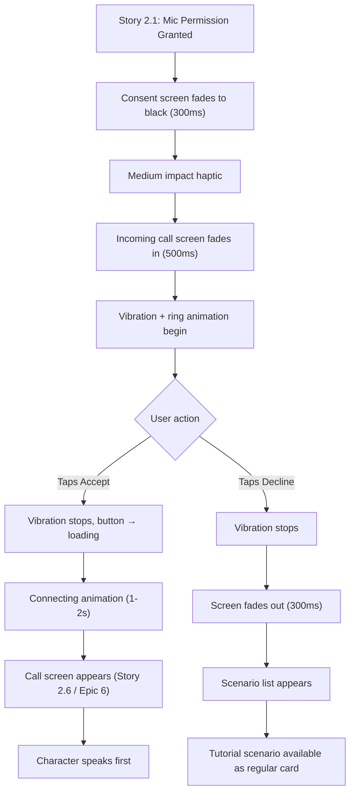

# Incoming Call Screen Design

**Author:** Dev Agent (Claude Opus 4.6)
**Date:** 2026-04-01
**Story:** 2.2 — Design First-Call Incoming Call Animation
**Status:** Done
**Consumed by:** Epic 4, Story 4.5 (Build First-Call Incoming Call Experience) and Epic 6 (call screen transitions)

---

## Design Token Reference

All color and spacing values reference tokens from the UX Design Specification and Story 2.1 onboarding design. Typography uses Inter exclusively — no Frijole on this screen.

### Colors

| Token | Hex | Usage on Incoming Call Screen |
|-------|-----|-------------------------------|
| `background` | `#1E1F23` | Screen background |
| `text-primary` | `#F0F0F0` | Character name |
| `call-secondary` | `#C6C6C8` | Role, "Calling..." text, button labels (screen-specific) |
| `call-accept` | `#50D95D` | Accept button background |
| `call-decline` | `#FD3833` | Decline button background |
| `avatar-bg` | `#414143` | Character avatar background circle |

**Note on `call-secondary` (#C6C6C8):** This screen uses #C6C6C8 for secondary text rather than the system-wide `text-secondary` (#9A9AA5). The lighter gray provides a more native phone call aesthetic and improves contrast (9.8:1 vs 5.1:1 on background).

**Note on button colors:** This screen uses phone-native green (#50D95D) and red (#FD3833) rather than the system `accent` (#00E5A0) and `destructive` (#E74C3C). These match the standard iOS/Android phone call button colors for maximum real-phone illusion.

### Typography

| Style | Font | Size | Weight | Usage |
|-------|------|------|--------|-------|
| `call-name` | Inter | 38px | Regular (400) | Character name (top of screen) |
| `call-role` | Inter | 16px | Regular (400) | Character role below name |
| `call-status` | Inter | 24px | Regular (400) | "Calling..." below avatar |
| `call-button-label` | Inter | 14px | Regular (400) | "Accept", "Decline" labels |

### Spacing

| Property | Value |
|----------|-------|
| Base unit | 8px |
| Screen padding horizontal | 20px |
| Button row horizontal padding | 30px |
| Touch target minimum | 44px |

---

## Screen Layout

### Purpose

Simulated incoming call screen shown **only once** — immediately after the user grants microphone permission during first-time onboarding (Story 2.1 Transition 3 handoff). This is the user's first real interaction with the product. The screen mimics a native FaceTime/WhatsApp incoming call to trigger a visceral, real-feeling "phone ringing" moment.

Every subsequent call is user-initiated from the scenario list. This screen is never shown again.

### Screen Layout Diagram

```
┌──────────────────────────────────────┐
│          SafeArea (top)              │
│                                      │
│             ~40px gap                │
│                                      │
│           "Bethany"                  │  Inter Regular 38px
│            centered                  │  #F0F0F0
│                                      │
│           "Girlfriend"               │  Inter Regular 16px
│            centered                  │  #C6C6C8
│                                      │
│                                      │
│          flex spacer                 │  Distributes vertical space
│                                      │
│                                      │
│       ┌────────────────────┐         │
│       │  Ring Animation    │         │  Expanding concentric
│       │  (pulsing circles) │         │  rings around avatar
│       │ ┌────────────────┐ │         │
│       │ │                │ │         │
│       │ │   Character    │ │         │  120x120 circle avatar
│       │ │    Avatar      │ │         │  centered horizontally
│       │ │                │ │         │
│       │ └────────────────┘ │         │
│       └────────────────────┘         │
│                                      │
│            16px gap                  │
│                                      │
│          "Calling..."                │  Inter Regular 24px
│            centered                  │  #C6C6C8
│                                      │
│                                      │
│          flex spacer                 │  Distributes vertical space
│                                      │
│                                      │
│  ┌──────────┐          ┌──────────┐  │  60x60 circles
│  │ Decline  │          │  Accept  │  │  Row: spaceBetween
│  │   🔴     │          │   🟢     │  │  H padding: 30px
│  └──────────┘          └──────────┘  │
│   "Decline"             "Accept"     │  Inter Regular 14px #C6C6C8
│                                      │
│            ~50px bottom padding      │
│          SafeArea (bottom)           │
└──────────────────────────────────────┘
```

### Z-Order (Back to Front)

1. **z0:** Screen background `#1E1F23` (solid fill)
2. **z1:** Content column (all foreground elements)
3. **z2:** Ring animation — expanding concentric circles around avatar (animated, behind avatar)
4. **z3:** Character avatar circle
5. **z4:** Character name text (top)
6. **z5:** Character role text
7. **z6:** "Calling..." status text
8. **z7:** Accept and Decline buttons
9. **z8:** Button labels

### Character Name (Subtask 1.3)

| Property | Value |
|----------|-------|
| Content | Character name from tutorial scenario (e.g., "Bethany") |
| Font family | Inter |
| Font weight | Regular (400) |
| Font size | 38px (`call-name`) |
| Color | `#F0F0F0` (`text-primary`) |
| Text alignment | Center |
| Position | Top of content column, below SafeArea + top spacer |
| Max lines | 1 |
| Overflow | Ellipsis (safety — names should be short) |

**Design rationale:** The large 38px name at the top of the screen immediately identifies WHO is calling, matching the native phone call pattern where the caller identity is the most prominent element. Regular weight keeps it clean and readable at this size.

### Character Role (Subtask 1.4)

| Property | Value |
|----------|-------|
| Content | Character's scenario role (e.g., "Girlfriend", "Mugger", "Waiter") |
| Font family | Inter |
| Font weight | Regular (400) |
| Font size | 16px (`call-role`) |
| Color | `#C6C6C8` (`call-secondary`) |
| Text alignment | Center |
| Position | Directly below character name, minimal gap (~4px) |

**Design rationale:** The role line provides scenario context — the user instantly knows both WHO is calling and WHAT their relationship is. This mirrors native phone UIs that show the contact type below the name (e.g., "mobile", "work"). The lighter #C6C6C8 color creates clear visual hierarchy: name (primary) → role (secondary).

**Overflow handling:** Max lines: 1, overflow: ellipsis. Scenario authors (Epic 3) should keep role text under 25 characters to avoid truncation on 320px screens.

### Character Avatar (Subtask 1.2)

| Property | Value |
|----------|-------|
| Shape | Circle |
| Diameter | 120px |
| Background | `#414143` (`avatar-bg`) |
| Content | Character illustration (same as scenario card avatar, scaled up) |
| Border | None (ring animation provides visual boundary) |
| Position | Centered horizontally, centered vertically between name/role and buttons (flex layout) |
| Shadow | None — flat design, consistent with app aesthetic |

**Design rationale:** 120px diameter is 2.4x the scenario card avatar (50px), making the character identity immediately recognizable at a glance. Centering the avatar vertically in the middle section creates a balanced composition with name/role at top and buttons at bottom.

**Character identity for first call:** The first-call scenario is the tutorial scenario (TBD by Epic 3). The avatar shows that character's illustration. The character name and role display at the top.

**Avatar fallback (image load failure):** If the character illustration fails to load (network error, corrupted cache), display the character's first initial as a text fallback — Inter Regular 48px `#F0F0F0` centered on the `#414143` circle background. The ring animation continues normally around the fallback initial.

### Calling Status Text

| Property | Value |
|----------|-------|
| Content | "Calling..." |
| Font family | Inter |
| Font weight | Regular (400) |
| Font size | 24px (`call-status`) |
| Color | `#C6C6C8` (`call-secondary`) |
| Text alignment | Center |
| Position | 16px below avatar bottom edge |

**Design rationale:** "Calling..." positioned below the avatar creates a visual anchor point — the user's eye flows from name (top) → avatar (center) → status (below avatar) → buttons (bottom). The 24px size is large enough to be immediately readable but secondary to the 38px name.

### Layout Specification Table (Subtask 1.5)

| Element | Position | Width | Height | Padding/Gap | Notes |
|---------|----------|-------|--------|-------------|-------|
| Screen background | Fill | 100% | 100% | — | `#1E1F23` solid |
| Top spacer | Column child 1 | — | ~40px | — | Gap between SafeArea and name |
| Character name | Column child 2 | Auto | ~46px | — | Inter Regular 38px, centered |
| Character role | Column child 3 | Auto | ~20px | T: 4px | Inter Regular 16px #C6C6C8, centered |
| Upper flex spacer | Column child 4 | — | Flexible | — | Distributes space above avatar |
| Ring animation container | Column child 5 | 180px | 180px | — | Centered, contains avatar + rings |
| Character avatar | Center of ring container | 120px | 120px | — | `#414143` circle |
| "Calling..." text | Column child 6 | Auto | ~30px | T: 16px | Inter Regular 24px #C6C6C8, centered |
| Lower flex spacer | Column child 7 | — | Flexible | — | Distributes space below status |
| Button row | Column child 8 | Screen width | 60px | H: 30px | Row with spaceBetween, Decline (left) + Accept (right) |
| Button labels row | Column child 9 | Screen width | ~18px | H: 30px, T: 8px | "Decline" (left) + "Accept" (right), same alignment as buttons |
| Bottom spacer | Column child 10 | — | ~50px | — | Before SafeArea bottom |

### Responsive Behavior (Subtask 1.6)

| Screen Width | Behavior |
|-------------|----------|
| 320px (iPhone SE) | Name 38px fits comfortably (~220px needed). Buttons 60px + 30px padding each side leaves ample gap. Flex spacers compress but layout remains balanced. |
| 375px (iPhone 14) | Primary target. All elements comfortable. Generous spacing between name, avatar, and buttons. |
| 430px (iPhone Pro Max) | Extra breathing room. No layout changes. Buttons further apart due to spaceBetween. |

**Vertical adaptation:** Two flex spacers (above and below avatar) distribute available vertical space equally, keeping the avatar centered regardless of screen height. On shorter screens (iPhone SE, 568pt), the spacers compress but all elements remain visible.

**No breakpoints needed.** Flutter's flex layout handles all variations naturally.

---

## Accept Button

### Button Specs (Subtask 2.1)

| Property | Value |
|----------|-------|
| Shape | Circle |
| Diameter | 60px |
| Background | `#50D95D` (`call-accept`) |
| Icon | Phone pickup icon (Material `phone` icon) |
| Icon size | 28px |
| Icon color | `#F0F0F0` (`text-primary`) |
| Label | "Accept" — Inter Regular 14px `#C6C6C8`, centered below button |
| Label gap | 8px below button |
| Touch target | 60px diameter (exceeds 44px minimum) |

### Button Position (Subtask 2.3)

| Property | Value |
|----------|-------|
| Horizontal position | Right side of button row |
| Button row layout | `Row` with `MainAxisAlignment.spaceBetween` |
| Button row horizontal padding | 30px (each side) |
| Vertical position | Bottom of content column, above bottom spacer (~50px + SafeArea from screen bottom) |

### Accept Button States (Subtask 2.2)

| State | Background | Icon | Label | Interaction |
|-------|-----------|------|-------|-------------|
| Default (calling) | `#50D95D` 100% | Phone `#F0F0F0` 28px | "Accept" `#C6C6C8` | Tappable |
| Pressed | `#50D95D` at 80% opacity | Phone `#F0F0F0` 28px | "Accept" `#C6C6C8` | Animating to loading |
| Loading (connecting) | `#50D95D` at 70% opacity | Replaced by 20px circular progress indicator `#F0F0F0` | "Connecting..." `#C6C6C8` | Non-interactive |

**Pressed → Loading transition:** On tap, the button immediately enters pressed state (80% opacity, 100ms), then transitions to loading state. The loading state persists until the call screen appears (1-2 seconds for pipeline initialization).

### Decline Button (Subtask 2.4)

| Property | Value |
|----------|-------|
| Shape | Circle |
| Diameter | 60px |
| Background | `#FD3833` (`call-decline`) |
| Icon | Phone hang-up icon (Material `call_end` icon) |
| Icon size | 28px |
| Icon color | `#F0F0F0` (`text-primary`) |
| Label | "Decline" — Inter Regular 14px `#C6C6C8`, centered below button |
| Label gap | 8px below button |
| Touch target | 60px diameter (exceeds 44px minimum) |
| Horizontal position | Left side of button row |

**Decline Button States:**

| State | Background | Icon | Interaction |
|-------|-----------|------|-------------|
| Default | `#FD3833` 100% | `call_end` `#F0F0F0` | Tappable |
| Pressed | `#FD3833` at 80% opacity | `call_end` `#F0F0F0` | Triggers decline flow |

**Design decision — Why include a Decline button:**
- Native FaceTime and WhatsApp incoming calls always show Accept and Decline buttons.
- Omitting Decline would break the native call illusion, which is the primary design goal for this screen.
- Decline behavior: stops the vibration, transitions to the scenario list. The tutorial scenario appears as a regular card on the scenario list, available to call anytime.
- The user does NOT lose their "first call" — they can tap the tutorial scenario from the list whenever they want.

**Design decision — Decline does NOT punish:**
- No confirmation dialog ("Are you sure?")
- No guilt trip ("You'll miss out!")
- No negative messaging
- Clean, silent transition to scenario list
- Matches the "no dark patterns" principle from UX spec

---

## Animation & Feedback

### Vibration Pattern (Subtask 3.1)

| Property | Value |
|----------|-------|
| Pattern type | Custom pulsed pattern mimicking phone ring |
| Cycle | Vibrate 800ms → Pause 400ms → Vibrate 800ms → Pause 1600ms |
| Cycle duration | 3600ms total per ring cycle |
| Repeat | Continuous loop until Accept or Decline |
| Start trigger | Screen fully visible (after 500ms fade-in from Story 2.1 Transition 3) |
| Stop trigger | User taps Accept or Decline |
| Intensity | Default device vibration intensity |

**Pattern rationale:** This mimics a standard phone ring pattern — two short rings separated by a brief gap, then a longer pause before the next ring. The 800ms vibrations are long enough to feel like a real phone ring but short enough to avoid annoyance. The 1600ms inter-cycle pause creates the rhythm of waiting between rings.

**Flutter implementation:** Use `HapticFeedback` for the medium impact on entry, then `Vibration` package for the custom pattern. On iOS, haptic pattern support is limited — use a timer-based approach with repeated `HapticFeedback.mediumImpact()` calls matching the timing. On Android, use `Vibration.vibrate(pattern: [0, 800, 400, 800, 1600], repeat: 0)`.

### Ring Animation (Subtask 3.2)

| Property | Value |
|----------|-------|
| Type | Expanding concentric circles (ripple effect) around avatar |
| Ring count | 3 rings visible simultaneously |
| Ring color | `#50D95D` (`call-accept`) |
| Ring initial opacity | 40% |
| Ring final opacity | 0% (fades out as it expands) |
| Ring initial diameter | 120px (same as avatar — starts at avatar edge) |
| Ring final diameter | 180px (30px expansion beyond avatar on each side) |
| Ring border width | 2px |
| Ring fill | None (stroke only) |
| Animation duration | 2000ms per ring (expand + fade) |
| Ring stagger | 667ms between each ring start (3 rings, evenly staggered within 2000ms cycle) |
| Easing | `Curves.easeOut` (fast start, slow end — natural ripple) |
| Loop | Continuous until Accept or Decline |

**Visual effect:** Three concentric circles continuously expand outward from the avatar's edge, each fading to transparent as it reaches maximum size. This creates a pulsing "calling" visual that draws the eye to the character without obscuring the avatar. The accept green color (#50D95D) reinforces the call association.

**Ring animation container:** 180x180px centered on the avatar. The avatar (120px) sits in the center. The rings expand from 120px to 180px diameter, staying within the container.

### Animation Loop Timing (Subtask 3.3)

| Animation | Duration | Loop | Sync |
|-----------|----------|------|------|
| Ring expansion (per ring) | 2000ms | Continuous | Staggered 667ms — independent loop |
| Vibration cycle | 3600ms | Continuous | Independent loop |
| Avatar subtle scale pulse | 3600ms | Continuous | Synced to vibration cycle |

**Synchronization note:** Ring animation (2000ms cycle) and vibration pattern (3600ms cycle) run on **independent loops** — they are not synchronized and will drift relative to each other. This is intentional: the visual rings provide continuous "calling" feedback while the vibration mimics a phone ring cadence. The avatar scale pulse is the only animation explicitly synced to the vibration cycle (both 3600ms).

**Avatar scale pulse:** Subtle breathing effect on the avatar — scales from 1.0 to 1.02 and back, synchronized with the vibration ring cycle. This creates a barely perceptible "pulse" that reinforces the ringing sensation subconsciously.

| Property | Value |
|----------|-------|
| Scale minimum | 1.0 |
| Scale maximum | 1.02 |
| Duration | 3600ms (matches vibration cycle) |
| Easing | `Curves.easeInOut` |

### Audio Consideration (Subtask 3.4)

**Design decision: No ringtone audio.**

| Consideration | Decision | Rationale |
|---------------|----------|-----------|
| Play a ringtone sound | **No** | The device vibration pattern is sufficient to create the incoming call sensation. Adding audio creates several problems: (1) the user may have their phone on silent, creating inconsistent experiences; (2) a custom ringtone sound file adds asset weight; (3) the vibration alone, combined with the visual ring animation, achieves the "visceral, real-feeling" goal without audio. |
| System ringtone | **No** | Cannot reliably trigger the device's actual ringtone. Would require platform-specific APIs and may conflict with Do Not Disturb settings. |
| Future consideration | **Optional** | If user testing reveals that the experience feels incomplete without audio, a short custom ringtone sound (2-3 second loop) could be added as a post-MVP enhancement. The design accommodates this without layout changes. |

---

## Transitions

### Entry Transition — From Story 2.1 Transition 3 (Subtask 4.1)

This screen picks up exactly where Story 2.1's Transition 3 ends.

**Complete entry sequence:**

| Step | Time | Action | Detail |
|------|------|--------|--------|
| 0 | 0ms | Mic permission granted | System dialog dismisses |
| 1 | 0ms | Medium impact haptic | `HapticFeedback.mediumImpact()` — signals transition |
| 2 | 0-300ms | Consent screen fades to black | Opacity 1.0 → 0.0 on consent screen, 300ms, `Curves.easeIn` |
| 3 | 300ms | Black screen (screen background visible) | `#1E1F23` background — brief scene break |
| 4 | 300-800ms | Incoming call screen fades in | Opacity 0.0 → 1.0, 500ms, `Curves.easeOut` |
| 5 | 800ms | Screen fully visible | All elements at full opacity |
| 6 | 800ms | Vibration begins | Custom pulse pattern starts |
| 7 | 800ms | Ring animation begins | Concentric circles start expanding |
| 8 | 800ms | Avatar pulse begins | Subtle scale animation starts |

**Total entry transition:** 800ms (300ms fade-out + 500ms fade-in)

**Visual continuity:** The fade-through-black creates an intentional scene break — the user is leaving the "setup" phase (email → consent → mic) and entering the "experience" phase (phone is calling). This is the moment the product reveals itself.

**Emotional design:** The medium impact haptic at step 1 creates a physical sensation that bridges the visual gap during the fade. The user feels something happen before they see the incoming call screen — mimicking the feeling of a phone vibrating in your pocket before you look at it.

### Exit Transition — Accept Tap (Subtask 4.2)

| Step | Time | Action | Detail |
|------|------|--------|--------|
| 0 | 0ms | User taps Accept | Button enters pressed state (80% opacity) |
| 1 | 100ms | Button enters loading state | Spinner replaces icon, label changes to "Connecting..." |
| 2 | 100ms | Vibration stops | Pattern canceled immediately |
| 3 | 100ms | Ring animation stops | Rings fade out (200ms, `Curves.easeOut`) |
| 4 | 100-200ms | Avatar pulse stops | Returns to scale 1.0 |
| 5 | 200ms | Connecting animation begins | Full-screen transition to call connection view |
| 6 | 200-1500ms | "Connecting..." phone dial animation | Mimics real phone dialing (1-2s). Masks LiveKit connection + Pipecat session setup |
| 7 | 1500-2000ms | Call screen appears | Character face appears, connection animation dissolves. Character speaks first. |

**Connecting animation spec:**

| Property | Value |
|----------|-------|
| Type | Fade transition — incoming call screen fades to call screen |
| Duration | 300ms crossfade |
| Intermediate state | Brief "Connecting..." text centered on `#1E1F23` background (if pipeline needs > 500ms) |
| Connecting text | "Connecting..." — Inter Regular 24px `#C6C6C8`, centered |
| Connecting indicator | Three-dot pulsing animation below text (standard connecting pattern) |
| Maximum wait | 5 seconds — if pipeline fails to connect, show error and return to scenario list |

**Pipeline initialization masking:** The connecting animation holds for as long as needed (typically 1-2 seconds) while LiveKit establishes the WebRTC connection and Pipecat initializes the voice pipeline. The animation only advances to the call screen when the pipeline signals ready.

**Minimum display duration:** The connecting animation is always displayed for at least **1 second**, even if the pipeline connects faster. This prevents a jarring instant transition and gives the user time to register the state change (incoming call → connecting → call). If the pipeline connects in <1s, the animation holds until the 1s minimum elapses, then transitions to the call screen.

### Exit Transition — Decline Tap (Subtask 4.3)

| Step | Time | Action | Detail |
|------|------|--------|--------|
| 0 | 0ms | User taps Decline | Button enters pressed state (80% opacity) |
| 1 | 100ms | Vibration stops | Pattern canceled immediately |
| 2 | 100ms | Ring animation stops | Rings fade out immediately |
| 3 | 100-400ms | Screen fades out | Opacity 1.0 → 0.0, 300ms, `Curves.easeIn` |
| 4 | 400ms | Navigate to scenario list | Standard `MaterialPageRoute` transition |
| 5 | 400-700ms | Scenario list fades in | Standard Material push transition (300ms) |

**Post-decline state:**
- The user is considered **fully onboarded** — account is created, onboarding is complete
- The declined call does **NOT** count against the free call limit (3 calls)
- Scenario list is shown with the tutorial scenario visible as a regular card
- If scenario data is not yet loaded (first launch), the scenario list shows its standard loading state (spinner) until data arrives
- Tutorial scenario shows "not attempted" state (2 lines, no stats)
- User can tap the phone icon on the tutorial scenario to start the call at any time
- No special messaging about the declined call — the scenario just sits there, waiting
- The incoming call screen is never shown again — declined or not

### Transition Timing Summary (Subtask 4.4)

| Transition | Duration | Easing | Haptic |
|-----------|----------|--------|--------|
| Entry fade-out (consent → black) | 300ms | `Curves.easeIn` | Medium impact at start |
| Entry fade-in (black → incoming call) | 500ms | `Curves.easeOut` | None (vibration starts at end) |
| Accept → loading state | 100ms | Linear | None |
| Accept → connecting animation | 300ms | `Curves.easeInOut` | None |
| Connecting → call screen | 300ms | `Curves.easeOut` | None (character speaks) |
| Decline → fade out | 300ms | `Curves.easeIn` | None |
| Decline → scenario list | 300ms | Material default | None |

---

## Accessibility

### WCAG 2.1 AA Contrast Verification (Subtask 5.1)

| Combination | Ratio | Status |
|-------------|-------|--------|
| `text-primary` (#F0F0F0) on `background` (#1E1F23) | 13.5:1 | Pass AA & AAA |
| `call-secondary` (#C6C6C8) on `background` (#1E1F23) | 9.8:1 | Pass AA & AAA |
| `call-accept` (#50D95D) on `background` (#1E1F23) | 8.0:1 | Pass AA & AAA |
| `call-decline` (#FD3833) on `background` (#1E1F23) | 4.6:1 | Pass AA |
| Accept icon (#F0F0F0) on `call-accept` (#50D95D) | 1.7:1 | Below AA text threshold |
| Decline icon (#F0F0F0) on `call-decline` (#FD3833) | 3.2:1 | Pass non-text (SC 1.4.11) |

**Icon contrast note:** The white phone icon on the green Accept button (#50D95D) has a 1.7:1 contrast ratio, which is below the WCAG AA text threshold. However:
1. This follows the **native iOS/Android phone call UI pattern** (FaceTime, WhatsApp both use white icons on green/red)
2. The icon meaning is conveyed by **shape** (phone icon) and **context** (position, color), not by contrast alone
3. WCAG SC 1.4.11 (non-text contrast) applies to "essential" graphics — the button color and position already convey the accept/decline semantic
4. All button labels below the circles ("Accept", "Decline" in #C6C6C8) pass AA at 9.8:1 on background

### Touch Targets

| Element | Visual Size | Touch Area | Min Required (44px) | Status |
|---------|-----------|-----------|---------------------|--------|
| Accept button | 60x60px circle | 60x60px | 44px | Pass |
| Decline button | 60x60px circle | 60x60px | 44px | Pass |
| Accept label "Accept" | ~46x18px | Extends Accept button touch area | 44px | Pass (part of button) |
| Decline label "Decline" | ~50x18px | Extends Decline button touch area | 44px | Pass (part of button) |

**Button + label as single touch target:** The label below each button is part of the button's interactive area. Tapping either the circle or the label triggers the same action.

### Screen Reader Announcements (Subtask 5.2)

| Element | VoiceOver/TalkBack Announcement |
|---------|--------------------------------|
| Screen (on appear) | "Calling [Character Name], [Role]. Double tap Accept to pick up, or Decline to dismiss." |
| Character name | "[Character Name]" |
| Character role | "[Role]" |
| Character avatar | "Profile picture of [Character Name]" |
| Calling status | "Calling" |
| Accept button | "Accept call, button" |
| Decline button | "Decline call, button" |
| Loading state (after Accept tap) | "Connecting call" |

**Live region:** The screen announcement fires as a live region **500ms after** the incoming call screen becomes fully visible (at the 1300ms mark of the overall entry sequence). This delay ensures the vibration feedback is perceived first, and the announcement does not compete with the initial haptic sensation.

**Reduced motion:** When system "Reduce Motion" is ON:
- Ring animation: replaced by a static green ring border (2px `#50D95D`) around the avatar at 180px diameter. No animation.
- Avatar scale pulse: disabled. Avatar remains at scale 1.0.
- Button pressed state: opacity change still applies (instant, no animation). No easing.
- Connecting animation: crossfade replaced by instant cut. Spinner replaced by static "Connecting..." text only.
- Screen transitions (entry fade-in 500ms, decline fade-out 300ms): reduced to instant cuts (0ms). The screen appears/disappears without fade.
- Vibration: unchanged (haptic feedback is not affected by Reduce Motion).

### Incoming Call in Context — Flow Diagram (Subtask 5.3)



### VoiceOver / TalkBack Focus Order

| Order | Element | Semantic Role |
|-------|---------|---------------|
| 1 | Character name | Static text |
| 2 | Character role | Static text |
| 3 | Character avatar | Image (decorative — can be skipped if name is announced) |
| 4 | "Calling..." status | Static text |
| 5 | Decline button | Button |
| 6 | Accept button | Button |

**Rationale:** Focus order follows the visual hierarchy top-to-bottom: identity (who) → status (what's happening) → actions (what to do). Decline is ordered before Accept to match left-to-right reading order in the button row, matching the visual layout.

### Design Token Cross-Reference (Subtask 5.4)

| Token Used | Source | Match with UX Spec |
|------------|--------|-------------------|
| `background` #1E1F23 | UX Spec: Color System | Exact match |
| `text-primary` #F0F0F0 | UX Spec: Color System | Exact match |
| `call-secondary` #C6C6C8 | Final design (Walid) | Screen-specific — lighter than system `text-secondary` (#9A9AA5) for native call aesthetic |
| `call-accept` #50D95D | Final design (Walid) | Screen-specific — native phone green, differs from system `accent` (#00E5A0) |
| `call-decline` #FD3833 | Final design (Walid) | Screen-specific — native phone red, differs from system `destructive` (#E74C3C) |
| `avatar-bg` #414143 | UX Spec: Core Palette | Exact match |
| `call-name` 38px Regular | Final design (Walid) | Screen-specific — larger than system `headline` (18px SemiBold) for call screen prominence |
| `call-role` 16px Regular | Final design (Walid) | Screen-specific — new element for character context |
| `call-status` 24px Regular | Final design (Walid) | Screen-specific — "Calling..." status text |
| `call-button-label` 14px Regular | Final design (Walid) | Screen-specific — button labels |
| Button size 60x60px | Final design (Walid) | Screen-specific — slightly smaller than call screen hang-up (64px) |
| Button row padding 30px | Final design (Walid) | Screen-specific |
| Touch target minimum 44px | UX Spec: Accessibility | Met (60px > 44px) |

**Design system note:** This screen introduces screen-specific tokens that intentionally differ from the system-wide design tokens. The incoming call screen is a special one-time experience that mimics native phone UI — its visual language prioritizes phone-call realism over app-wide consistency. The system tokens remain unchanged; these call-specific values are scoped to this screen only.

---

## Flutter Widget Mapping

| Design Element | Flutter Widget | Notes |
|---------------|---------------|-------|
| Screen root | `Scaffold` with `backgroundColor: #1E1F23` | No AppBar, full-screen |
| Content layout | `Column` with `MainAxisAlignment.start` | Vertical stack of all elements |
| Top spacer | `SizedBox(height: 40)` | Gap below SafeArea |
| Character name | `Text` with Inter Regular 38px `#F0F0F0` | Centered |
| Character role | `Text` with Inter Regular 16px `#C6C6C8` | Centered, 4px below name |
| Upper flex spacer | `Spacer()` | Pushes avatar to center |
| Ring animation container | `SizedBox(width: 180, height: 180)` + `Stack` | Contains avatar + animated rings |
| Ring animation | Custom `AnimatedBuilder` with `CustomPainter` | 3 concentric circles, staggered animation, `#50D95D` |
| Character avatar | `CircleAvatar(radius: 60, backgroundColor: #414143)` | 120px diameter |
| "Calling..." text | `Text` with Inter Regular 24px `#C6C6C8` | 16px below avatar, centered |
| Lower flex spacer | `Spacer()` | Pushes buttons to bottom |
| Button row | `Row` with `MainAxisAlignment.spaceBetween` | Padding horizontal: 30px |
| Accept button | `GestureDetector` + `Container` (circle) | 60px, `#50D95D` bg, phone icon `#F0F0F0` |
| Decline button | `GestureDetector` + `Container` (circle) | 60px, `#FD3833` bg, call_end icon `#F0F0F0` |
| Button labels | `Text` with Inter Regular 14px `#C6C6C8` | Below each button, 8px gap, same Row alignment |
| Bottom spacer | `SizedBox(height: 50)` + `SafeArea` | Bottom padding |
| Entry transition | `FadeTransition` (from Navigator) | 500ms, `Curves.easeOut` |
| Vibration | `Vibration` package / `HapticFeedback` | Custom pattern, platform-adaptive |
| Connecting state | `AnimatedSwitcher` on button content | Swaps icon for spinner |

### File Locations (per Architecture)

| File | Path |
|------|------|
| Incoming call screen | `client/lib/features/onboarding/views/incoming_call_screen.dart` |
| Ring animation widget | `client/lib/features/onboarding/widgets/ring_animation.dart` |
| Color tokens | `client/lib/core/theme/app_colors.dart` |
| Typography tokens | `client/lib/core/theme/app_typography.dart` |
| Theme configuration | `client/lib/core/theme/app_theme.dart` |
| Navigation (GoRouter) | `client/lib/core/navigation/app_router.dart` |

---

## Open Questions for Review

1. **First-call character identity:** Which character appears on the first incoming call? The screenshot uses "Bethany" / "Girlfriend" as example. The tutorial scenario character needs to be defined in Epic 3 (Scenario Content). The design is character-agnostic — any character name + role can be plugged in.

2. **Decline button inclusion:** This design includes full specs for both Accept and Decline buttons. Stakeholder to confirm whether the Decline button should be included (native call realism) or removed (force first-call engagement). If removed, the Accept button centers in the button row and all Decline-related specs (button, states, exit transition) are dropped.

3. **Connecting animation detail:** The "Connecting..." intermediate state between Accept tap and call screen appearance needs visual refinement during Epic 4/6 implementation. The current spec defines text + pulsing dots, but a more elaborate phone-dial animation could be designed. This is a polish item.

4. **Audio ringtone:** The current design omits ringtone audio (vibration only). If user testing shows the experience needs audio to feel "real enough," a short ringtone loop could be added without design changes.
