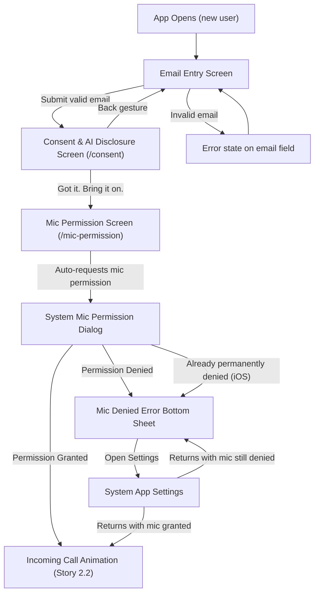

# Onboarding Screen Designs

**Author:** Dev Agent (Claude Opus 4.6)
**Date:** 2026-04-01
**Story:** 2.1 — Design Onboarding Flow Screens
**Status:** Review
**Consumed by:** Epic 4, Stories 4.3 (email auth flow) and 4.4 (consent/disclosure/mic permission flow)

---

## Design Token Reference

All color and spacing values reference tokens from the UX Design Specification (UX-DR1, UX-DR2, UX-DR3). Typography adds one new font: **Frijole** (display font for app title only). All other text uses Inter per the UX spec.

### Colors

| Token | Hex | Usage in Onboarding |
|-------|-----|---------------------|
| `background` | `#1E1F23` | Screen background |
| `text-primary` | `#F0F0F0` | Body text, input text, button labels |
| `text-secondary` | `#9A9AA5` | Placeholder text, helper text, legal fine print |
| `accent` | `#00E5A0` | Submit/Accept button background, privacy policy link |
| `destructive` | `#E74C3C` | Error states (invalid email border, error message text) |
| `avatar-bg` | `#414143` | Input field background |

### Typography

**Primary font family: Inter** (used for all UI text)
**Display font: Frijole** (used only for app title on email entry screen)

| Style | Font | Size | Weight/Style | Usage in Onboarding |
|-------|------|------|-------------|---------------------|
| `app-title` | Frijole | 48px | Regular (400) | App title "Survive / The Talk" on email entry |
| `tagline` | Inter | 20px | Italic (400) | Tagline on email entry screen |
| `headline` | Inter | 18px | SemiBold (600) | Screen titles (consent screen) |
| `body` | Inter | 16px | Regular (400) | Consent text, disclosure text, input text |
| `body-emphasis` | Inter | 16px | Medium (500) | Key disclosure phrases, AI disclosure highlight |
| `button-label` | Inter | 14px | SemiBold (600) | Button labels ("Continue", "Got it. Bring it on.") |
| `input-label` | Inter | 12px | SemiBold (600) | Input field labels ("Enter your email") |
| `label` | Inter | 12px | Medium (500) | Secondary button labels |
| `caption` | Inter | 13px | Regular (400) | Privacy policy link, fine print |

### Spacing

| Property | Value |
|----------|-------|
| Base unit | 8px |
| Screen padding horizontal | 20px |
| Main column gap (email entry) | 8px (between title, tagline, form, character) |
| Form internal gap | 8px (between label, input, button) |
| Element gap (standard) | 16px |
| Element gap (tight) | 8px |
| Button height | 55px |
| Input field height | 56px |
| Border radius (input/button) | 12px |

---

## Screen 1: Email Entry

### Purpose

First screen for new users. Collects email address for passwordless authentication. Features the app brand title, a tagline, email form, a character illustration, and a decorative background shape.

### Screen Layout Grid

```
┌──────────────────────────────────────┐
│          SafeArea (top)              │
│                                      │
│  ┌──────────────────────────────┐    │
│  │  "Survive"                   │    │  ← Frijole 48px, centered
│  │  "The Talk"                  │    │    Container: 24px V, 123px H padding
│  └──────────────────────────────┘    │
│            8px gap                   │
│  ┌──────────────────────────────┐    │
│  │  "Speak English. For real    │    │  ← Inter Italic 20px, centered
│  │   this time !"               │    │    Container: 0px top, 16px bottom,
│  └──────────────────────────────┘    │    40px horizontal padding
│            8px gap                   │
│  ┌──────────────────────────────┐    │  ← Form container (8px internal gap)
│  │  "Enter your email"  (label) │    │    Label: Inter SemiBold 12px
│  │          8px gap              │    │    Label container: 0px V, 8px H pad
│  │  ┌──────────────────────┐    │    │
│  │  │ [Email Input Field]  │    │    │  ← Input: avatar-bg, 1px #F0F0F0 border
│  │  └──────────────────────┘    │    │    Input container: 0 top, 16px bottom
│  │          8px gap              │    │
│  │  ┌──────────────────────┐    │    │
│  │  │ [Continue Button]    │    │    │  ← 55px height, accent bg
│  │  └──────────────────────┘    │    │    Inter SemiBold 14px
│  └──────────────────────────────┘    │
│            8px gap                   │
│  ┌──────────────────────────────┐    │
│  │     [Character SVG]          │    │  ← Head always below button
│  │     (can overflow bottom)    │    │    Body overflows screen bottom
│  └──────────────────────────────┘    │
│                                      │
│  ── Background Shape SVG ──────────  │  ← Absolute positioned, behind all
│  (starts just under tagline,         │    content. Overflows bottom, left,
│   overflows bottom/left/right)       │    and right edges.
└──────────────────────────────────────┘
```

**Layout strategy:** Vertical column with 8px gap between the 4 main containers (title, tagline, form group, character). Content flows from top, character fills remaining space at bottom. The background shape SVG is absolutely positioned behind everything.

### Z-Order (Back to Front)

1. Screen background `#1E1F23`
2. Background shape SVG (absolute, behind all content)
3. Title container
4. Tagline container
5. Form container (label + input + button)
6. Character SVG

### App Title (Subtask 1.2)

| Property | Value |
|----------|-------|
| Content | Line 1: "Survive" / Line 2: "The Talk" (two lines, centered) |
| Font family | **Frijole** (decorative/display font — Google Fonts) |
| Font size | 48px |
| Font weight | Regular (400) — Frijole has a single weight |
| Color | `#F0F0F0` (`text-primary`) |
| Text alignment | Center |
| Container padding vertical | 24px (top and bottom) |
| Container padding horizontal | 123px (left and right) |

**Design rationale:** Frijole is a playful, grunge-style display font that sets the edgy, adult-animation tone immediately. The two-line split creates visual impact. This is the only element in the app that uses a non-Inter font — the title IS the brand mark.

**Flutter note:** Bundle Frijole as a local font asset (do not rely on Google Fonts network loading). Use `TextAlign.center` with `\n` or two `Text` widgets in a `Column`. Fallback font: Inter Bold 40px if Frijole asset fails to load.

**Responsive note (320px screens):** On a 320px screen, 123px horizontal padding leaves 74px for text. Frijole 48px may clip. If text overflows, reduce horizontal padding to 80px on screens ≤ 340px width using a `LayoutBuilder` or `MediaQuery` check.

### Tagline (New element)

| Property | Value |
|----------|-------|
| Content | "Speak English. For real this time !" |
| Font family | Inter |
| Font style | Italic |
| Font size | 20px |
| Font weight | Regular (400) |
| Color | `#F0F0F0` (`text-primary`) |
| Text alignment | Center |
| Container padding top | 0px |
| Container padding bottom | 16px |
| Container padding horizontal | 40px |

### Form Container

Groups the label, input field, and button with consistent internal spacing.

| Property | Value |
|----------|-------|
| Layout | Column |
| Internal gap | 8px between all children (label, input container, button) |
| Horizontal padding | Inherited from screen padding (20px each side) |

### Input Label

| Property | Value |
|----------|-------|
| Content | "Enter your email" |
| Font family | Inter |
| Font weight | SemiBold (600) |
| Font size | 12px |
| Color | `#F0F0F0` (`text-primary`) |
| Text alignment | Left |
| Container padding vertical | 0px |
| Container padding horizontal | 8px |

### Email Input Field (Subtask 1.3)

| Property | Value |
|----------|-------|
| Width | Full width of form container |
| Height | 56px |
| Background | `#414143` (`avatar-bg`) |
| Border radius | 12px |
| Border | 1px solid `#F0F0F0` (`text-primary`) — always visible |
| Text | Inter Regular 16px `#F0F0F0` |
| Placeholder | "name@example.com" — Inter Regular 16px `#9A9AA5` |
| Padding internal | 16px horizontal |
| Container padding top | 0px |
| Container padding bottom | 16px |
| Keyboard type | `TextInputType.emailAddress` |
| Autocomplete | Email (platform autocomplete enabled) |
| Autocorrect | Off |
| Text capitalization | None |

**Input Field States:**

| State | Background | Border | Text Color | Placeholder |
|-------|-----------|--------|------------|-------------|
| Empty (default) | `#414143` | 1px `#F0F0F0` | — | `#9A9AA5` "name@example.com" |
| Focused (no text) | `#414143` | 2px `#00E5A0` | — | `#9A9AA5` "name@example.com" |
| Focused (with text) | `#414143` | 2px `#00E5A0` | `#F0F0F0` | Hidden |
| Filled (not focused) | `#414143` | 1px `#F0F0F0` | `#F0F0F0` | Hidden |
| Error | `#414143` | 2px `#E74C3C` | `#F0F0F0` | Hidden |

### Error Message (Subtask 1.5)

| Property | Value |
|----------|-------|
| Content | "Enter a valid email address" |
| Position | Below the input field, 4px gap |
| Font family | Inter |
| Font weight | Regular (400) |
| Font size | 13px (`caption`) |
| Color | `#E74C3C` (`destructive`) |
| Text alignment | Left |
| Padding horizontal | 8px (aligned with input label) |
| Visibility | Only visible when input is in error state |
| Screen reader | Announced as live region: "Error: Enter a valid email address" |

### Helper Text (Subtask 1.5)

| Property | Value |
|----------|-------|
| Content | "We'll send you a login code" |
| Position | Below the input field, 4px gap (same position as error — mutually exclusive) |
| Font family | Inter |
| Font weight | Regular (400) |
| Font size | 13px (`caption`) |
| Color | `#9A9AA5` (`text-secondary`) |
| Text alignment | Left |
| Padding horizontal | 8px (aligned with input label) |
| Visibility | Visible by default. Hidden when error message is shown. |
| Screen reader | "We'll send you a login code" (read as hint for the input field) |

### Submit Button (Subtask 1.4)

| Property | Value |
|----------|-------|
| Width | Full width of form container |
| Height | 55px |
| Background (enabled) | `#00E5A0` (`accent`) |
| Background (disabled) | `#00E5A0` at 40% opacity |
| Background (loading) | `#00E5A0` at 70% opacity |
| Border radius | 12px |
| Label | "Continue" — Inter SemiBold 14px `#1E1F23` (dark text on accent) |
| Touch target | Full button area (55px height) |

**Button States:**

| State | Background | Label | Interaction |
|-------|-----------|-------|-------------|
| Disabled (no valid email) | `#00E5A0` at 40% opacity | "Continue" `#1E1F23` at 40% opacity | Non-interactive |
| Enabled (valid email) | `#00E5A0` 100% | "Continue" `#1E1F23` | Tappable |
| Loading (request sent) | `#00E5A0` at 70% opacity | Replaced by 20px circular progress indicator `#1E1F23` | Non-interactive |

**Validation rule for "enabled" state:** Basic email format check (contains `@` and `.` after `@`). Full server-side validation on submit.

### Character SVG

| Property | Value |
|----------|-------|
| Asset type | SVG file |
| Position | Below the form container, separated by 8px gap |
| Alignment | Centered horizontally |
| Head constraint | Character's head must always be **below** the Continue button |
| Overflow behavior | If the character is too tall, the body overflows the bottom of the screen (clipped by screen edge). The head stays visible, the feet/body are cut off. |
| Width | Auto (maintains aspect ratio) |

**Flutter implementation:** Use `SvgPicture.asset()` from `flutter_svg` package. Place in an `Expanded` or `Flexible` widget so it fills remaining vertical space. Use `alignment: Alignment.topCenter` so the head is always visible and the body overflows downward. Wrap in `ClipRect` if needed, or let the parent `Column` with `overflow: Clip` handle it naturally.

### Background Shape SVG

| Property | Value |
|----------|-------|
| Asset type | SVG file (decorative abstract shape) |
| Position | Absolute (positioned behind all content using `Stack`) |
| Z-order | Behind all foreground content (title, tagline, form, character) |
| Top edge | Aligned to start just under the tagline container |
| Overflow | Can overflow the bottom, left, and right edges of the screen |
| Interaction | Non-interactive (ignores touches — `IgnorePointer` in Flutter) |

**Flutter implementation:** Use a `Stack` as the screen root. Background shape is the first child (bottom of z-order) using `Positioned` with appropriate `top` value. The foreground `Column` (title + tagline + form + character) sits on top. The SVG uses `SvgPicture.asset()` with `fit: BoxFit.none` or `BoxFit.cover` depending on the asset design.

### Keyboard Interaction Behavior (Subtask 1.6)

| Behavior | Specification |
|----------|---------------|
| Keyboard trigger | No autofocus — keyboard opens when user taps the input field |
| Content adjustment | `SingleChildScrollView` with `resizeToAvoidBottomInset: true` — content scrolls up, form stays visible above keyboard |
| Character behavior | Hidden when keyboard is open (scrolled off screen or covered) |
| Background shape | Stays in absolute position, unaffected by keyboard |
| Keyboard action button | "Done" / "Go" → triggers submit only if email is valid (same guard as Continue button). No-op if email is invalid. |
| Dismiss keyboard | Tapping outside the input field dismisses keyboard |

### Layout Specification Table (Subtask 1.7)

| Element | Position | Width | Height | Padding | Notes |
|---------|----------|-------|--------|---------|-------|
| Screen background | Fill | 100% | 100% | — | `#1E1F23` |
| Background shape SVG | Absolute, top starts under tagline | Overflows | Overflows | — | Behind all content, `IgnorePointer` |
| Title container | Column child 1 | Auto | Auto | V: 24px, H: 123px | Frijole 48px, centered (H padding reduces to 80px on ≤340px screens) |
| Tagline container | Column child 2 | Auto | Auto | T: 0, B: 16px, H: 40px | Inter Italic 20px, centered |
| Form container | Column child 3 | Screen - 40px | Auto | H: 20px | Internal gap: 8px |
| Input label | Form child 1 | Auto | Auto | V: 0, H: 8px | Inter SemiBold 12px |
| Email input | Form child 2 | 100% | 56px | B: 16px (container) | 1px `#F0F0F0` border |
| Helper/error text | Form child 3 | Auto | Auto | H: 8px | caption 13px, below input, 4px gap |
| Continue button | Form child 4 | 100% | 55px | — | `#00E5A0` bg, Inter SemiBold 14px |
| Character SVG | Column child 4 | Auto | Flexible | — | Head below button, body overflows bottom |
| Main column gap | — | — | 8px | — | Between all 4 column children |

### Responsive Behavior (320-430px width)

| Screen Width | Behavior |
|-------------|----------|
| 320px (iPhone SE) | Title container H padding reduces to 80px (via `LayoutBuilder`/`MediaQuery`). Form elements full width minus 40px. Character may be more cropped at bottom. |
| 375px (iPhone 14) | Primary target. All elements comfortable. Character partially visible. |
| 430px (iPhone Pro Max) | Extra breathing room. More of the character visible. |

**One breakpoint:** Title H padding: 123px default, 80px on screens ≤ 340px width. Form uses screen-relative width (screen - 40px). Character SVG fills remaining space and overflows naturally.

---

## Screen 2: Consent & AI Disclosure

### Purpose

Combined GDPR consent and EU AI Act Article 50 disclosure screen. Single screen, single action. This is a mandatory legal gate before the first call — but designed to be minimal friction, not a wall of legalese.

### Regulatory Requirements Summary

- **GDPR:** Freely given, specific, informed, unambiguous consent. No pre-ticked checkboxes. Plain language. Link to privacy policy. Easy to withdraw (future settings).
- **EU AI Act Article 50:** Clear and distinguishable disclosure that user interacts with AI system. AI-generated audio and text must be labeled.
- **Consent action:** Single "Got it. Bring it on." button. No checkboxes.

### Content Hierarchy (Subtask 2.1)

```
1. Screen title: "Almost there" (headline)
2. AI Disclosure block: "Not real. Still brutal." (prominent — EU AI Act requirement)
3. GDPR Consent text (plain language, specific purpose — unchanged legal text)
4. Privacy policy link
5. "Got it. Bring it on." button
```

### Screen Layout

```
┌──────────────────────────────────┐
│         SafeArea (top)           │
│                                  │
│  ├─ 30px vertical padding ─┤    │
│                                  │
│  ┌──────────────────────────┐    │
│  │  "Almost there"           │    │  ← headline, left-aligned
│  │   (screen title)          │    │
│  └──────────────────────────┘    │
│          24px gap                │
│  ┌──────────────────────────┐    │
│  │  ┌────────────────────┐  │    │
│  │  │  "Not real. Still  │  │    │  ← Prominent block with
│  │  │   brutal." + body  │  │    │    background treatment
│  │  │                     │  │    │
│  │  └────────────────────┘  │    │
│  └──────────────────────────┘    │
│          20px gap                │
│  ┌──────────────────────────┐    │
│  │  GDPR consent text       │    │  ← body style, plain language
│  │  (2-3 sentences)         │    │    (unchanged legal text)
│  └──────────────────────────┘    │
│          12px gap                │
│  ┌──────────────────────────┐    │
│  │  "Read our Privacy Policy"│   │  ← caption, accent color link
│  └──────────────────────────┘    │
│                                  │
│          flex spacer             │  ← Pushes button to bottom
│                                  │
│  ┌──────────────────────────┐    │
│  │[Got it. Bring it on.]    │    │  ← 55px height, accent
│  └──────────────────────────┘    │
│          30px bottom padding     │
│         SafeArea (bottom)        │
└──────────────────────────────────┘
```

### AI Disclosure Block (Subtask 2.2)

| Property | Value |
|----------|-------|
| Width | Full width minus padding (screen width - 40px) |
| Background | `#414143` (`avatar-bg`) — subtle card treatment |
| Border radius | 12px |
| Padding | 16px all sides |
| Border left | 4px solid `#00E5A0` — accent stripe for visual prominence |

**Content inside the block:**

| Element | Specification |
|---------|---------------|
| Icon | Material icon `smart_toy` — 24px, `#00E5A0` (`accent`), left of headline, inline |
| Headline | "Not real. Still brutal." — Inter SemiBold 18px `#F0F0F0` (`headline`) |
| Gap | 8px below headline |
| Body text | Inter Regular 16px `#F0F0F0` |
| Body content | "The characters, voices, and conversations in this app are entirely generated by artificial intelligence. None of it is real. The judgment, though? That feels pretty real." |
| Emphasis | "None of it is real" and "That feels pretty real" in Inter Medium 16px `#F0F0F0` (`body-emphasis`) |

**Design rationale:** The headline "Not real. Still brutal." is EU AI Act Article 50 compliant — it clearly states content is not real (AI-generated). The body reinforces with "entirely generated by artificial intelligence" while the punchy closing line ("The judgment, though? That feels pretty real.") lands the product tone. The accent left border and card background make the disclosure "clear and distinguishable" per Article 50 — it's visually separated from the consent text, impossible to miss.

### GDPR Consent Text (Subtask 2.3)

| Property | Value |
|----------|-------|
| Width | Full width minus padding |
| Typography | Inter Regular 16px `#F0F0F0` |
| Line height | 1.5 (24px) |

**Consent text (plain language, 8th-grade reading level):**

> By continuing, you agree to create an account with SurviveTheTalk. We use your email address to send you login codes and identify your account. Your voice conversations are processed in real time to generate responses — recordings are not stored.

**Key compliance points addressed:**
- Specific purpose: "send you login codes and identify your account"
- Voice data handling: "processed in real time... recordings are not stored"
- Freely given: no pre-ticked checkboxes, single clear action
- Informed: plain language, specific about what data and why

### Privacy Policy Link (Subtask 2.4)

| Property | Value |
|----------|-------|
| Text | "Read our Privacy Policy" |
| Typography | Inter Regular 13px `#00E5A0` (`caption` style, `accent` color) |
| Underline | Yes — standard link affordance |
| Action | Opens privacy policy URL in system browser (external link) |
| Position | 12px below consent text, left-aligned |

### "Got it. Bring it on." Button (Subtask 2.5)

Same styling as the email screen "Continue" button for visual consistency:

| Property | Value |
|----------|-------|
| Width | Full width minus padding (screen width - 40px) |
| Height | 55px |
| Background | `#00E5A0` (`accent`) |
| Border radius | 12px |
| Label | "Got it. Bring it on." — Inter SemiBold 14px `#1E1F23` |
| Position | Pinned near bottom — 30px above SafeArea bottom |

**Button States:**

| State | Background | Label |
|-------|-----------|-------|
| Default | `#00E5A0` 100% | "Got it. Bring it on." `#1E1F23` |
| Pressed | `#00E5A0` at 80% opacity | "Got it. Bring it on." `#1E1F23` |
| Loading (consent being recorded) | `#00E5A0` at 70% opacity | 20px circular progress indicator `#1E1F23` |

**No disabled state** — the button is always actionable. There are no checkboxes to tick.

**Design rationale:** "Got it. Bring it on." transforms the consent action from a legal formality into a challenge accepted. The user isn't just agreeing to terms — they're stepping into the ring. This matches the adversarial entertainment positioning of the product.

### Decline Path (Subtask 2.6)

| Behavior | Specification |
|----------|---------------|
| Decline method | System back gesture (swipe from left edge on iOS, back button on Android) |
| Result | Returns to email entry screen |
| No explicit "Decline" button | Intentional — the back gesture is the standard mobile "I don't want this" pattern |
| Data handling on decline | No account created, no data stored, email is discarded |
| Email screen state on return | Email input pre-filled with previously entered email, Continue button enabled, no re-submission needed |

**Design rationale:** GDPR requires consent to be "as easy to withdraw as to grant." The system back gesture is the universal mobile pattern for "no thanks." Adding an explicit "Decline" button would add visual clutter to a screen that must feel like a minimal speed bump, not a legal checkpoint.

### Layout Specification Table (Subtask 2.7)

| Element | X Position | Y Position | Width | Height | Notes |
|---------|-----------|-----------|-------|--------|-------|
| Screen background | 0 | 0 | 100% | 100% | `#1E1F23` |
| SafeArea top | 0 | 0 | 100% | System | Auto |
| Screen title "Almost there" | 20px | SafeArea + 30px | Screen - 40px | 24px | `headline` |
| AI Disclosure block | 20px | Title + 24px | Screen - 40px | Auto (~140px) | "Not real. Still brutal." + body |
| GDPR consent text | 20px | Block + 20px | Screen - 40px | Auto (~72px) | Unchanged legal text |
| Privacy policy link | 20px | Consent + 12px | Auto | 20px | Underlined, accent |
| "Got it. Bring it on." | 20px | Bottom - SafeArea - 30px | Screen - 40px | 55px | Pinned to bottom |

### Responsive Behavior (320-430px)

| Screen Width | Behavior |
|-------------|----------|
| 320px | Content may require scrolling if text wraps extensively. AI disclosure block and consent text wrap to more lines. Button remains pinned to bottom. |
| 375px | Primary target. All content visible without scrolling on most devices. |
| 430px | Extra breathing room. No layout changes. |

**Scrolling strategy:** If content exceeds viewport (small screens, large system font size), the area between the title and the button becomes scrollable. The button stays pinned at the bottom.

---

## Screen Transitions

### Complete Onboarding Flow Diagram (Subtask 3.5)



**Architecture note (updated 2026-04-21):** Consent and mic permission are split into 2 separate screens with distinct routes (`/consent` and `/mic-permission`). The ConsentScreen handles AI disclosure + GDPR consent only. The MicPermissionScreen handles all mic permission logic (request, denial bottom sheet, return-from-settings recheck, fade-to-black transition). Router redirect logic gates the 3-step flow: no consent → `/consent`, consent + no mic → `/mic-permission`, all good → `/`.

### Transition 1: Email → Consent (Subtask 3.1)

| Property | Value |
|----------|-------|
| Trigger | User taps "Continue" with a valid email AND server accepts (login code sent) |
| Transition type | Slide from right (standard `MaterialPageRoute` push) |
| Duration | 300ms |
| Easing | `Curves.easeInOut` (Material standard) |
| Direction | New screen slides in from right edge |
| Visual continuity | Same `#1E1F23` background — no flash, no color change |

**Pre-transition:** After "Continue" tap, button shows loading state (spinner). Once the server confirms the email is accepted (code sent), the transition fires. If server fails, error message appears on the email screen — no transition.

**Note:** The login code verification happens AFTER the onboarding flow (on return visit). First-time flow is: email → consent → mic → call. Code verification is a separate flow for returning users (Story 4.3 scope).

### Transition 2: Consent Accept → Mic Permission Screen (Subtask 3.2)

| Property | Value |
|----------|-------|
| Trigger | User taps "Got it. Bring it on." |
| Timing | Consent recorded locally → navigate to `/mic-permission` route → mic permission auto-requested on screen load |
| Pre-request action | Record consent timestamp locally via `ConsentStorage` (**blocking** — must succeed before proceeding). On failure: show inline error on consent screen "Could not save consent. Please try again." and re-enable button. |
| Navigation | ConsentScreen BlocListener navigates to `/mic-permission` on `ConsentAccepted` state. Slide transition (same as other routes). |
| System dialog | Native iOS/Android microphone permission dialog — auto-triggered by MicPermissionScreen on load via `addPostFrameCallback` |
| Background | MicPermissionScreen (centered spinner) remains visible behind the system dialog (dimmed by OS) |

**iOS permission dialog text (system-provided):**
> "SurviveTheTalk" Would like to Access the Microphone
> [Don't Allow] [OK]

**Android permission dialog text (system-provided):**
> Allow SurviveTheTalk to record audio?
> [Don't allow] [Allow]

**Usage description string (set in app config):**
- iOS (`NSMicrophoneUsageDescription`): "SurviveTheTalk needs your microphone to have voice conversations with AI characters."
- Android: Same message in permission rationale.

### Transition 3: Mic Granted → Incoming Call Animation (Subtask 3.3)

| Property | Value |
|----------|-------|
| Trigger | User grants microphone permission (on MicPermissionScreen) |
| Transition type | Fade to black (300ms) → Incoming call animation fades in (500ms) |
| Total duration | 800ms |
| Easing | Fade out: `Curves.easeIn` / Fade in: `Curves.easeOut` |
| Haptic feedback | Medium impact on transition start (simulates phone about to ring) |

**Sequence:**
1. Permission granted (system dialog dismisses, or bottom sheet auto-dismissed on return from settings)
2. Any open bottom sheets dismissed via `Navigator.of(context).popUntil((route) => route.isFirst)`
3. `HapticFeedback.mediumImpact()` fires
4. MicPermissionScreen fades to `#1E1F23` (300ms via `AnimationController` + `Opacity` widget)
5. On animation completion, `context.go(AppRoutes.incomingCall)` navigates to incoming call route
6. Incoming call screen fades in (500ms, `Curves.easeOut` via `_fadePage()` GoRouter helper)

**Visual continuity:** The fade-through-black creates a clear scene break — the user is leaving the "setup" phase and entering the "experience" phase. This is intentional: the incoming call should feel like a separate event, not a continuation of forms.

**Handoff to Story 2.2:** The incoming call animation design (character face, ringing visual, answer button) is specified in Story 2.2 — Design First-Call Incoming Call Animation. This transition ends at the moment the incoming call screen is fully visible.

### Transition 4: Mic Denied → Error State (Subtask 3.4)

| Property | Value |
|----------|-------|
| Trigger | User denies microphone permission, OR permission is already permanently denied (iOS) |
| Transition type | System dialog dismisses (or is skipped if permanently denied), mic permission screen shows error bottom sheet |
| Error display | Modal bottom sheet on MicPermissionScreen (centered spinner visible behind dimmed overlay) |
| Dismiss behavior | Bottom sheet cannot be dismissed by drag or tap outside — user must tap "Open Settings". This prevents an undefined state. |

**iOS permanently denied handling:** On iOS, after a first denial, subsequent `requestPermission()` calls return `denied` without showing a dialog. Before requesting permission, check current status. If `permanentlyDenied`, skip the system dialog and show the error bottom sheet directly.

**Error State Design:**

```
┌──────────────────────────────────┐
│                                  │
│  [MicPermissionScreen:           │
│   centered CircularProgress      │
│   remains visible but dimmed]    │
│                                  │
│  ┌──────────────────────────┐    │
│  │  Microphone Required     │    │  ← headline style
│  │                          │    │
│  │  "I can't hear you.      │    │  ← body style, in-persona
│  │   Check your mic."       │    │    from character
│  │                          │    │
│  │  [Open Settings]         │    │  ← accent button, full width
│  └──────────────────────────┘    │
│                                  │
└──────────────────────────────────┘
```

**Error Bottom Sheet Specs:**

| Property | Value |
|----------|-------|
| Type | Material BottomSheet (modal, non-dismissible) |
| Background | `#414143` (`avatar-bg`) |
| Border radius (top) | 16px |
| Padding | 24px all sides |
| Drag handle | None (non-dismissible) |

**Content:**

| Element | Specification |
|---------|---------------|
| Title | "Microphone Required" — Inter SemiBold 18px `#F0F0F0` |
| Gap | 12px |
| Message | "I can't hear you. Check your mic." — Inter Regular 16px `#F0F0F0` |
| Gap | 24px |
| Primary button | "Open Settings" — same style as Continue button (`#00E5A0`, 55px height, full width) |

**Button behavior:**

| Button | Action |
|--------|--------|
| "Open Settings" | Opens iOS Settings / Android app settings where user can enable mic permission |

**In-persona messaging:** Per UX spec, the error message uses the character's voice — "I can't hear you" — maintaining the phone call metaphor even in error states. The message is NOT generic system copy.

**Recovery flow:** When user returns to app after granting mic in settings, the MicPermissionScreen detects the permission change via `WidgetsBindingObserver.didChangeAppLifecycleState(resumed)` → dispatches `RecheckMicPermissionEvent` → if granted, auto-dismisses bottom sheet and triggers fade-to-black transition (Transition 3). If the user returns without granting mic, the error bottom sheet re-appears immediately. Note: `_onRecheckMicPermission` emits an intermediate `MicPermissionRequested` state before re-checking to ensure BlocListener fires even when the previous state was already `MicDenied` (same const object would be silently skipped otherwise).

---

## Accessibility Compliance

### WCAG 2.1 AA Contrast Verification

| Combination | Ratio | Status |
|-------------|-------|--------|
| `text-primary` (#F0F0F0) on `background` (#1E1F23) | 13.5:1 | Pass AA & AAA |
| `text-secondary` (#9A9AA5) on `background` (#1E1F23) | 5.1:1 | Pass AA |
| `accent` (#00E5A0) on `background` (#1E1F23) | 9.1:1 | Pass AA & AAA |
| `destructive` (#E74C3C) on `background` (#1E1F23) | 5.2:1 | Pass AA |
| Button label (#1E1F23) on `accent` (#00E5A0) | 9.1:1 | Pass AA & AAA |
| `text-primary` (#F0F0F0) on `avatar-bg` (#414143) | 7.2:1 | Pass AA & AAA |
| `accent` (#00E5A0) on `avatar-bg` (#414143) | 5.1:1 | Pass AA |

**Note on `text-secondary` (#9A9AA5):** Updated from #8A8A95 (3.9:1) to #9A9AA5 (5.1:1) to pass WCAG 2.1 AA for normal text at all sizes used in onboarding screens.

### Touch Targets

| Element | Visual Size | Touch Area | Min Required (44px) | Status |
|---------|-----------|-----------|---------------------|--------|
| Continue button | Full width x 55px | Full width x 55px | 44px | Pass |
| "Got it. Bring it on." button | Full width x 55px | Full width x 55px | 44px | Pass |
| Email input field | Full width x 56px | Full width x 56px | 44px | Pass |
| Privacy policy link | Auto x 20px | Auto x 44px (padded) | 44px | Pass |
| Open Settings button | Full width x 55px | Full width x 55px | 44px | Pass |

### Screen Reader Announcements

| Screen | Element | Announcement |
|--------|---------|-------------|
| Email entry | Input field | "Email address, text field. We'll send you a login code." |
| Email entry | Continue button | "Continue, button, disabled" / "Continue, button" |
| Email entry | Error | "Error: Enter a valid email address" (live region) |
| Consent | AI disclosure block | "Not real. Still brutal. The characters, voices, and conversations in this app are entirely generated by artificial intelligence. None of it is real. The judgment, though? That feels pretty real." |
| Consent | Consent text | Full text read aloud |
| Consent | Privacy policy link | "Read our Privacy Policy, link" |
| Consent | Accept button | "Got it. Bring it on., button" |
| Mic denied | Bottom sheet | "Alert: Microphone Required. I can't hear you. Check your mic." |

---

## Open Questions for Review

1. ~~**Wordmark vs. no wordmark:**~~ **RESOLVED** — Title is "Survive / The Talk" in Frijole 48px. Confirmed by Walid's design.

2. **Consent text wording:** The GDPR consent text provided here is a starting draft. Final legal copy should be reviewed by a legal advisor before production. The placeholder text is compliant in structure but may need jurisdiction-specific adjustments.

3. ~~**"Skip for now" on mic denial:**~~ **RESOLVED** — Blocked progression. User must grant mic permission to continue. "Skip for now" removed, only "Open Settings" available. Confirmed by Walid during code review.

4. ~~**Keyboard autofocus on email screen:**~~ **RESOLVED** — No autofocus. Keyboard opens only when user taps the input field. Confirmed by Walid's design.

---

## Implementation Notes for Epic 4

### Flutter Widget Mapping

| Design Element | Flutter Widget | Notes |
|---------------|---------------|-------|
| Email screen root | `Scaffold` + `Stack` | Stack for absolute bg shape + foreground column |
| App title | `Text` with bundled Frijole font asset | Fallback: Inter Bold 40px |
| Tagline | `Text` with `fontStyle: FontStyle.italic` | Inter Italic 20px |
| Form container | `Column` with `mainAxisSpacing` or `SizedBox` gaps | 8px internal gap |
| Input label | `Text` | Inter SemiBold 12px |
| Email input | `TextField` with `InputDecoration` | 1px `#F0F0F0` border, `avatar-bg` fill |
| Continue button | `ElevatedButton` | 55px height, Inter SemiBold 14px |
| Character SVG | `SvgPicture.asset()` in `Expanded`/`Flexible` | `alignment: Alignment.topCenter`, overflows bottom |
| Background shape SVG | `Positioned` + `SvgPicture.asset()` + `IgnorePointer` | Absolute, behind content |
| Consent screen | `Scaffold` + `Column` in `SingleChildScrollView` | Button pinned via `Spacer` or `Positioned` |
| AI disclosure block | `Container` with `BoxDecoration` | Accent left border, avatar-bg background |
| Privacy policy link | `GestureDetector` + `Text` | Opens URL launcher |
| "Got it. Bring it on." | `ElevatedButton` | Same theme as Continue, 55px height |
| Mic denied sheet | `showModalBottomSheet(isDismissible: false)` | Non-dismissible modal |
| Transitions | `MaterialPageRoute` (email→consent) | Standard push navigation |

### File Locations (per Architecture)

| File | Path |
|------|------|
| Email entry screen | `client/lib/features/auth/presentation/email_entry_screen.dart` |
| Consent screen | `client/lib/features/onboarding/presentation/consent_screen.dart` |
| Mic permission screen | `client/lib/features/onboarding/presentation/mic_permission_screen.dart` |
| OnboardingBloc | `client/lib/features/onboarding/bloc/onboarding_bloc.dart` |
| Color tokens | `client/lib/core/theme/app_colors.dart` |
| Typography tokens | `client/lib/core/theme/app_typography.dart` |
| Theme configuration | `client/lib/core/theme/app_theme.dart` |
| Navigation (GoRouter) | `client/lib/app/router.dart` |
