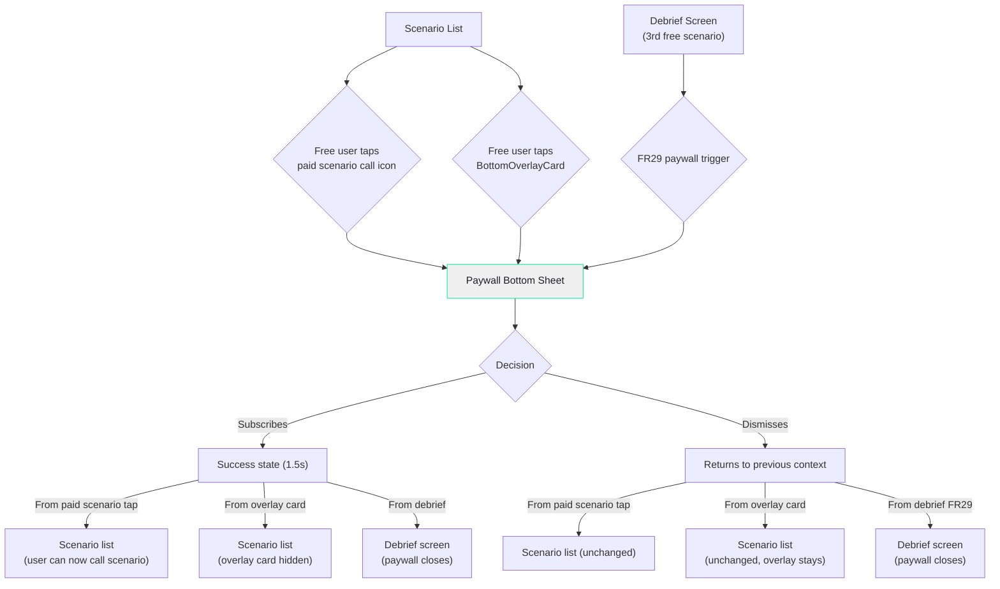

# Paywall Screen Design

**Author:** Dev Agent (Claude Opus 4.6)
**Date:** 2026-04-02
**Story:** 2.5 — Design Paywall Screen
**Status:** Review
**Consumed by:** Epic 8, Story 8.2 (Build Paywall Screen with Invisible Tier Design)

---

## Format Decision: Modal Bottom Sheet

### Evaluation (Subtask 1.1)

| Factor | Modal Bottom Sheet | Full Screen |
|--------|-------------------|-------------|
| Dismissibility | Swipe down + tap scrim + "Not now" — multiple natural exit paths | Only explicit button — feels more committed |
| Context preservation | Previous screen visible behind scrim — user remembers where they are | Context lost — user enters a "different place" |
| Dark patterns signal | Partial coverage communicates "this is optional" | Full takeover feels more like a trap |
| Content space | Limited vertical space (adequate for minimal content) | Generous space for elaborate layouts |
| Conversion feeling | Lightweight ask — "quick decision, not a commitment page" | Heavy ask — feels like a sales page |
| Material 3 support | `showModalBottomSheet` — native, well-tested | `Scaffold` — standard |
| Clean dismiss (AC #2) | Swipe-to-dismiss is the most natural dismiss pattern | Requires explicit back navigation |

### Decision (Subtask 1.2)

**Modal Bottom Sheet.**

Rationale:
1. The paywall appears at **moments of maximum intent** — the user already wants to subscribe (tapped a paid scenario or the overlay card). Elaborate persuasion is unnecessary; clarity and speed matter more.
2. The **"no dark patterns" principle** (AC #2) favors a format that inherently communicates dismissibility. A bottom sheet can be swiped away — a full screen cannot.
3. The paywall content is **minimal by design**: title, subtitle, price, three benefits, CTA, dismiss. This doesn't need full-screen real estate.
4. **Context preservation**: the scrim behind the sheet keeps the scenario list (or debrief) visible, reinforcing that dismissing returns "right back where you were."
5. Consistent with the product's philosophy of **invisible, minimal UI** — the paywall is a contextual interrupt, not a destination.

---

## Design Token Reference

The paywall sheet uses an **inverted light theme** — white background with dark text — creating visual contrast against the dark app background and signaling a distinct, focused interaction. This follows the same inverted pattern as the BottomOverlayCard (`#F0F0F0` bg on dark app) established in the UX spec. Typography uses Inter exclusively.

### Colors

| Token | Hex | Usage on Paywall Screen |
|-------|-----|-------------------------|
| `paywall-surface` | `#F0F0F0` | Sheet background — screen-specific, inverted from app dark theme |
| `paywall-text` | `#1E1F23` | Title, price amount, benefit text — reuses app `background` as text |
| `paywall-text-secondary` | `#4C4C4C` | Subtitle, price period, dismiss button, legal text, drag handle — matches BottomOverlayCard subtitle |
| `accent` | `#00E5A0` | CTA button background, benefit checkmarks |
| `destructive` | `#C0392B` | Error message text (purchase failure) — darkened from system #E74C3C for WCAG AA compliance on light surface |

**Inverted color rationale:** The white sheet against the dark scrim creates maximum visual separation — the paywall feels like a distinct surface, not an extension of the app. The dark-on-light text is easier to scan for transactional content (price, benefits, legal). This mirrors the BottomOverlayCard's inverted treatment, establishing a visual pattern: "light surface = commerce/action." The `#4C4C4C` secondary text is already used in the UX spec for the BottomOverlayCard subtitle.

### Typography

| Style | Font | Size | Weight | Usage |
|-------|------|------|--------|-------|
| `headline` | Inter | 18px | SemiBold (600) | Sheet title ("Speak English for real") |
| `paywall-price` | Inter | 36px | Bold (700) | Price amount ("$1.99") — screen-specific |
| `body` | Inter | 16px | Regular (400) | Subtitle, benefit text, price period, dismiss text |
| `caption` | Inter | 13px | Regular (400) | Legal fine print, error message |
| `button-label` | Inter | 14px | SemiBold (600) | CTA button text — uses Story 2.1's `button-label` token, NOT the system `label` (12px Medium) |

**Screen-specific typography: `paywall-price` (36px Bold).** This is a new size for the price display hero element. Rationale: `display` (64px) is disproportionately large for a bottom sheet. 36px Bold is prominent enough to be the sheet's hero element while maintaining visual balance.

### Spacing

| Property | Value |
|----------|-------|
| Base unit | 8px |
| Sheet padding horizontal | 20px |
| Sheet padding top (below drag handle) | 32px |
| Sheet padding bottom | 20px + SafeArea bottom |
| Section gap (standard) | 32px |
| Section gap (title to subtitle) | 24px |
| Section gap (before dismiss) | 16px |
| Element gap (between benefits) | 8px |
| Sheet top border radius | 16px |

---

## Screen Layout

### Purpose

Contextual subscription offer presented as a modal bottom sheet with an **inverted light theme**. Appears at moments of maximum user intent — when they've already decided to engage with paid content. The design optimizes for **clarity and speed**: price, value, action. The white surface creates a focused "decision card" that stands out against the dark app.

### Screen Layout Diagram (Subtask 2.6)

```
+--------------------------------------+
|                                      |
|          (Scrim: #000000 @ 50%)      |  Dim previous screen
|                                      |
|          Previous screen visible     |  Context preserved
|          behind scrim                |
|                                      |
+======================================+  <- Sheet top edge (16px radius)
|          -- drag handle --           |  4x40px, #4C4C4C
|                                      |
|             32px gap                 |
|                                      |
|    "Speak English for real"          |  Inter SemiBold 18px
|            centered                  |  #1E1F23
|                                      |
|             24px gap                 |
|                                      |
|    "Practice with characters who     |  Inter Regular 16px
|     won't go easy on you."           |  #4C4C4C, centered
|                                      |
|            32px gap                  |
|                                      |
|            "$1.99"                   |  Inter Bold 36px
|            centered                  |  #1E1F23
|                                      |
|           "per week"                 |  Inter Regular 16px
|            centered                  |  #4C4C4C
|                                      |
|            32px gap                  |
|                                      |
|     check  All scenarios unlocked.   |  check image + #1E1F23 text
|            8px gap                   |  Inter Regular 16px
|                                      |
|     check  Daily calls. Daily progress.   |  check image + #1E1F23 text
|            8px gap                   |  Inter Regular 16px
|                                      |
|     check  Know exactly what you're doing wrong   |  check image + #1E1F23 text
|                                      |  Inter Regular 16px
|                                      |
|            32px gap                  |
|                                      |
|      [      Let's go       ]         |  FilledButton
|                                      |  #00E5A0 bg, #1E1F23 text
|                                      |  48px height, full width
|                                      |
|            16px gap                  |
|                                      |
|          "Not now"                   |  TextButton
|            centered                  |  Inter Regular 16px #4C4C4C
|                                      |  48px touch target
|                                      |
|            32px gap                  |
|                                      |
| "Auto-renewable. 3 calls per day.    |  Inter Regular 13px
|          Cancel anytime."            |  #4C4C4C, centered
|                                      |
|         20px + SafeArea bottom       |
+--------------------------------------+
```

**Layout strategy:** Single centered column optimized for scanning speed. The user's eye path: title (emotional hook) -> subtitle (value framing) -> price (how much) -> benefits (what I get) -> CTA (action) -> dismiss (exit). Top-to-bottom, one decision, no branching. The entire sheet content is visible without scrolling on all supported screen sizes.

### Z-Order (Back to Front)

1. **z0:** Previous screen content (scenario list or debrief)
2. **z1:** Scrim overlay (`#000000` at 50% opacity)
3. **z2:** Sheet surface (`#F0F0F0`) with 16px top border radius
4. **z3:** Sheet content (all text, buttons, checkmarks)

### Drag Handle (Material 3 Standard)

| Property | Value |
|----------|-------|
| Width | 40px |
| Height | 4px |
| Color | `#4C4C4C` |
| Border radius | Fully rounded |
| Position | Centered horizontally, 8px from sheet top edge |

**Purpose:** Visual affordance that the sheet can be dragged down to dismiss. Standard Material 3 drag indicator.

### Title — "Speak English for real" (Subtask 2.1)

| Property | Value |
|----------|-------|
| Content | "Speak English for real" |
| Font family | Inter |
| Font weight | SemiBold (600) |
| Font size | 18px (`headline`) |
| Color | `#1E1F23` (`paywall-text`) |
| Text alignment | Center |
| Position | 32px below drag handle |
| Max lines | 1 |

**Copy rationale:** "Speak English for real" positions the product promise directly — this isn't a language app, it's real practice with real pressure. The title speaks to the user's aspiration, not to a feature.

### Subtitle (Subtask 2.1)

| Property | Value |
|----------|-------|
| Content | "Practice with characters who won't go easy on you." |
| Font family | Inter |
| Font weight | Regular (400) |
| Font size | 16px (`body`) |
| Color | `#4C4C4C` (`paywall-text-secondary`) |
| Text alignment | Center |
| Position | 24px below title, 32px above price |
| Max lines | 2 |

**Copy rationale:** The subtitle explains the product's differentiator — adversarial characters who challenge you. "Won't go easy on you" echoes the sarcastic tone of the characters themselves, giving the user a preview of the experience they're buying into.

### Price Display — "$1.99" (Subtask 2.2)

| Property | Value |
|----------|-------|
| Content | "$1.99" |
| Font family | Inter |
| Font weight | Bold (700) |
| Font size | 36px (`paywall-price`) |
| Color | `#1E1F23` (`paywall-text`) |
| Text alignment | Center |
| Position | 32px below subtitle |
| Max lines | 1 |

**"per week" label:**

| Property | Value |
|----------|-------|
| Content | "per week" |
| Font family | Inter |
| Font weight | Regular (400) |
| Font size | 16px (`body`) |
| Color | `#4C4C4C` (`paywall-text-secondary`) |
| Text alignment | Center |
| Position | Directly below price amount (tight, no explicit gap) |

**Design rationale:** The price is the sheet's hero element. At 36px Bold in dark text on the white surface, it reads instantly. The muted "per week" below clarifies the billing period. The two-line price display ("$1.99" / "per week") is cleaner than "$1.99/week" in a single line.

### Benefits List (Subtask 2.1)

Three benefit rows, each with a green checkmark icon and dark text:

| Property | Value |
|----------|-------|
| Layout | Row — checkmark icon (left) + text (right) |
| Gap between icon and text | 12px |
| Gap between benefit rows | 8px |
| Position | 32px below price section |
| Alignment | Left-aligned within the sheet's horizontal padding |

**Benefit 1:**

| Property | Value |
|----------|-------|
| Icon | Green checkmark image, ~20px |
| Icon color | `#00E5A0` (`accent`) |
| Text | "All scenarios unlocked." |
| Font | Inter Regular 16px (`body`) `#1E1F23` |

**Benefit 2:**

| Property | Value |
|----------|-------|
| Icon | Green checkmark image, ~20px |
| Icon color | `#00E5A0` (`accent`) |
| Text | "Daily calls. Daily progress." |
| Font | Inter Regular 16px (`body`) `#1E1F23` |

**Benefit 3:**

| Property | Value |
|----------|-------|
| Icon | Green checkmark image, ~20px |
| Icon color | `#00E5A0` (`accent`) |
| Text | "Know exactly what you're doing wrong" |
| Font | Inter Regular 16px (`body`) `#1E1F23` |

**Design rationale:** Three benefits covering the three pillars of value: access (all scenarios), habit (daily practice), and insight (debrief feedback). The third benefit — "Know exactly what you're doing wrong" — highlights the debrief as a unique differentiator. The 8px gap between benefits keeps them visually tight as a single unit. The accent green checkmarks on the white background pop clearly.

### CTA Button (Subtask 2.3)

| Property | Value |
|----------|-------|
| Type | `FilledButton` (Material 3) |
| Text | "Let's go" |
| Font family | Inter |
| Font weight | SemiBold (600) |
| Font size | 14px (`button-label`) |
| Text color | `#1E1F23` (`paywall-text`) |
| Background color | `#00E5A0` (`accent`) |
| Width | Full width (sheet width - 40px horizontal padding) |
| Height | 48px |
| Border radius | 12px |
| Position | 32px below benefits list |
| Touch target | 48px (equals button height) |

**Design rationale:** "Let's go" is energetic and forward-moving — not transactional ("Subscribe") but action-oriented. It implies starting an experience, not signing a contract. The accent green CTA is the only large colored element on the white sheet, drawing the eye naturally. Full-width ensures it's easy to tap.

### Dismiss Action — "Not now" (Subtask 2.4)

| Property | Value |
|----------|-------|
| Type | `TextButton` (Material 3) |
| Text | "Not now" |
| Font family | Inter |
| Font weight | Regular (400) |
| Font size | 16px (`body`) |
| Text color | `#4C4C4C` (`paywall-text-secondary`) |
| Position | 16px below CTA button, centered |
| Touch target | 48px height (padded) |
| Alignment | Center |

**Design rationale:** "Not now" is neutral and non-manipulative. No dark patterns. The muted `#4C4C4C` color makes it visible but doesn't compete with the green CTA.

**Clean dismiss principle (AC #2):** Tapping "Not now" OR swiping down OR tapping the scrim all produce the same result — clean return to the previous context. No confirmation dialog. No follow-up nag.

### Legal Fine Print

| Property | Value |
|----------|-------|
| Content | "Auto-renewable. 3 calls per day. Cancel anytime." |
| Font family | Inter |
| Font weight | Regular (400) |
| Font size | 13px (`caption`) |
| Color | `#4C4C4C` (`paywall-text-secondary`) |
| Text alignment | Center |
| Position | 32px below dismiss button |

**Required disclosure:** App Store and Play Store require auto-renewal and cancellation information to be visible at the point of purchase. The daily call limit (3/day) is disclosed here in the factual/legal zone — the user knows the limit before purchasing.

### Layout Specification Table (Subtask 2.5)

| Element | Position | Width | Height | Padding/Gap | Notes |
|---------|----------|-------|--------|-------------|-------|
| Scrim | Full screen overlay | 100% | 100% | — | `#000000` @ 50% opacity |
| Sheet surface | Bottom-anchored | 100% | Auto (~518px content + ~34px SafeArea = ~552px) | Top radius: 16px | `#F0F0F0` background |
| Drag handle | Sheet child 1 | 40px | 4px | T: 8px | `#4C4C4C`, centered |
| Title | Sheet child 2 | Auto | ~22px | T: 32px | `headline` `#1E1F23`, centered |
| Subtitle | Sheet child 3 | Screen - 40px | ~40px | T: 24px | `body` `#4C4C4C`, centered, max 2 lines |
| Price "$1.99" | Sheet child 4 | Auto | ~44px | T: 32px | `paywall-price` 36px Bold `#1E1F23`, centered |
| Price period "per week" | Sheet child 5 | Auto | ~20px | T: 0px | `body` `#4C4C4C`, centered |
| Benefit 1 | Sheet child 6 | Screen - 40px | ~24px | T: 32px | Row: check icon + 12px gap + text `#1E1F23` |
| Benefit 2 | Sheet child 7 | Screen - 40px | ~24px | T: 8px | Row: check icon + 12px gap + text `#1E1F23` |
| Benefit 3 | Sheet child 8 | Screen - 40px | ~24px | T: 8px | Row: check icon + 12px gap + text `#1E1F23` |
| CTA "Let's go" | Sheet child 9 | Screen - 40px | 48px | T: 32px | `FilledButton`, accent bg, 12px radius |
| "Not now" | Sheet child 10 | Auto | 48px (touch) | T: 16px | `TextButton` `#4C4C4C`, centered |
| Legal text | Sheet child 11 | Auto | ~16px | T: 32px | `caption` `#4C4C4C`, centered |
| Bottom padding | Sheet child 12 | — | 20px + SafeArea | — | Respects home indicator |

**Total estimated sheet height:**
8 (handle top) + 4 (handle) + 32 (gap) + 22 (title) + 24 (gap) + 40 (subtitle) + 32 (gap) + 44 (price) + 20 (period) + 32 (gap) + 24 (benefit 1) + 8 (gap) + 24 (benefit 2) + 8 (gap) + 24 (benefit 3) + 32 (gap) + 48 (CTA) + 16 (gap) + 48 (dismiss) + 32 (gap) + 16 (legal) + 20 (bottom) = **~518px** + SafeArea (~34px) = **~552px**

- iPhone 14 (844px): ~65% of screen height — comfortable bottom sheet proportion
- iPhone SE (568px): ~97% — exceeds 85% threshold, requires scrollable container

**iPhone SE mitigation (mandatory):** Wrap the sheet content in a `SingleChildScrollView` inside the bottom sheet. This is the canonical implementation for all screen sizes — on larger screens, the content fits without scrolling; on iPhone SE, the user can scroll if needed. Using `isScrollControlled: true` with `MainAxisSize.min` and a `SingleChildScrollView` is the standard Flutter pattern for content-heavy bottom sheets. Do NOT use adaptive spacing reduction — a single layout for all devices is simpler and more maintainable.

### Sheet Top Border Radius

| Property | Value |
|----------|-------|
| Top-left radius | 16px |
| Top-right radius | 16px |
| Bottom-left radius | 0px (anchored to bottom) |
| Bottom-right radius | 0px (anchored to bottom) |

**Rationale:** 16px is 2x the base unit (8px). Slightly larger than the 12px card radius used in debrief, distinguishing the sheet as a higher-level container.

---

## Screen States

### State 1: Default Paywall (Subtask 3.1)

The standard presentation when the paywall first appears. All content visible, CTA active.

| Element | Value |
|---------|-------|
| Sheet background | `#F0F0F0` |
| Title | "Speak English for real" |
| Subtitle | "Practice with characters who won't go easy on you." |
| Price | "$1.99" / "per week" |
| Benefits | Three rows with green checkmarks |
| CTA button | "Let's go" — active, accent green |
| Dismiss | "Not now" — active |
| Legal | "Auto-renewable. 3 calls per day. Cancel anytime." |
| Drag-to-dismiss | Enabled |
| Scrim tap | Enabled |

This is the state shown in the layout diagram above.

### State 2: Loading/Processing (Subtask 3.2)

Active after the user taps "Let's go" and the StoreKit 2 / Google Play Billing purchase flow begins.

| Element | Change from Default |
|---------|---------------------|
| CTA button text | Hidden — replaced by `CircularProgressIndicator` |
| CTA button background | `#00E5A0` (`accent`) — unchanged |
| CTA button | Disabled (non-tappable) |
| Progress indicator | 24px diameter, `#1E1F23` color (dark on green bg), centered in button |
| "Not now" | Disabled, opacity reduced to 40% |
| Drag-to-dismiss | Disabled — prevent accidental dismiss during purchase |
| Scrim tap | Disabled — prevent dismiss during purchase |
| All other elements | Unchanged |

**Design rationale:** The loading state is minimal — only the CTA changes. Disabling all dismiss paths during processing prevents the sheet from closing while the purchase is in-flight.

**Duration:** Typically 1-3 seconds for StoreKit 2 / Play Billing.

**Timeout:** If no response from the payment system after 15 seconds (native sheet failed to appear, store unavailable, etc.), the paywall transitions to **State 4 (Error)** with the error message "Something went wrong. Try again." and all dismiss paths are re-enabled. This prevents the user from being stuck in a non-dismissible loading state.

### State 3: Subscription Success (Subtask 3.3)

Shown briefly after successful purchase confirmation from the payment system.

| Element | Change from Default |
|---------|---------------------|
| Title | Changes to "You're in" |
| Subtitle | Hidden |
| Price + period | Hidden |
| Benefits | Hidden |
| CTA button | Hidden — replaced by success checkmark |
| Success checkmark | `#00E5A0` (`accent`), 48px, centered where CTA was |
| "Not now" | Hidden |
| Legal text | Hidden |
| Auto-dismiss | After 1.5 seconds (or 5 seconds if VoiceOver/TalkBack active), sheet slides down |

**Content after dismiss depends on entry point:**

| Entry Point | After Success Dismiss |
|------------|----------------------|
| Paid scenario tap | Scenario list — user can now call that scenario |
| BottomOverlayCard | Scenario list — overlay card now hidden (paid state) |
| Debrief FR29 | Debrief screen — paywall closes, debrief stays visible |

**Dismiss paths during success hold:** All manual dismiss paths (swipe, scrim tap, Android back) are **disabled** during the 1.5s/5s hold. The auto-dismiss is the only exit. This prevents the user from accidentally interrupting the post-purchase state update (scenario list refresh, overlay card removal).

**Design rationale:** "You're in" is short and affirming. The 1.5-second auto-dismiss respects the user's time (extended to 5s when screen reader is active, matching Story 2.3 call-ended pattern). Consistent with the "no success toasts, no confetti" principle.

### State 4: Subscription Error/Failure (Subtask 3.4)

Shown when the payment system returns an error (card declined, network issue, payment system error).

| Element | Change from Default |
|---------|---------------------|
| CTA button | Returns to "Let's go" — active, accent green |
| Error message | Appears 8px below CTA button |
| Error message text | "Something went wrong. Try again." |
| Error message font | Inter Regular 13px (`caption`) |
| Error message color | `#C0392B` (`destructive` darkened for light surface — see Accessibility) |
| Error message alignment | Center |
| "Not now" | Position shifts from T:16px to T:8px below error message (~24px below CTA), remains active |
| Legal text | Position shifts down accordingly, remains visible |
| Drag/scrim dismiss | Re-enabled |

**Error state layout:** Error message (T:8px below CTA) + "Not now" (T:8px below error) + legal text (T:32px below dismiss). Total added height: ~21px (error text ~13px + 8px gap). On iPhone SE, this pushes the sheet to ~573px — scrollable container (see iPhone SE mitigation) handles the overflow.

**Re-tap behavior:** When the user taps "Let's go" again after an error, the error message disappears, and the sheet transitions back to **State 2 (Loading)**. The standard loading → success/error cycle repeats.

**User-cancelled purchase:** When the user cancels within the native payment sheet (StoreKit / Play Billing), the paywall returns to the **Default state**, not error state.

### Dismiss Behavior Per Entry Point (Subtask 3.5)

| Entry Point | Dismiss Action | Result |
|------------|----------------|--------|
| Free user taps call icon on paid scenario | Sheet slides down | Scenario list, unchanged. No call initiated. |
| Free user taps BottomOverlayCard | Sheet slides down | Scenario list, unchanged. Overlay card remains visible. |
| Free user reaches debrief after 3rd free scenario (FR29) | Sheet slides down | Debrief screen stays visible. Paywall closes. User continues reading debrief. |

**Android system back button behavior per state:**

| State | Back Button Behavior |
|-------|---------------------|
| Default | Dismisses sheet (same as "Not now") |
| Loading | Blocked — no action (dismiss disabled during purchase) |
| Success hold | Blocked — auto-dismiss only |
| Error | Dismisses sheet (same as "Not now") |

**Clean dismiss principle (AC #2):** All three entry points produce the same dismiss animation (slide down). The underlying screen is never modified by the dismiss. No penalty, no nag, no "are you sure?" confirmation.

---

## Transitions and Animations

### Entry Animation (Subtask 4.1)

| Property | Value |
|----------|-------|
| Type | Slide up from bottom (standard BottomSheet) |
| Sheet duration | 300ms |
| Sheet curve | `Curves.easeOutCubic` (Material 3 standard) |
| Scrim fade-in | 200ms, `Curves.easeOut` (simultaneous with sheet) |
| Scrim color | `#000000` at 50% opacity |

**Standard Material 3 bottom sheet entry.** The sheet slides up smoothly while the scrim fades in behind it.

### Dismiss Animation (Subtask 4.2)

| Trigger | Animation | Duration | Notes |
|---------|-----------|----------|-------|
| Tap "Not now" | Sheet slides down | 250ms, `Curves.easeIn` | Scrim fades simultaneously |
| Swipe down | Sheet follows finger, then snaps down | Physics-based (Material default) | Gesture-driven dismiss |
| Tap scrim | Sheet slides down | 250ms, `Curves.easeIn` | Same as "Not now" |

**All three dismiss methods produce identical results:** the sheet disappears and the previous screen is unchanged.

### Success Transition (Subtask 4.3)

| Step | Time | Action | Detail |
|------|------|--------|--------|
| 0 | 0ms | Purchase confirmed | Payment system returns success |
| 1 | 0-200ms | Content swap | Default content crossfades to "You're in" + checkmark (200ms) |
| 2 | 200-1700ms | Hold | Success state visible for 1.5 seconds |
| 3 | 1700-1950ms | Sheet slides down | 250ms, `Curves.easeIn` |
| 4 | 1950ms | Previous screen updated | Scenario list refreshes (overlay card hidden if now paid) |

**Total success transition:** ~2 seconds from confirmation to sheet dismissed.

### Reduced Motion Behavior

**Deferred to post-MVP.** Full animations only at launch. Can be added later without breaking changes.

### Navigation Context



### Transition Timing Summary

| Transition | Duration | Easing | Notes |
|-----------|----------|--------|-------|
| Entry: sheet slide-up | 300ms | `Curves.easeOutCubic` | Standard Material 3 |
| Entry: scrim fade-in | 200ms | `Curves.easeOut` | Simultaneous with sheet |
| Dismiss: sheet slide-down | 250ms | `Curves.easeIn` | Same for all dismiss triggers |
| Dismiss: scrim fade-out | 250ms | `Curves.easeIn` | Simultaneous with sheet |
| Success: content crossfade | 200ms | `Curves.easeOut` | Default -> "You're in" |
| Success: hold | 1500ms (5000ms if screen reader active) | — | Functional, not decorative |
| Success: sheet slide-down | 250ms | `Curves.easeIn` | After hold completes |

---

## Accessibility

### WCAG 2.1 AA Contrast Verification (Subtask 5.1)

| Combination | Ratio | Status |
|-------------|-------|--------|
| `paywall-text` (#1E1F23) on `paywall-surface` (#F0F0F0) | 14.8:1 | Pass AA & AAA |
| `paywall-text-secondary` (#4C4C4C) on `paywall-surface` (#F0F0F0) | 5.7:1 | Pass AA (matches UX spec BottomOverlayCard verification) |
| `accent` (#00E5A0) on `paywall-surface` (#F0F0F0) | 1.6:1 | Fail text — decorative icon only (see note below) |
| "Not now" disabled (#4C4C4C @ 40% ≈ #B3B3B7) on `paywall-surface` (#F0F0F0) | ~1.7:1 | N/A — disabled state, not required to meet AA (WCAG SC 1.4.3 exempts disabled components) |
| `destructive` (#C0392B) on `paywall-surface` (#F0F0F0) | 4.7:1 | Pass AA for normal text |
| CTA text (#1E1F23) on `accent` (#00E5A0) | 9.1:1 | Pass AA & AAA |

**Note on accent checkmarks:** The green checkmarks (#00E5A0) on #F0F0F0 have a 1.6:1 ratio — below the 3:1 threshold for non-text contrast (SC 1.4.11). Justification: the checkmarks are **supplementary decorative icons** — removing them does not change the informational content. Each benefit row's text in `#1E1F23` (14.8:1) conveys the complete meaning. Screen readers skip the icon and announce the text only. Per SC 1.4.11, contrast requirements apply to graphical objects "required for understanding the content" — these icons are not required, the text stands alone. The final mockup confirms this visual treatment.

**Note on error text:** The error color is `#C0392B` (darkened from the system `destructive` #E74C3C) to meet WCAG 2.1 AA for normal text on the light paywall surface. #C0392B on #F0F0F0 yields 4.7:1 — above the 4.5:1 AA threshold for normal text at 13px caption size.

### Screen Reader Announcements (Subtask 5.2)

| Element | VoiceOver/TalkBack Announcement |
|---------|--------------------------------|
| Sheet (on appear) | "Subscription offer. One dollar ninety-nine per week." (concise — detail available via sequential focus navigation) |
| Title | "Speak English for real" |
| Subtitle | "Practice with characters who won't go easy on you." |
| Price | "One dollar ninety-nine" |
| Price period | "per week" |
| Benefit 1 | "All scenarios unlocked." |
| Benefit 2 | "Daily calls. Daily progress." |
| Benefit 3 | "Know exactly what you're doing wrong." |
| CTA | "Let's go, button" |
| CTA (loading) | "Processing, please wait" |
| Dismiss | "Not now, button" |
| Legal text | "Auto-renewable. Three calls per day. Cancel anytime." |
| Success state | "Subscription confirmed. You're in." |
| Error state | "Something went wrong. Try again. Let's go, button." |
| Transition: default → loading | Live-region polite announcement: "Processing purchase, please wait." |
| Transition: loading → success | Live-region assertive announcement: "Subscription confirmed. You're in." |
| Transition: loading → error | Live-region assertive announcement: "Purchase failed. Something went wrong. Try again." |

**Focus order:** Drag handle (accessibility skip) -> title -> subtitle -> price -> price period -> benefit 1 -> benefit 2 -> benefit 3 -> CTA -> dismiss -> legal text. Standard top-to-bottom reading order.

**Sheet appearance:** When the sheet appears, it is announced as a modal dialog. Focus moves to the **title** (first content element), allowing screen reader users to hear the value proposition before reaching the CTA. The CTA is reachable via standard forward navigation.

### Responsive Behavior (Subtask 5.3)

| Screen Width | Behavior |
|-------------|----------|
| 320px (iPhone SE) | Subtitle wraps to 2 lines. Benefit 3 wraps to 2 lines. Sheet height (~552px) exceeds screen — `SingleChildScrollView` handles overflow (see Layout section). |
| 375px (iPhone 14) | Primary target. All elements comfortable. Subtitle fits on 2 lines. Benefit 3 may wrap. Sheet takes ~65%. |
| 430px (iPhone Pro Max) | Extra breathing room. No layout changes. All text fits comfortably. |

**Vertical adaptation:** Sheet height is content-driven (auto-height via `MainAxisSize.min`). Content is wrapped in `SingleChildScrollView` — on larger screens nothing scrolls, on iPhone SE the user can scroll if needed.

**No breakpoints needed** for horizontal or vertical layout. The scrollable container handles all screen sizes uniformly.

### Touch Target Compliance (Subtask 5.4)

| Element | Touch Target Size | Method | Status |
|---------|-------------------|--------|--------|
| "Let's go" CTA | 48px height x full width | Button native height | Pass (48px >= 48px) |
| "Not now" dismiss | 48px height x auto width | Padded touch target | Pass (48px >= 48px) |
| Drag handle area | ~20px height x full width | Standard Material drag area | N/A — supplementary |
| Scrim tap | Full screen | Tap anywhere outside sheet | Pass |

All interactive elements meet the 48px minimum touch target requirement.

---

## Flutter Widget Mapping

### Widget Mapping (Subtask 6.1)

| Design Element | Flutter Widget | Notes |
|---------------|---------------|-------|
| Sheet presentation | `showModalBottomSheet` | `isDismissible: true`, `enableDrag: true`, `isScrollControlled: true`, `backgroundColor: #F0F0F0` |
| Sheet container | `Container` with `BoxDecoration` | `#F0F0F0` bg, top-left/top-right 16px radius |
| Content layout | `Column` with `MainAxisSize.min` | Auto-height, centered |
| Drag handle | `Container` (40x4) | `#4C4C4C`, border-radius 2px, centered |
| Safe area | `SafeArea` (bottom only) | Inside sheet, wraps bottom padding |
| Title | `Text` "Speak English for real" with Inter SemiBold 18px `#1E1F23` | Centered |
| Subtitle | `Text` with Inter Regular 16px `#4C4C4C` | Centered, max 2 lines |
| Price amount | `Text` with Inter Bold 36px `#1E1F23` | Centered |
| Price period | `Text` with Inter Regular 16px `#4C4C4C` | Centered |
| Benefit row | `Row` — `Icon` + `SizedBox(width: 12)` + `Text` | Left-aligned, `#1E1F23` text |
| Benefit checkmark | `Icon(Icons.check_circle, size: 20, color: #00E5A0)` | Decorative — screen reader skips |
| CTA "Let's go" | `FilledButton` | `#00E5A0` bg, `#1E1F23` text, 48px height, full width, 12px radius |
| CTA loading state | `SizedBox(24x24)` + `CircularProgressIndicator` inside `FilledButton` | `strokeWidth: 2`, `#1E1F23` color |
| Dismiss button | `TextButton` | "Not now", `#4C4C4C`, 48px touch target height |
| Legal text | `Text` with Inter Regular 13px `#4C4C4C` | Centered |
| Success checkmark | `Icon(Icons.check_circle, size: 48)` | `#00E5A0`, replaces CTA area |
| Success title | `Text` "You're in" with Inter SemiBold 18px `#1E1F23` | Replaces "Speak English for real" |
| Error text | `Text` with Inter Regular 13px `#C0392B` | Centered, 8px below CTA |
| Scrim | Material `ModalBarrier` | `#000000` @ 50% — handled by `showModalBottomSheet` |
| Android back button | `PopScope` with `canPop` controlled by state | `canPop: true` in default/error, `canPop: false` in loading/success |
| Reduced motion | Deferred to post-MVP | Full animations only at launch. No `MediaQuery.disableAnimations` handling until post-MVP. |

### File Locations (Subtask 6.2)

| File | Path |
|------|------|
| Paywall bottom sheet | `client/lib/features/subscription/views/paywall_bottom_sheet.dart` |
| Subscription BLoC | `client/lib/features/subscription/bloc/subscription_bloc.dart` |
| Subscription state | `client/lib/features/subscription/bloc/subscription_state.dart` |
| Color tokens | `client/lib/core/theme/app_colors.dart` |
| Typography tokens | `client/lib/core/theme/app_typography.dart` |
| Theme configuration | `client/lib/core/theme/app_theme.dart` |
| Navigation (GoRouter) | `client/lib/core/navigation/app_router.dart` |

---

## Design Token Cross-Reference

| Token Used | Source | Match with UX Spec |
|------------|--------|-------------------|
| `paywall-surface` #F0F0F0 | This design | Screen-specific — inverted light surface for commerce context |
| `paywall-text` #1E1F23 | UX Spec: `background` token | Reused as text color on inverted surface |
| `paywall-text-secondary` #4C4C4C | UX Spec: BottomOverlayCard subtitle | Matches existing overlay card secondary text |
| `accent` #00E5A0 | UX Spec: Color System | Exact match — CTA and checkmarks |
| `destructive` #C0392B | UX Spec: Color System (darkened) | Darkened from system #E74C3C for WCAG AA on light surface (4.7:1) |
| `headline` 18px SemiBold | UX Spec: Typography | Exact match — title |
| `paywall-price` 36px Bold | This design | Screen-specific — price display hero |
| `body` 16px Regular | UX Spec: Typography | Exact match — subtitle, benefits, dismiss |
| `caption` 13px Regular | UX Spec: Typography | Exact match — legal, error |
| `button-label` 14px SemiBold | Story 2.1 (Onboarding) | Reuses onboarding's `button-label` token — NOT the system `label` (12px Medium) |

**Screen-specific color tokens:** `paywall-surface` (#F0F0F0) and `paywall-text-secondary` (#4C4C4C) are new to this screen. The inverted theme creates visual separation from the dark app. Both colors already exist in the UX spec — #F0F0F0 is `text-primary` and the BottomOverlayCard background, #4C4C4C is the BottomOverlayCard subtitle. Reusing them here establishes a consistent "light surface" pattern.

**Screen-specific typography token:** `paywall-price` (36px Bold) — same as previous design iteration.

**Implementation note — token naming:** In `app_colors.dart`, the paywall tokens (`paywallSurface`, `paywallTextSecondary`) must be named distinctly from the app-wide `textSecondary` (#9A9AA5). The paywall uses #4C4C4C for secondary text (matching BottomOverlayCard), while the rest of the app uses #9A9AA5. Do not confuse the two.

---

## Resolved Design Decisions

Design decisions resolved during creation and visual design iteration (2026-04-02).

| # | Question | Resolution | Rationale |
|---|----------|------------|-----------|
| 1 | BottomSheet vs full screen? | **Modal Bottom Sheet** | Maximum dismissibility, context preservation, no dark patterns signal. |
| 2 | Sheet theme — dark or light? | **Inverted light theme (#F0F0F0 surface)** | Light sheet on dark scrim creates maximum visual separation. Follows BottomOverlayCard's inverted pattern (#F0F0F0 matches its background). Commerce contexts benefit from light backgrounds (easier to scan prices and text). |
| 3 | Price display size? | **36px Bold (custom `paywall-price`)** | 64px disproportionate for bottom sheet. 36px is a prominent hero while maintaining balance. |
| 4 | Benefits — how many? | **Three** | Access ("All scenarios unlocked"), habit ("Daily calls. Daily progress."), insight ("Know exactly what you're doing wrong"). Three pillars of value. |
| 5 | CTA text? | **"Let's go"** | Energetic, forward-moving. Not transactional ("Subscribe") but action-oriented. Implies starting an experience, not signing a contract. |
| 6 | Dismiss text? | **"Not now"** | Neutral temporal deferral. No dark patterns. |
| 7 | Success confirmation? | **Auto-dismiss after 1.5s** | User subscribed to DO something. Minimize time between payment and action. |
| 8 | Border radius? | **16px** | 2x base unit. More restrained than Material 3 default (28dp). |
| 9 | Spacing rhythm? | **32px primary gaps** | Generous spacing on the white surface creates breathing room. 32px between major sections, 8px between tightly related elements (benefits). |
| 10 | iPhone SE overflow? | **Scrollable container** | Sheet at ~552px exceeds SE screen. `SingleChildScrollView` wraps content — no adaptive spacing, single layout for all devices. |

---

## Open Questions for Epic 8

These questions were surfaced during code review (2026-04-02, updated 2026-04-13) and should be resolved during Epic 8 implementation (Story 8.2).

| # | Question | Context | Suggested Resolution |
|---|----------|---------|---------------------|
| 1 | FR29 paywall timing on debrief screen — when exactly does the paywall auto-present? | FR29 says "paywall presented after 3rd free scenario on debrief screen" but does not specify: immediately on debrief load? After a delay? After scroll? | Recommend: present immediately on debrief load (0ms delay). The debrief content remains visible behind the scrim. User can dismiss to read debrief. |
| 2 | Product unavailable state — what if the subscription product cannot be loaded? | StoreKit 2 / Play Billing may fail to load the product (no product ID, store unavailable, region restriction). Currently no state defined for this. | Recommend: do not show the paywall at all if the product cannot be loaded. The CTA should never be tappable without a valid product. Log the error for analytics. |
| 3 | 15s loading timeout vs native payment sheet interaction | The 15s timeout may fire while the user is still authenticating (Face ID, password) in the native StoreKit/Play Billing sheet above the paywall. The timeout cannot distinguish "store never responded" from "user is actively completing payment." | Recommend: suspend or cancel the 15s timer when the native payment sheet becomes visible (app lifecycle → background/inactive state). Only apply timeout when the app remains in foreground with no native sheet presented. |
