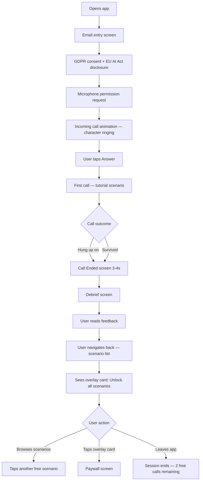
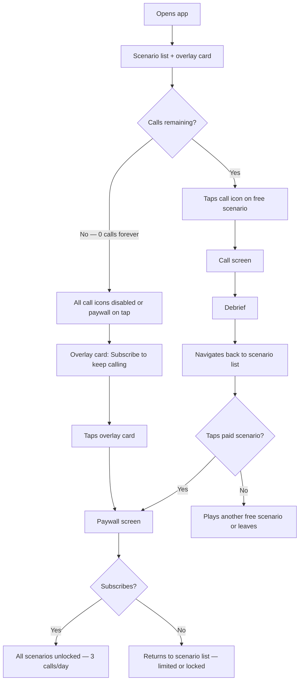
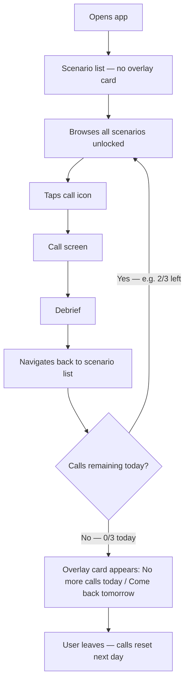
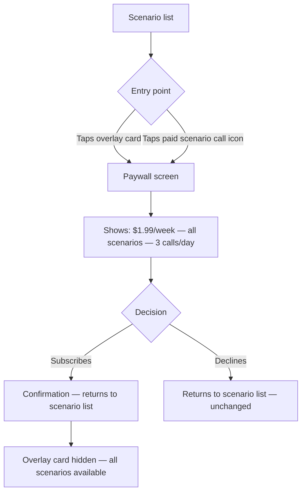
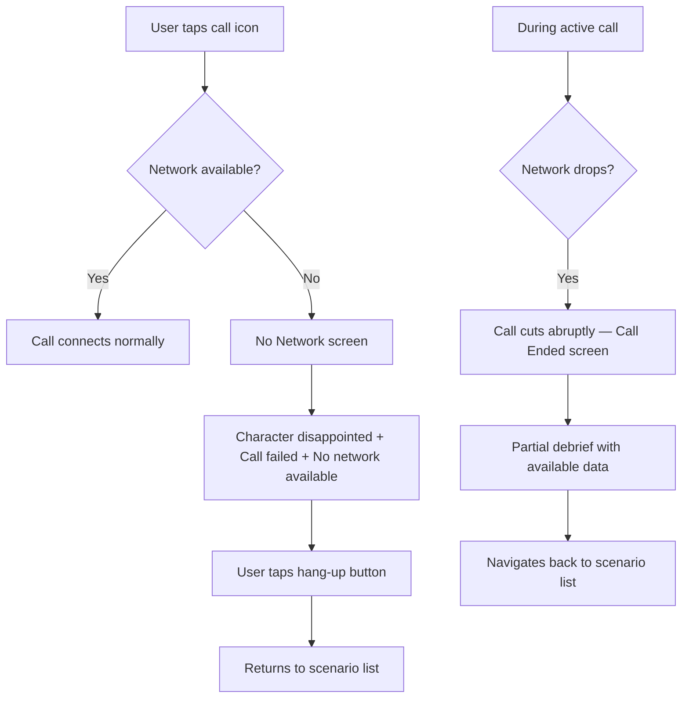

# UX Design Specification surviveTheTalk2

**Author:** walid
**Date:** 2026-03-26

---

## Executive Summary

### Project Vision

SurviveTheTalk is a mobile app (iOS + Android, Flutter) that crash-tests intermediate English learners through high-stakes animated phone calls with adversarial 2D characters. The UX is built around a phone call metaphor — the app behaves like a real phone receiving incoming calls from sarcastic, impatient characters who react in real-time via Rive animation. The product is positioned as adversarial entertainment: a game you survive, not a tool you study with. The core experience loop is: receive call → survive the conversation → get a brutally honest debrief → study on your own → come back stronger.

The app follows an extreme minimalist philosophy: three screens only (scenario list, call, debrief/report), no mobile nav bar, no tutorial. The call IS the onboarding. Every design decision serves the phone call metaphor and the fail-forward emotional loop.

### Target Users

**Primary: "The Desk Worker Leveling Up" (Karim archetype)**
Male, mid-20s, IT/office worker. Intermediate English — reads documentation, understands podcasts, but freezes in real conversations. Opens the app to unwind after work like a mobile game. Consumes adult animation (Rick & Morty, South Park). Shares fails on social media with self-deprecating humor. High willingness to pay at the ~$2/week price point.

**Secondary: "The Pre-Exchange Student" (Sofia archetype)**
20-24, university student preparing for ERASMUS or international exchange. Academic English gives false confidence — can write essays but can't order food without freezing. Gen Z, native meme consumer. The edgy tone feels natural. Shares replays on Instagram Stories as social currency.

**Tertiary: "The Fresh Expat" (Tomasz archetype)**
25-35, recently relocated to an English-speaking country. Intermediate English that worked for tourism but crumbles under daily-life pressure (landlord disputes, doctor appointments). Needs to handle real situations now — the scenarios mirror their actual life.

**Operator: Solo developer (Walid)**
Creates scenarios via system prompts, monitors costs and retention, tunes difficulty. Needs an operational dashboard and scenario authoring workflow.

### Key Design Challenges

1. **Voice-first UX with visual secondary role** — The core experience is a real-time voice conversation. The visual layer (animated character + emotional reactions) must enhance the conversation without distracting from it. The call screen must feel like a real phone call, not a chatbot interface.

2. **Invisible onboarding with mandatory compliance gates** — Zero-friction onboarding (email → immediate call) must coexist with microphone permission, GDPR consent, and EU AI Act disclosure — all without breaking the phone call immersion.

3. **Honest feedback that motivates retry** — The debrief delivers brutally frank error analysis, but the UX must ensure failure feels like a challenge to overcome, not a reason to quit. Visual design must calibrate between "honest mirror" and "game you want to beat."

4. **Three-screen minimalism** — Scenario list, call, and debrief must be self-sufficient. No navigation bar, no settings screen, no tutorial. Each screen must communicate context, status, and available actions without any UI scaffolding.

### Design Opportunities

1. **Phone call metaphor as universal UX language** — Incoming call vibration, ringing, hang-up animation, "no network" offline screen. Every user already knows this interaction pattern — zero learning curve.

2. **Character emotional reactions as real-time feedback system** — Grimaces, eye-rolls, smirks, and anger expressions communicate performance quality before the user receives any written feedback. This creates an emotionally engaging, non-verbal feedback layer unique in the language learning space.

3. **Debrief as shareable sports commentary** — The post-call report can be designed as annotated match analysis: key moments highlighted, specific errors flagged with corrections, survival percentage as a score. This is both the highest-value screen (where users learn) and the most shareable (where viral moments originate).

## Core User Experience

### Defining Experience

The core experience of SurviveTheTalk is a single, high-stakes interaction: **surviving a real-time voice call with an adversarial AI character**. The user speaks English under pressure while an animated 2D character reacts emotionally to what they say — grimacing at grammar mistakes, rolling eyes at long hesitations, escalating frustration until eventually hanging up if performance drops too low.

Everything in the app exists to serve this one interaction. The scenario list feeds calls. The debrief explains what happened. The subscription unlocks more calls. There is no secondary mode, no text exercises, no vocabulary drills. The call is the product.

The core loop is: **Call → Fail → Debrief → Study on your own → Come back stronger → Progress → Share**

### Platform Strategy

- **Platform:** Mobile app (iOS + Android) via Flutter single codebase
- **Interaction model:** Voice-first. The primary input is the user's spoken English through the device microphone. Touch interactions are minimal and limited to: tap to start a call, tap to end a call, scroll through debrief, tap to select a scenario
- **Orientation:** Portrait only. The phone call metaphor is inherently vertical
- **Offline capability:** Scenario list and past debrief reports available offline. Calls require network. Offline call attempts display a phone-style "no signal" screen maintaining the phone metaphor
- **Device capabilities leveraged:** Microphone (core — STT input), haptic feedback (incoming call vibration), push notification permission (primed at MVP, used post-MVP)
- **No tablet optimization** for MVP — phone-only experience matches the phone call metaphor

### Effortless Interactions

**1. Starting a call — One tap**
A single green call button on each scenario card. No configuration, no difficulty selection, no pre-call setup. Tap and the character picks up. Mirrors the simplicity of tapping a contact in a real phone app.

**2. Understanding what to do — Zero instructions**
The character speaks first, setting the scenario. The user responds naturally. No tutorial needed because every human already knows how a phone call works. The phone call metaphor eliminates the need for any onboarding UI.

**3. First-time experience — The call IS the onboarding**
After email entry, the phone rings. The user's first interaction with the product is the product itself — not a welcome screen, not a feature tour, not a settings page. Consent and permissions are integrated into the pre-call flow as minimal friction gates.

**4. Post-call transition — Automatic debrief**
When the call ends (character hangs up or user ends it), the debrief appears automatically. No navigation required. The transition from call to debrief should feel like a natural post-call moment — the emotional weight of what just happened is still fresh.

**5. Returning to scenarios — Intentional navigation**
After reading the debrief, the user navigates back to the scenario list to select their next call. There is no shortcut retry button. This intentional friction serves two purposes: it encourages users to absorb the debrief feedback and do their own research before attempting again, and it controls API costs by discouraging rapid-fire retry loops. The user should come back to a scenario when they feel ready, not when a button tempts them.

### Critical Success Moments

**Moment 1: "The Phone Rings" (First Launch)**
The user's first experience is an incoming call animation — screen lights up, phone vibrates, a character's face appears with a ringing sound. This must feel visceral and real enough to create an emotional spike. If this moment feels flat or app-like, the entire phone call illusion fails. This is the make-or-break onboarding moment.

**Moment 2: "It Reacted to Me" (First Character Response)**
Within the first 10 seconds of speaking, the character visibly reacts — a grimace, an eye-roll, a smirk. The user realizes this is not a scripted conversation. The character is responding to THEM. This is the "this is different from everything I've tried" moment that separates SurviveTheTalk from every chatbot and language app.

**Moment 3: "Finally, the Truth" (First Debrief)**
The debrief screen shows specific errors with corrections: "You said 'I am agree' three times — the correct form is 'I agree.'" No praise without merit. No "great job" for a 45% survival rate. For the first time, the user gets honest, specific feedback on their English. This is the "aha" moment that justifies payment. The debrief is designed as a study guide — it gives users clear areas to work on independently before their next attempt.

**Moment 4: "I'm Getting Better" (Return Progression)**
The user comes back — hours or days later — after studying the errors flagged in the debrief. They replay a scenario and see their survival percentage increase: 73% → 89%. The debrief shows fewer errors. The character lasted longer before hanging up. This concrete proof of improvement validates the product's promise: the app is the test, self-study is the training, and progress is real.

### Experience Principles

1. **The phone is the interface** — Every UX decision follows the phone call metaphor. If a real phone doesn't have it, the app doesn't need it. Incoming calls, hang-ups, no-signal screens, contact-list-style scenario browsing. The metaphor is the design system.

2. **Fail forward, never fail out** — Failure must feel like a game-over screen, not a test result. Getting hung up on is funny and motivating. The debrief should make the user think "I need to work on this and come back" — not "I'll just try again right now." Motivation to improve, not to retry immediately.

3. **Honest, not hostile** — The character is sarcastic and impatient. The debrief is brutally frank. But the UX wrapping (visual design, copy, progression display) must ensure the user feels challenged, not attacked. The line between "tough love" and "bullying" is a UX calibration problem.

4. **Nothing between the user and the call** — Every screen, every tap, every second of delay between "I want to practice English" and "I'm in a call" is friction that kills engagement. The app should feel like it's pulling you into calls, not making you navigate to them. But once a call ends, the debrief is the destination — not another call.

5. **Show, don't score** — During the call, feedback is emotional (character reactions), not numerical. No on-screen metrics, no timers, no scores visible during the conversation. The call should feel like a real conversation under pressure, not a test with a visible grade. Numbers appear only in the debrief, after the emotional experience is complete.

6. **The debrief is the takeaway, not the trampoline** — The post-call debrief is designed for absorption, not for bouncing into another call. It presents errors clearly, suggests what to study, and lets the user sit with the feedback. The path back to calling requires navigating to the scenario list — intentional friction that protects margins and encourages genuine improvement between attempts.

## Desired Emotional Response

### Primary Emotional Goals

**1. Adrenaline Without Anxiety**
The call should trigger the same rush as the first drop of a rollercoaster — exciting, not terrifying. The user's heart rate should spike when the phone rings, but the humor and absurdity of the character prevent it from becoming genuine anxiety. This is play-stress, not real stress.

**2. Self-Deprecating Laughter**
The defining emotional signature of SurviveTheTalk. When the character hangs up, the user laughs at themselves — not out of shame, but out of genuine amusement at the absurdity of the situation. "I just got hung up on by a cartoon mugger because I said 'I am not want problem.'" This emotion is the viral engine: people share moments they laugh about, not moments they're proud of.

**3. Honest Clarity**
The debrief should produce a moment of clear-eyed self-assessment. Not the sting of criticism, but the relief of finally understanding what's wrong. Like looking in a mirror after years of blurry reflections — the truth is useful, not painful. The user leaves the debrief thinking "I know exactly what to work on."

**4. Earned Confidence**
Progress in SurviveTheTalk is never given — it's proven. The app doesn't say "great job." The user's improvement is visible in concrete metrics (73% → 89%) and fewer flagged errors. This creates a deeper, more durable confidence than praise ever could. The feeling: "I earned this. The app just confirmed it."

### Emotional Journey Mapping

| Stage | Target Emotion | Emotional Intensity | Design Driver |
|-------|---------------|-------------------|---------------|
| Discovery (social media) | Curious amusement | Low-medium | UGC fail clips with self-deprecating humor |
| First launch / Phone rings | Excited nervousness | High | Incoming call animation, vibration, character face appearing |
| During the call | Playful tension | High (sustained) | Real-time character reactions mixing pressure with humor |
| Character hangs up (failure) | Self-deprecating laughter | Medium-high | Theatrical hang-up animation, absurd character reaction |
| Debrief reading | Constructive lucidity | Medium | Clear error flagging, specific corrections, no false praise |
| Post-debrief (closing app) | Autonomous motivation | Low-medium | Study guide framing — the debrief gives direction for self-study |
| Return to app (days later) | Cautious confidence | Medium | Visible previous score, familiar scenario, knowledge of what to improve |
| Progression confirmed | Validated pride | High | Higher survival %, fewer errors, character lasted longer |

### Micro-Emotions

**Confidence vs. Confusion**
During the call: the user should feel challenged but never lost. The character's dialogue must be understandable even when fast or slangy — the challenge is responding, not comprehending. If the user feels confused about what the character said (rather than how to respond), the emotional contract breaks.

**Excitement vs. Anxiety**
The phone ringing should trigger excitement, not dread. The key calibration: the first scenario must be easy enough for near-guaranteed partial success. A user who fails at 15% on their first call will feel anxiety on every subsequent call. A user who reaches 73% feels the rush of "I almost made it."

**Accomplishment vs. Frustration**
Accomplishment must come from self-improvement between sessions, not from in-app rewards. The debrief gives the user a clear "study list." When they return and perform better, the accomplishment is theirs — the app is just the measuring instrument. Frustration is acceptable only at the "I need to be better" level, never at the "this is unfair" level.

**Trust vs. Skepticism**
The debrief must be accurate and useful from the very first call. If the user reads a correction and thinks "that's wrong" or "that's obvious," trust collapses. The feedback must identify errors the user genuinely didn't realize they were making. The "finally, the truth" moment only works once — if the first debrief is generic or inaccurate, the user won't trust the second one.

### Design Implications

| Emotional Goal | UX Design Approach |
|---------------|-------------------|
| Adrenaline without anxiety | First scenario calibrated for 60-80% survival. Incoming call animation uses humor (character's impatient face) alongside tension (ringing, vibration) to keep the tone playful |
| Self-deprecating laughter | Character hang-up is theatrical and exaggerated — not a cold disconnect but a dramatic exit. The tone is sitcom, not courtroom. Failure screens use absurd humor, not clinical language |
| Honest clarity | Debrief uses direct, specific language. No hedging ("you might want to consider..."). Instead: "You said X. The correct form is Y." Errors are listed as concrete items, not vague impressions |
| Earned confidence | No congratulatory messages. Progress is shown through numbers (survival %, error count) and comparison with previous attempts. The app validates, it never praises |
| Autonomous motivation | Debrief ends with clear "areas to work on" — not a retry button. The user closes the app knowing what to study. The emotional arc of a session ends with direction, not with a loop |
| Cautious confidence on return | Scenario list shows previous best score and attempt count. The user sees where they left off and remembers why they came back. No "welcome back!" — the scenarios are just waiting |

### Emotional Design Principles

1. **Humor is the safety net** — Every moment of stress must have an adjacent moment of humor. The character's exaggerated reactions, the absurdity of the scenarios, and the theatrical hang-ups ensure that failure never feels like genuine rejection. If the user isn't smiling within 5 seconds of getting hung up on, the emotional design has failed.

2. **Honesty builds trust, praise destroys it** — In a product positioned as "the honest mirror," any false praise is a trust violation. The debrief must never say "good effort" after a 30% survival rate. Trust is built by consistently telling the truth — even when it stings. Users will tolerate harsh feedback from a source they trust far more than gentle feedback from one they don't.

3. **The gap between sessions is where growth happens** — The app does not try to fill the user's time between calls. The debrief provides direction for self-study. The emotional design supports a user who closes the app feeling motivated to learn on their own, not one who feels compelled to make another call immediately. The absence of instant retry is an emotional design choice, not just a cost control measure.

4. **Earned feelings over given feelings** — The app never tells the user how to feel. No "You're improving!" banners. No achievement badges. No streak celebrations. Instead, the numbers speak: 73% → 89%. Fewer errors. The character lasted longer. The user draws their own conclusion: "I'm getting better." Self-generated pride is more powerful and more durable than externally applied praise.

5. **Tension is entertainment, not trauma** — The adversarial mechanic must stay in the entertainment register. The character is like a tough coach in a comedy movie — demanding, impatient, but ultimately a character in a story. The user should never feel personally attacked. The character is sarcastic about the SITUATION ("You can't even order food?"), never about the PERSON ("You're hopeless").

## UX Pattern Analysis & Inspiration

### Inspiring Products Analysis

**1. Rick & Morty / South Park (Animated Shows — Tonal & Visual Inspiration)**

These aren't apps, but they define the emotional and visual DNA of SurviveTheTalk:

- **Tonal pattern:** Characters are selfish, impatient, and brutally honest — but the audience loves them because the humor makes the harshness entertaining. Rick doesn't care about your feelings, but you laugh at his cruelty instead of being offended. This is the exact emotional calibration SurviveTheTalk's characters need: sarcastic TO the user, funny FOR the user.
- **Visual pattern:** Minimalist 2D character design with exaggerated facial expressions. Rick & Morty achieves enormous emotional range with simple shapes — wide eyes for shock, half-closed eyes for contempt, mouth shapes that instantly communicate mood. This maps directly to the Rive puppet system: 5-6 emotional states with simple geometric expressiveness.
- **Pacing pattern:** Both shows alternate between high-tension moments and comedic relief within seconds. A life-threatening scene cuts to a sarcastic one-liner. SurviveTheTalk should mirror this: the stress of struggling to respond is immediately followed by the character's exaggerated eye-roll or theatrical sigh.
- **Transferable lesson:** The audience laughs at characters being terrible to each other. In SurviveTheTalk, the user IS the target — but the character's reactions are so over-the-top that they become comedy, not cruelty.

**2. Wordle (Mobile Game — Structural Inspiration)**

Wordle shares surprising structural parallels with SurviveTheTalk:

- **One core mechanic, zero clutter:** One game per day. No settings, no tutorials, no progression trees. Open the app, play, close the app. SurviveTheTalk mirrors this: open the app, make a call, read the debrief, close the app.
- **Built-in scarcity:** One puzzle per day creates anticipation and prevents burnout. SurviveTheTalk's energy system (1-2 calls/day) serves the same function — scarcity makes each call feel valuable and controls API costs.
- **Viral through results, not gameplay:** Wordle went viral through its colored square grid shared on Twitter — not through gameplay recordings. Users share their RESULTS, not the process. SurviveTheTalk's viral equivalent: the survival percentage and error highlights from the debrief, not the call itself.
- **No praise, just data:** Wordle shows you the answer if you fail. No "nice try!" — just the truth. The debrief mirrors this: "You said X. The correct form is Y."
- **Transferable lesson:** Extreme simplicity + daily scarcity + shareable results = massive organic growth without paid acquisition.

**3. FaceTime / WhatsApp Call UI (Native Phone — Interaction Inspiration)**

The phone call is a UI pattern every smartphone user already knows:

- **Incoming call screen:** Full-screen takeover with contact photo, name, accept/decline buttons. SurviveTheTalk's first-call onboarding should replicate this pattern exactly — character face, character name, green accept button. The user knows what to do without any instruction.
- **In-call screen:** Minimal chrome. Contact photo/video centered. End call button at the bottom. Timer running. No menus, no options cluttering the experience. SurviveTheTalk's call screen should be equally sparse: character animation centered, red hang-up button, nothing else.
- **Call-end transition:** When a FaceTime call ends, the screen returns to the previous context. In SurviveTheTalk, the call-end transitions to the debrief — a natural "what happened during that call" moment.
- **No-signal behavior:** Real phones show "Call Failed" or "No Service." SurviveTheTalk's offline mode should mimic this exactly — maintaining the phone metaphor even in error states.
- **Transferable lesson:** Don't invent a new UI for voice calls. The native phone call UI is the most universally understood interaction pattern in mobile history. Copy it.

**4. Getting Over It / Flappy Bird (Games — Failure Loop Inspiration)**

These games made failure the core entertainment:

- **Failure is the content:** In Getting Over It, falling back to the start IS the game. In Flappy Bird, dying at pipe 3 IS the game. The fun isn't in winning — it's in the absurdity of failing and the determination to try again. SurviveTheTalk's hang-up mechanic works the same way: getting hung up on is funny, shareable, and motivating.
- **No hand-holding:** These games offer zero tutorials, zero difficulty settings, zero encouragement. You play, you fail, you learn through repetition. SurviveTheTalk's no-tutorial onboarding follows this philosophy.
- **Sharable failure moments:** "I died at pipe 7" became social currency. "I survived 73% of the mugger" is the same mechanic — a number that invites comparison and competition.
- **Transferable lesson:** When failure is entertaining rather than punishing, users don't need encouragement to come back. The desire to beat their own score is intrinsic.

### Transferable UX Patterns

**Navigation Patterns:**

| Pattern | Source | Application in SurviveTheTalk |
|---------|--------|------------------------------|
| Single-screen focus | Wordle | Each of the 3 screens occupies the full viewport. No split views, no floating menus, no overlays. One screen = one purpose |
| Native phone call flow | FaceTime/WhatsApp | Incoming call → in-call → call ended. The user never "navigates" — they answer, talk, and the call ends. The app drives the flow |
| Back = done | Native phone patterns | Navigating back from the debrief to the scenario list is the natural "I'm done" gesture. No explicit "close" or "finish" button needed |

**Interaction Patterns:**

| Pattern | Source | Application in SurviveTheTalk |
|---------|--------|------------------------------|
| Zero-instruction onboarding | Flappy Bird / Getting Over It | The first call teaches through doing. No tutorial overlay, no coach marks, no "tap here to start" |
| Scarcity as engagement | Wordle | Limited daily calls make each one feel meaningful. The user prepares before calling, not during |
| Theatrical failure | Getting Over It | Character-specific dramatic hang-up animations (the mugger walks away disgusted, the girlfriend slams the phone, the cop says "we're done here") |

**Visual Patterns:**

| Pattern | Source | Application in SurviveTheTalk |
|---------|--------|------------------------------|
| Exaggerated facial expression as feedback | Rick & Morty | 5-6 distinct emotional states readable at a glance. Wide eyes = surprise, half-closed = contempt, open mouth = anger. Simple shapes, maximum expressiveness |
| Minimalist character on plain background | South Park | Character is the visual focus. Background is secondary or absent during calls. No UI clutter competing with the character's face |
| Results as shareable artifact | Wordle | The debrief summary (survival %, key errors) is designed to be screenshot-worthy — clean, readable, and meaningful out of context |

### Anti-Patterns to Avoid

**1. The "Great Job!" Trap (Duolingo, ChatGPT Voice)**
Every competitor praises the user regardless of performance. Duolingo's owl celebrates completing a lesson whether you got 100% or guessed randomly. ChatGPT Voice says "That's a great sentence!" when you butcher the grammar. This creates false confidence and erodes trust. SurviveTheTalk must NEVER praise without evidence. Silence is better than false praise.

**2. The Tutorial Wall (Most Education Apps)**
Multi-screen onboarding flows that explain features before the user has any context for why they matter. "Here's how the debrief works!" means nothing before the user's first call. SurviveTheTalk's onboarding is the first call — everything is learned through experience, not explanation.

**3. The Gamification Layer (Duolingo, Language Learning Apps)**
Streaks, badges, leaderboards, XP points, daily goals, animated celebrations. These mechanics create obligation ("I can't break my streak") rather than genuine motivation. SurviveTheTalk's motivation is intrinsic: "I want to survive longer next time." No extrinsic reward system needed — and any added would dilute the honest-mirror positioning.

**4. The Chatbot UI (AI Conversation Apps)**
Chat bubbles, typing indicators, text input fields. These patterns signal "AI assistant" and destroy the phone call illusion. SurviveTheTalk is NOT a chatbot. The call screen should have zero text UI elements — just the character's animated face and a hang-up button.

**5. The Retry Loop (Mobile Games)**
Many games place a large "PLAY AGAIN" button immediately after failure. This encourages impulsive replays without reflection. SurviveTheTalk deliberately avoids this — the debrief is the destination after failure, and returning to the scenario list requires intentional navigation. Each call should be a considered decision, not a reflex.

### Design Inspiration Strategy

**Adopt directly:**
- FaceTime incoming call screen pattern for first-call onboarding — character face, name, green button
- Wordle's results-as-shareable-artifact pattern for the debrief summary
- Rick & Morty's exaggerated facial expression system for the Rive puppet emotional states
- Native phone "no signal" pattern for offline states

**Adapt for SurviveTheTalk:**
- Wordle's daily scarcity → energy system with 1-2 calls/day (not one universal daily puzzle, but per-user call limits)
- Getting Over It's theatrical failure → character-specific dramatic hang-up animations (the mugger walks away disgusted, the girlfriend slams the phone, the cop says "we're done here")
- South Park's minimalist character design → single Rive puppet file with maximum expressiveness through minimal geometry

**Avoid entirely:**
- Any gamification layer (streaks, badges, XP, leaderboards)
- Any praise or congratulatory messaging
- Any chatbot-style UI elements (chat bubbles, typing indicators)
- Any tutorial or onboarding flow before the first call
- Any instant-retry button or mechanic that encourages impulsive replays

## Design System Foundation

### Design System Choice

**Material Design 3 (Flutter Default) — Heavily Themed**

Material Design 3 serves as the invisible structural foundation. Flutter's built-in Material widgets provide the scaffolding (buttons, cards, scrollable areas, text styles), while a custom dark theme and Rive animations deliver the visual identity. The design system is deliberately understated — in a product where the animated character IS the interface, the UI components should be invisible infrastructure, not visual features.

### Rationale for Selection

| Factor | Decision Driver |
|--------|----------------|
| **Solo developer speed** | Material 3 is Flutter's default — zero additional dependencies, zero learning curve, exhaustive documentation. Every hour saved on UI infrastructure is an hour spent on the call experience |
| **Minimal UI surface** | Only 3 screens with sparse UI elements. A custom design system would be over-engineered for ~15 total interactive components across the entire app |
| **Accessibility built-in** | Material widgets include VoiceOver/TalkBack support, dynamic font sizing, and touch target compliance out of the box. Critical for App Store approval with minimal effort |
| **Visual identity lives in Rive** | The character animation carries 90% of the visual personality. UI widgets are functional scaffolding — buttons to tap, text to read, cards to scroll. They don't need to be visually distinctive |
| **Phone metaphor compatibility** | Material's elevation and surface model works well for the call screen (full-screen, no chrome) and scenario list (card-based layout). The debrief is primarily text content, which Material handles natively |

### Implementation Approach

**Theme Configuration:**
- Dark theme base — matches the edgy, adult animation tone and keeps visual focus on the Rive character
- Custom color palette: muted dark backgrounds with high-contrast accent colors for interactive elements (green for call, red for hang-up)
- Typography: a single sans-serif font family — clean and readable for debrief content, not decorative. The character's personality comes from animation and voice, not from fancy fonts
- Minimal elevation — flat design aesthetic that doesn't compete with the 2D character animation style

**Component Usage:**
- Scenario list: Material Cards with custom styling (scenario title, survival %, call button)
- Call screen: Full-screen canvas for Rive animation + single FloatingActionButton (hang-up). No Material chrome visible
- Debrief screen: Material scrollable content with styled text. Error cards for specific corrections. No unnecessary decoration
- Paywall: Material bottom sheet or dialog — standard conversion pattern
- Consent/permissions: Material dialogs — functional, not branded

**What Material Provides (use as-is):**
- Touch target sizing and accessibility compliance
- Screen transitions and navigation patterns
- Text scaling and dynamic font support
- Scrolling physics and gesture handling
- Dialog and bottom sheet patterns
- Platform-adaptive behavior (iOS vs Android subtle differences)

**What Custom Theme Overrides:**
- Color scheme (dark palette with accent colors)
- Typography scale (single font family, specific sizes for debrief readability)
- Shape theme (rounded corners matching the 2D animation aesthetic)
- Component density (sparse, breathing room — not cramped)

### Customization Strategy

**Layer 1: Material Foundation (unchanged)**
Core widget behavior, accessibility, platform conventions. Never modified.

**Layer 2: Theme Overrides (app-wide)**
Colors, typography, shapes, elevation. Applied via ThemeData — single source of truth for all visual styling. Changes here cascade to every screen instantly.

**Layer 3: Rive Animation Layer (custom)**
The character puppet, emotional state machines, lip sync, and hang-up animations. This is where 90% of the visual design effort lives. Completely independent from Material — Rive renders on its own canvas.

**Layer 4: Screen-Specific Composition (minimal)**
Per-screen layout decisions: how the Rive canvas, Material widgets, and content areas are arranged. Each of the 3 screens has a unique composition, but uses the same themed Material components and the same Rive character system.

**Design Token Strategy:**
- Keep it minimal — a solo developer does not need a 200-token design system
- Essential tokens only: background color, surface color, primary accent (green/call), destructive accent (red/hang-up), text primary, text secondary, border radius, spacing unit
- All tokens defined in a single theme file — no scattered magic values

## Defining Experience

### The One-Liner

"Survive a phone call with a sarcastic cartoon character — in English."

This is what users tell their friends. This is what appears in TikTok captions. This is the product compressed into a single shareable sentence. Like "Swipe right to match" (Tinder) or "Share photos that disappear" (Snapchat), this sentence IS the product.

### User Mental Model

**What users bring to the experience:**
Users understand phone calls. Every smartphone owner has answered hundreds of calls, knows the ringing sound, the green button, the "hello?", the hang-up. SurviveTheTalk hijacks this deeply ingrained mental model and adds one twist: the person on the other end is an animated character who judges your English.

**Mental model subversion:**
Language learners come from apps that are patient, forgiving, and structured (Duolingo lessons, ChatGPT conversations). Their mental model for "English practice" includes: I can take my time, I can make mistakes safely, the app will help me. SurviveTheTalk deliberately breaks this expectation. The character is NOT patient. The character does NOT help. The character hangs up. This subversion is the product's emotional engine — it creates the tension that makes calls memorable and shareable.

**The key insight:**
Users don't need to learn a new interaction pattern. They already know how to make a phone call. They already know what it feels like when someone on the phone is getting impatient with them. SurviveTheTalk simply wraps English practice inside this universally understood, emotionally loaded interaction.

### Success Criteria

| Criteria | What "Success" Looks Like | What "Failure" Looks Like |
|----------|--------------------------|--------------------------|
| **Immediacy** | User is talking to the character within 3 seconds of tapping the call button | User waits through loading screens, connection messages, or setup steps |
| **Illusion of real conversation** | User forgets they're talking to AI within the first 30 seconds | User is constantly aware of response delays, robotic voice, or scripted dialogue |
| **Emotional engagement** | User's heart rate increases during the call — they CARE about surviving | User feels bored, indifferent, or treats it as a mundane exercise |
| **Character believability** | User perceives the character as a personality with opinions and reactions | Character feels like a chatbot with a voice skin — mechanical, predictable |
| **Failure as entertainment** | User laughs or smiles when the character hangs up on them | User feels frustrated, embarrassed, or confused when the call ends |
| **Debrief as revelation** | User reads the debrief and thinks "I didn't realize I was doing that" | User reads the debrief and thinks "I already knew this" or "this is wrong" |

### Novel UX Patterns

**What's established (use directly):**
- Phone call interaction (ringing, answering, hanging up) — universal pattern
- Full-screen media experience during calls (FaceTime model)
- Card-based list for browsing content (scenario list)
- Scrollable text report (debrief)

**What's novel (SurviveTheTalk innovations):**

1. **Adversarial AI voice conversation as gameplay** — No existing app uses a hostile AI character in a real-time voice call as the core mechanic. The character's impatience is not a bug — it's the game. This is genuinely new.

2. **Non-verbal animated feedback during voice interaction** — The character's facial expressions serve as a real-time performance indicator that the user processes subconsciously. No language app provides continuous visual feedback DURING the conversation. Competitors show feedback AFTER (debrief) or not at all.

3. **Forced hang-up as fail state** — The character decides when the conversation is over, not the user. This inverts the control dynamic of every AI conversation app. The user must EARN the right to keep talking. Being hung up on is the central emotional event of the product.

4. **Phone call metaphor for educational content** — Using the phone call UI pattern to deliver language practice is a novel combination. The metaphor does all the onboarding work: users instantly know how to interact, what to expect, and how the experience will end.

**Teaching strategy for novel elements:**
No explicit teaching needed. The phone call metaphor carries the user through the first experience without instruction. The character's first line sets the scenario. The character's reactions teach the user that their performance matters. The hang-up teaches the user that there are consequences. The debrief teaches the user what went wrong. Everything is learned through experience, never through explanation.

### Experience Mechanics

#### Phase 1: Call Initiation (0-5 seconds)

**From the scenario list:**
User taps the green call button on a scenario card. The screen transitions to a full-screen call connection view — brief "connecting..." animation (1-2 seconds maximum) that mimics a real phone dialing. This masks the pipeline initialization (LiveKit connection, Pipecat session setup) behind a familiar phone UX pattern.

**The character picks up:**
The character's face appears on screen — animated, alive, already in-character. The connection animation dissolves into the character looking at the screen, as if they just answered their phone. The character speaks first, ALWAYS. The user never has to figure out how to start.

**First-call special case (onboarding):**
After email entry + consent, the app simulates an INCOMING call — the screen shows a ringing phone animation with the character's face and name, vibration feedback, green "answer" button. The user taps to answer. This is the only time the app initiates the call. Every subsequent call is user-initiated from the scenario list.

#### Phase 2: Scene Setting (5-15 seconds)

**The character establishes the scenario:**
The character delivers 2-3 opening sentences that set the scene, establish their personality, and implicitly tell the user what's at stake. Examples:
- **Mugger:** "Hey. Don't move. I said DON'T MOVE. Give me your wallet. Now."
- **Sarcastic waiter:** "Welcome to the worst restaurant in town. I've been on my feet for 12 hours. What do you want?"
- **Furious girlfriend:** "Oh, NOW you pick up? You know what, don't even start. Explain yourself."

The opening lines serve three UX purposes simultaneously:
1. **Context** — The user understands the situation without any text description
2. **Vocabulary preview** — The character's language level signals what the user needs to match
3. **Emotional hook** — The tension is immediate. The user is already "in" the scenario

**The user's first response window:**
After the character's opening, there's a natural pause — the character looks at the user expectantly. This is the user's cue to speak. No "your turn" indicator, no microphone icon pulsing. The character's expectant expression IS the prompt, just like in a real conversation.

#### Phase 3: Conversational Loop (15 seconds — 2-5 minutes)

**Turn-taking mechanics:**
The conversation follows a natural turn-taking rhythm, not rigid alternation. The character may speak multiple sentences before the user responds, or may interrupt the user mid-sentence if they're rambling. The AI pipeline manages this naturally — the STT detects speech end, the LLM generates a contextual response, the TTS delivers it in the character's voice.

**Character reaction system (Rive emotional states):**
The character's face continuously reflects the user's performance:

| User Behavior | Character Reaction | Rive State |
|---------------|-------------------|------------|
| Grammatically correct, contextually appropriate response | Subtle nod, neutral-to-satisfied expression | Satisfaction |
| Minor grammar error but understandable meaning | Brief eyebrow raise, slight smirk | Smirk |
| Significant grammar error or wrong vocabulary | Eye-roll, exaggerated sigh | Frustration |
| Long hesitation (>3 seconds) | Impatient tapping, checking watch, looking away | Impatience |
| Very long silence (>5 seconds) | Angry expression, leans toward screen | Anger |
| Completely off-topic or incomprehensible | Confused squint, pulls phone away from ear to look at it | Confusion |
| Inappropriate or abusive content | Disgusted expression → hang-up | Disgust → Hang-up |

These reactions happen in real-time — the character's expression shifts DURING the user's speech, not after. This creates the illusion that the character is genuinely listening and reacting.

**Silence handling:**
Silence is the most common user behavior under pressure. The character handles it in escalating stages:
1. **0-3 seconds:** Normal conversational pause. Character waits with neutral expression
2. **3-5 seconds:** Character shows subtle impatience — slight frown, shift in posture
3. **5-8 seconds:** Character prompts verbally — "Hello? You still there?" / "I'm waiting..."
4. **8+ seconds:** Character escalates — "Okay, I don't have time for this." — approaching hang-up threshold

**Escalation mechanics:**
The character has an internal "patience meter" (invisible to the user) that depletes based on:
- Grammar errors (small deductions)
- Long silences (moderate deductions)
- Off-topic responses (large deductions)
- Incomprehensible speech (large deductions)

The meter also RECOVERS slightly when the user produces a good response — creating the dynamic tension of "I was about to lose them but I pulled it back." When the meter hits zero, the character hangs up.

#### Phase 4: The Hang-Up (Failure) or Completion (Success)

**Hang-up (most common outcome):**
The character delivers a dramatic exit line — in-character, theatrical, and specific to the scenario:
- **Mugger:** *slams something* "Forget it. You're not even worth robbing." *call ends*
- **Waiter:** *heavy sigh* "I'm done. Next customer." *call ends*
- **Girlfriend:** "You know what? We're done. Don't call me back." *hangs up with force*

The hang-up animation is exaggerated and character-specific. The screen shows a brief "Call Ended" overlay (mimicking a real phone) with the call duration and a theatrical description — "The mugger gave up on you" — before transitioning to the debrief.

**Completion (rare, high achievement):**
If the user survives the entire scenario, the character's exit is different — grudging respect rather than frustration:
- **Mugger:** "...Fine. Keep your wallet. You talk too much anyway." *walks away*
- **Waiter:** "Huh. You actually knew what you wanted. That's a first." *brings the food*
- **Girlfriend:** "...Okay. Fine. But we're still talking about this later."

Completion does NOT trigger congratulations from the app. The character's grudging acceptance IS the reward. The debrief still shows errors and areas to improve — even a "perfect" run has room for improvement.

#### Phase 5: Post-Call Transition (3-5 seconds)

**From call to debrief:**
The "Call Ended" screen holds for 2-3 seconds — letting the emotional weight of what just happened settle. Then it fades into the debrief screen. This transition is automatic — no "View Report" button. The debrief loads while the "Call Ended" screen is visible (masking the LLM analysis time behind an emotionally appropriate pause).

**The debrief appears fully formed:**
When the debrief screen fades in, it's complete — no loading spinners, no progressive rendering. The user sees:
1. Survival percentage (large, prominent)
2. Attempt number for this scenario
3. Previous best (if applicable) for comparison
4. Encouraging framing — conditional, shown only when survival >40% (proximity to threshold, improvement since last attempt)
5. List of specific language errors with corrections (max 5, deduplicated, with repetition count)
6. Hesitation moments with context (top 1-3, only silences >3 seconds)
7. Idioms or slang encountered with explanations (hidden if none)
8. Inappropriate behavior explanation (conditional, FR37)
9. "Areas to work on" summary at the bottom (2-3 items)

Content decisions, JSON schema, LLM/backend field split, and tone register are defined in `debrief-content-strategy.md`.

The debrief ends. There is no call-to-action button at the bottom. The user navigates back to the scenario list using standard back navigation when they're ready — after they've absorbed the feedback.

## Visual Design Foundation

### Color System

**Philosophy: The UI disappears, the character shines.**
The color system is deliberately restrained. A dark neutral background creates a stage for the Rive character animation. UI colors serve functional purposes only and never compete with the character for attention.

**Core Palette:**

| Token | Hex | Usage |
|-------|-----|-------|
| `background` | `#1E1F23` | Primary app background — dark charcoal with warm undertone |
| `avatar-bg` | `#414143` | Avatar circle background, card backgrounds in debrief, separators |
| `text-primary` | `#F0F0F0` | All text, all icons. Single color for everything typographic |
| `text-secondary` | `#8A8A95` | Secondary text — metadata, subtitles, timestamps, explanations |

**Functional Colors:**

| Token | Hex | Usage |
|-------|-----|-------|
| `accent` | `#00E5A0` | Brand accent — toxic mint green. Corrections in debrief, expression explanations |
| `status-completed` | `#2ECC40` | Scenario completed (100% survival). Stats on scenario card |
| `status-in-progress` | `#FF6B6B` | Scenario attempted but not completed. Stats on scenario card |
| `destructive` | `#E74C3C` | Hang-up button, WiFi barred icon, errors in debrief, survival % when < 100% |

**Design decision: monochrome scenario list.**
The scenario list uses only `#F0F0F0` on `#1E1F23`. No accent colors, no colored buttons, no badges. Color enters the experience during the call (character reactions) and in the debrief (error/correction highlights). The emotional intensity ramps FROM the list INTO the call, not before.

**Paywall strategy: invisible tiers.**
All scenario cards look identical regardless of free/paid status. No visual differentiation between locked and unlocked scenarios. When a free-tier user taps the call icon on a paid scenario, the paywall appears at that moment — maximum intent, maximum conversion potential.

### Typography System

**Font Family: Inter**
Single font family. Hierarchy through weight and style, not size variation.

| Style | Size | Weight/Style | Usage |
|-------|------|-------------|-------|
| `card-title` | 12px | Bold (700) | Character name on scenario card |
| `card-tagline` | 12px | Italic (400 italic) | Scenario differentiator tagline |
| `card-stats` | 12px | Regular (400) | Status line on scenario card |
| `display` | 64px | Bold (700) | Survival percentage on debrief — the hero number |
| `headline` | 18px | SemiBold (600) | Screen titles, "Call failed" |
| `section-title` | 14px | SemiBold (600) | Debrief section headers |
| `body` | 16px | Regular (400) | Debrief body text, "No network available" |
| `body-emphasis` | 16px | Medium (500) | Debrief inline emphasis |
| `caption` | 13px | Regular (400) | Metadata, timestamps, attempt counts |
| `label` | 12px | Medium (500) | Button labels, tags |

### Spacing & Layout Foundation

**Base Unit: 8px**

**Screen-Level Layout:**

| Property | Value |
|----------|-------|
| Screen background | `#1E1F23` |
| Screen padding horizontal | 20px |
| Screen padding vertical | 30px (scenario list), 60px top (call/debrief safe area) |

**Scenario Card Layout:**

| Property | Value |
|----------|-------|
| Card background | Transparent (no background) |
| Card width | Full width (screen width - 40px) |
| Gap between cards | 12px |
| Internal layout | Row — 3 containers, vertically centered |

**Card Container 1 — Avatar:**

| Property | Value |
|----------|-------|
| Size | 50 x 50px |
| Shape | Circle (border-radius 25px) |
| Background | `#414143` |

**Card Container 2 — Text (center, flex):**

| Property | Value |
|----------|-------|
| Padding vertical | 10px |
| Padding horizontal | 0px |
| Gap between text lines | 5px |
| Line 1 | Character name — Inter Bold 12px `#F0F0F0` |
| Line 2 | Scenario tagline — Inter Italic 12px `#F0F0F0` |
| Line 3 | Stats (if attempted) — Inter Regular 12px. "Best:" in `#F0F0F0`, % + attempts in `#FF6B6B` (in progress) or `#2ECC40` (completed) |

**Card Container 3 — Actions (right):**

| Property | Value |
|----------|-------|
| Layout | Row, vertically centered |
| Gap between icons | 20px |
| Icon 1 | Report/clipboard — 24px `#F0F0F0` |
| Icon 2 | Phone call — 24px `#F0F0F0` |

**Scenario Card States:**

| State | Line 3 | Stats Color | Report Icon |
|-------|--------|-------------|-------------|
| Not attempted | Hidden (2 lines only) | — | Hidden |
| In progress (< 100%) | "Best: 73% · 3 attempts" | `#FF6B6B` | Visible |
| Completed (100%) | "Best: 100% · 3 attempts" | `#2ECC40` | Visible |

### Screen Designs

#### Screen 1: Scenario List — VALIDATED

Scrollable vertical list of scenario cards. No header, no nav bar. Cards are flat (no background) on the app background. All cards look identical regardless of free/paid tier — paywall triggers on tap when needed.

#### Screen 2: Call Screen — VALIDATED

| Element | Specs |
|---------|-------|
| Background | Scenario-specific illustration with gaussian blur (~15-25px), no overlay. Blur creates depth — background is ambiance, character is focal point |
| Character | Rive canvas full-screen — character animation + hang-up button + all interactions live in Rive |
| Hang-up button | 64x64px circle `#E74C3C`, phone-down icon 28px `#FFFFFF`, centered horizontally, bottom padding 50px. Built in Rive (captures click events) |
| Text on screen | None. Zero UI text during the call |
| Architecture | Flutter provides background image asset + blur. Rive provides everything else as full-screen canvas overlay |

**Call Screen — "No Network" State — VALIDATED**

| Element | Specs |
|---------|-------|
| Background | `#1E1F23` solid (no scenario image — call never started) |
| WiFi barred icon | 40x40px, `#E74C3C`, positioned 40px from top, 40px from right |
| Character avatar | ~100x100px circle, `#414143` background, character with disappointed expression, centered horizontally, slightly above vertical center |
| "Call failed" | Inter SemiBold 18px `#F0F0F0`, centered, ~20px below avatar |
| "No network available" | Inter Regular 16px `#8A8A95`, centered, ~8px below |
| Hang-up button | 64x64px circle `#E74C3C`, phone-down icon 28px `#FFFFFF`, centered, bottom padding ~50px. Tap returns to scenario list |

#### Screen 3: Debrief Screen — DESIGNED

**Status:** Content strategy finalized (`debrief-content-strategy.md`). Visual design complete (`debrief-screen-design.md`).

**Content sections (in order):**
1. Hero section — survival % (64px Bold, `#E74C3C` <100% / `#2ECC40` 100%), character name, scenario title, attempt number, previous best
2. Encouraging framing — conditional (>40%), proximity to threshold + improvement since last attempt
3. Language errors — max 5 deduplicated errors with corrections, context, and repetition count
4. Hesitation analysis — 1-3 moments (>3s threshold) with duration and context
5. Idioms & slang — hidden if none encountered
6. About this call — conditional (FR37 inappropriate behavior)
7. Areas to work on — 2-3 actionable improvement areas

**Design constraints:**
- Scrollable vertical screen
- No retry button — user navigates back to scenario list via back arrow
- The debrief is the takeaway, not the trampoline
- Must be screenshot-worthy for viral sharing potential (hero section is self-contained ~280px)
- Tone: clinical, factual, specific — no praise, no persona voice
- Full specs: `debrief-screen-design.md` (visual) + `debrief-content-strategy.md` (content)

#### Bottom Overlay Card (Scenario List) — VALIDATED

Persistent contextual card fixed at the bottom of the scenario list. Extends into the safe area. Serves as both paywall entry point and energy limit indicator.

**Layout:**

| Property | Value |
|----------|-------|
| Position | Fixed bottom, extends INTO safe area |
| Width | Full screen width |
| Background | `#F0F0F0` (inverted — light card on dark app bg) |
| Padding | 20px all sides, bottom = safe area inset + 20px |
| Layout | Row — diamond icon (left) + text container (right) |
| Gap (icon ↔ text) | 10px |
| Tap action | Opens paywall screen |

**Left Container — Diamond Icon:**

| Property | Value |
|----------|-------|
| Content | Diamond/gem icon (blue) |
| Alignment | Centered vertically |

**Right Container — Text:**

| Property | Value |
|----------|-------|
| Layout | Column, left-aligned |
| Gap between lines | 10px |
| Line 1 (title) | Inter Bold 14px `#1E1F23` |
| Line 2 (subtitle) | Inter Regular 11px `#4C4C4C` |

**Card States:**

| User State | Line 1 | Line 2 | Visible? |
|------------|--------|--------|----------|
| Free, calls remaining | "Unlock all scenarios" | "If you can survive us, real humans don't stand a chance" | Yes |
| Free, 0 calls (permanent) | "Subscribe to keep calling" | "If you can survive us, real humans don't stand a chance" | Yes |
| Paid, calls remaining | — | — | Hidden |
| Paid, 0 calls/day | "No more calls today" | "Come back tomorrow" | Yes |

#### Secondary Screens — PENDING DESIGN

**"Call Ended" Transition Screen:**
Appears for 3-4 seconds after hang-up, before debrief. Shows character hang-up animation, "Call Ended" text, call duration, theatrical scenario-specific phrase. Auto-transitions to debrief. Design specs TBD.

**First-Call Incoming Call Screen (Onboarding):**
Simulated incoming call — character face, name, vibration, green "answer" button. Seen only once (first launch after email entry). Mirrors native incoming call UI. Design specs TBD.

**Onboarding Flow:**
Email entry + GDPR consent + EU AI Act disclosure. Minimal friction gates before first call. Design specs TBD.

**Paywall Screen:**
Triggered when free user taps call icon on a paid scenario. Subscription offer ($1.99/week). Design specs TBD.

### Accessibility Considerations

**Contrast Ratios (WCAG 2.1 AA):**

| Combination | Ratio | Status |
|-------------|-------|--------|
| `text-primary` (#F0F0F0) on `background` (#1E1F23) | 13.5:1 | Pass (AA & AAA) |
| `text-primary` (#F0F0F0) on `avatar-bg` (#414143) | 7.2:1 | Pass (AA & AAA) |
| `accent` (#00E5A0) on `background` (#1E1F23) | 9.1:1 | Pass (AA & AAA) |
| `destructive` (#E74C3C) on `background` (#1E1F23) | 5.2:1 | Pass (AA) |
| `status-completed` (#2ECC40) on `background` (#1E1F23) | 8.5:1 | Pass (AA & AAA) |

**Touch Targets:**
- All interactive icons: minimum 48x48px touch area
- Hang-up button: 64x64px
- Avatar: 50x50px

**Screen Reader:**
- Scenario cards announce: character name, tagline, status, available actions
- Call screen: hang-up button labeled "End call"
- Voice-first call experience inherently accessible to visually impaired users

**Reduced Motion:**
- Rive animations respect system "Reduce Motion" setting where applicable
- Essential animations play at reduced intensity
- Character emotional reactions remain functional as static expression changes

## Design Direction Decision

### Design Directions Explored

Design direction was established through iterative Figma prototyping rather than theoretical mockup exploration. The stakeholder built each screen in Figma, tested visual choices in real-time, and refined through multiple rounds of feedback. This hands-on approach produced a validated direction faster and with higher confidence than static mockup comparison.

Key design decisions made through Figma iteration:
- Flat cards with no background (rejected card backgrounds as too heavy)
- Monochrome icon buttons instead of colored CTA buttons (rejected green call button)
- Invisible free/paid tiers with paywall on tap (rejected FREE/PAID badges)
- Color-coded stats: red for in-progress, green for completed (rejected single-color stats)
- Scenario tagline as differentiator for same-character scenarios (added during iteration)
- Background blur without overlay for call screen (rejected dark overlay approach)
- Full Rive canvas for call screen including hang-up button (rejected Flutter-native button)

### Chosen Direction

**"Dark Contact List" — Monochrome Minimalism with Character-Driven Color**

The visual direction follows a strict hierarchy: the app UI is monochrome and invisible, the character animation is where all visual energy lives.

**Core visual identity:**
- Dark neutral background (`#1E1F23`) — not pure black, warm charcoal
- Single text color (`#F0F0F0`) for all UI text and icons — no hierarchy through color, only through weight/style
- Color appears only for functional meaning: red (`#E74C3C`) for errors and destructive actions, green (`#2ECC40`) for completion, mint (`#00E5A0`) for corrections and brand accent
- No card backgrounds, no borders, no shadows, no elevation — flat and clean
- The Rive character animation is the only visually rich element in the entire app

**This direction mirrors the product's philosophy:** the app is the stage, the character is the performer. The UI gets out of the way.

### Design Rationale

| Decision | Rationale |
|----------|-----------|
| Monochrome UI | Prevents UI from competing with Rive character for visual attention. Matches adult animation aesthetic (dark, minimal, focus on character) |
| No card backgrounds | Lighter, more contact-list-like. Reduces visual clutter in a 3-screen app where simplicity is paramount |
| Invisible tiers | Maximizes paywall exposure at moments of intent. Removes visual gatekeeping that would reduce exploration |
| Stats color coding | Instant visual feedback on scenario status without reading text. Red = challenge pending, Green = conquered |
| Scenario taglines | Solves the multi-scenario-per-character problem elegantly. Adds personality and differentiation to the card |
| Blur without overlay | Preserves background image colors as ambient mood. Each scenario has its own color atmosphere during calls |
| Rive-native hang-up button | Keeps the entire call screen in one rendering layer. Simpler architecture, consistent visual integration |

### Implementation Approach

**Design-to-code pipeline:**
1. Figma serves as the visual reference for Flutter screen composition and spacing
2. Rive files contain all animated elements (character, call screen interactions)
3. Flutter provides the structural layout, theme tokens, background image handling, and data binding
4. A single `ThemeData` file in Flutter defines all color and typography tokens from the validated palette

**No additional design exploration needed for validated screens.** The scenario list and call screen are implementation-ready. The debrief screen design is pending content strategy definition.

## User Journey Flows

### Journey 1: First-Time User (Karim — Day 1)



**Key moments:**
- Zero UI before the first call — email → consent → mic → incoming call
- The first call IS the onboarding
- Overlay card visible immediately on scenario list after first call
- No push notification permission in MVP

### Journey 2: Returning Free User (Sofia — Day 2-3)



**Key moments:**
- Free calls are finite (3 total on Day 1) — no daily recharge
- Once calls hit 0, overlay card changes to "Subscribe to keep calling"
- Paywall accessible via overlay card at any time OR by tapping a paid scenario
- Intentional friction: no retry button, must navigate back

### Journey 3: Paid User Daily Session (Tomasz — Week 2+)



**Key moments:**
- No overlay card while calls are available (clean list)
- 3 calls/day limit — overlay card appears only when depleted
- Calls reset daily for paid users
- No retry button — study between sessions

### Journey 4: Paywall Conversion (Any Free User)



**Key moments:**
- Two entry points to paywall: overlay card (always visible) + paid scenario tap
- Single price point, clear value proposition
- No dark patterns — decline returns cleanly to list

### Journey 5: Offline / Network Loss



**Key moments:**
- Pre-call: No Network screen with validated design
- Mid-call: graceful degradation with partial debrief
- No call attempt consumed if network fails before connection

### Journey Patterns

**Navigation Patterns:**
- **Forward-only during call flow:** scenario list → call → debrief → back to list. No skipping, no shortcuts
- **Back navigation as intentional friction:** debrief ends with no CTA — user must actively navigate back when ready
- **Overlay card as persistent ambient CTA:** visible on scenario list, never during calls

**Decision Patterns:**
- **Implicit paywall gates:** user discovers paid content by tapping, not by seeing locked indicators
- **Binary call outcome:** hung up (fail) or survived (success) — no partial states during the call itself
- **Subscribe or leave:** paywall presents a single option with clean decline path

**Feedback Patterns:**
- **Character reaction as real-time feedback:** during calls, the character's face IS the performance indicator
- **Debrief as delayed reflection:** detailed feedback appears only after the emotional weight of the call outcome settles
- **Stats accumulation on cards:** scenario cards passively update with best score and attempt count

### Flow Optimization Principles

1. **Minimize steps to first call:** Email → consent → mic → incoming call. Four gates, zero optional steps, zero explanation screens
2. **Mask technical latency behind emotional pauses:** "Call Ended" screen holds 3-4 seconds (emotional weight) while debrief loads in background. "Connecting..." animation masks pipeline initialization
3. **Single screen per context:** user is never on a screen that serves two purposes. List = browse. Call = talk. Debrief = learn. Overlay = convert
4. **No dead ends:** every screen has exactly one clear exit path. No confusion about "what do I do now?"
5. **Friction where it matters:** no retry button (cost control), no daily free recharge (conversion pressure), no push notifications in MVP (scope control)

## Component Strategy

### Design System Components (Material 3)

Material Design 3 is Flutter's default design system. The following Material widgets are used as-is with dark theme overrides — no customization beyond `ThemeData`:

| Material 3 Widget | Usage in SurviveTheTalk |
|-------------------|------------------------|
| `Scaffold` | Base structure for all screens |
| `ListView` | Scrollable scenario list, scrollable debrief |
| `IconButton` | Report icon, phone call icon on scenario cards |
| `SafeArea` | Screen padding, overlay card bottom inset |
| `BackdropFilter` | Gaussian blur on call screen background image |
| `Dialog` / `BottomSheet` | GDPR consent, mic permission, paywall |
| `TextButton` | Consent actions, paywall CTA |
| `CircleAvatar` | Character avatar on scenario cards and no-network screen |
| `ThemeData` | Single file — all color/typography tokens |
| `Navigator` | Forward-only navigation: list → call → debrief → back |

### Custom Components

Five custom components required. Each consumes theme tokens from a single `theme.dart` file — zero hardcoded values.

#### 1. ScenarioCard

**Purpose:** Browsable entry point to each scenario on the main list.

**Anatomy:**
```
[Avatar 50x50] [10px gap] [Text Column (flex)]  [Actions: report + phone, gap 20px]
                            ├─ Name (Bold 12px #F0F0F0)
                            ├─ Tagline (Italic 12px #F0F0F0)
                            └─ Stats (Regular 12px, conditional)
```

**States:**

| State | Line 3 (Stats) | Stats Color | Report Icon |
|-------|----------------|-------------|-------------|
| Not attempted | Hidden | — | Hidden |
| In progress | "Best: 73% · 3 attempts" | `#FF6B6B` | Visible |
| Completed | "Best: 100% · 3 attempts" | `#2ECC40` | Visible |

**Interaction:** Phone icon tap → call screen (or paywall if paid scenario for free user). Report icon tap → debrief for that scenario.

**Accessibility:** Announces "Character name, tagline, status, tap phone to call, tap report to view debrief."

#### 2. BottomOverlayCard

**Purpose:** Persistent paywall CTA and energy limit indicator on scenario list.

**Anatomy:**
```
[Diamond icon] [10px gap] [Text Column, left-aligned]
                           ├─ Title (Bold 14px #1E1F23)
                           └─ Subtitle (Regular 11px #4C4C4C)
```

**Container:** Full width, `#F0F0F0` background, 20px padding all sides, bottom = safe area + 20px. Extends into safe area.

**States:**

| State | Title | Subtitle | Visible |
|-------|-------|----------|---------|
| Free, calls remaining | "Unlock all scenarios" | "If you can survive us, real humans don't stand a chance" | Yes |
| Free, 0 calls (permanent) | "Subscribe to keep calling" | "If you can survive us, real humans don't stand a chance" | Yes |
| Paid, calls available | — | — | No |
| Paid, 0 calls today | "No more calls today" | "Come back tomorrow" | Yes |

**Interaction:** Tap anywhere → paywall screen (except in "Paid, 0 calls" state where it's informational only).

**Accessibility:** Announces current state text + "tap to view subscription options" when actionable.

#### 3. CallScreenCanvas

**Purpose:** Full-screen call experience — Rive animation over blurred background.

**Anatomy:**
```
[Background Image (Flutter asset, scenario-specific)]
  └─ [BackdropFilter: gaussian blur ~15-25px, no overlay]
      └─ [Rive Canvas: full screen]
           ├─ Character puppet (emotional states, lip sync)
           └─ Hang-up button (64x64 circle #E74C3C)
```

**Flutter responsibility:** Load background image asset + apply blur.
**Rive responsibility:** Everything else — character, hang-up button, all interactions.

**States:** Active call (character animating) → Call ending (hang-up animation) → transition out.

**Accessibility:** Hang-up button labeled "End call." Voice-first experience inherently accessible.

#### 4. NoNetworkScreen

**Purpose:** Graceful failure when call cannot connect.

**Anatomy:**
```
[WiFi barred icon: 40x40 #E74C3C, pos: 40px top, 40px right]

[Character avatar: ~100x100 circle, disappointed expression, centered]
[Call failed: SemiBold 18px #F0F0F0, centered]
[No network available: Regular 16px #8A8A95, centered]

[Hang-up button: 64x64 circle #E74C3C, centered, bottom ~50px]
```

**Background:** `#1E1F23` solid. **Interaction:** Hang-up tap → returns to scenario list.

#### 5. CallEndedOverlay

**Purpose:** Emotional transition between call and debrief (3-4 seconds).

**Anatomy (pending full design):**
- Character hang-up animation (Rive)
- "Call Ended" text
- Call duration
- Theatrical scenario-specific phrase (e.g., "The mugger gave up on you")
- Auto-transitions to debrief (no tap needed)

**Implementation note:** Debrief loads in background during this screen — latency masking.

### Component Implementation Strategy

**Token Architecture:**
- One `theme.dart` file defines all colors, typography, and spacing
- Custom components consume theme tokens — zero hardcoded values
- Rive files reference color tokens for hang-up button only (rest is art-directed)

**Build Order (solo developer, single-pass):**

| Phase | Components | Reason |
|-------|-----------|--------|
| **Phase 1 — Core loop** | ScenarioCard, CallScreenCanvas, NoNetworkScreen | Minimum to play one scenario end-to-end |
| **Phase 2 — Monetization** | BottomOverlayCard, PaywallSheet (Material BottomSheet) | Enables conversion funnel |
| **Phase 3 — Polish** | CallEndedOverlay, OnboardingFlow | Emotional transitions + compliance gates |

## UX Consistency Patterns

### Action Hierarchy

The app has very few actions. Each screen has a minimal number of things the user can do:

| Priority | Action | Visual Treatment | Location |
|----------|--------|-----------------|----------|
| **Primary** | Start call (phone icon) | `#F0F0F0` icon 24px, 48px touch target | Scenario card, right side |
| **Primary** | End call (hang-up) | 64x64 circle `#E74C3C`, white icon | Call screen, bottom center (Rive) |
| **Secondary** | View debrief (report icon) | `#F0F0F0` icon 24px, 48px touch target | Scenario card, right side |
| **Secondary** | Tap overlay card | Full card is tap target, `#F0F0F0` bg | Scenario list, fixed bottom |
| **Tertiary** | Back navigation | System back gesture / button | Debrief → scenario list |

**Rule: One primary action per screen.** Scenario list = call. Call screen = hang up. Debrief = read (no action, back is tertiary). This eliminates decision paralysis.

**Rule: No colored buttons on the scenario list.** All icons are `#F0F0F0`. Color enters the experience only during calls (character) and in debriefs (corrections). The list stays monochrome.

### Feedback Patterns

#### Real-Time Feedback (During Call)

The character IS the feedback system. No toasts, no banners, no UI indicators.

| Event | Feedback Mechanism |
|-------|--------------------|
| Good response | Character subtle nod, neutral-to-satisfied expression (Rive) |
| Grammar error | Character eye-roll, smirk (Rive) |
| Long silence | Character impatient tapping, verbal prompt |
| Critical failure | Character angry expression → hang-up animation |
| Successful completion | Character grudging acceptance (in-character exit line) |

**Rule: Zero text-based feedback during calls.** The character's face is the only performance indicator.

#### Post-Action Feedback

| Event | Feedback | Duration |
|-------|----------|----------|
| Call ended (hung up) | "Call Ended" overlay + theatrical phrase | 3-4 seconds, auto-transition |
| Call ended (survived) | Same overlay, different tone | 3-4 seconds, auto-transition |
| No network | NoNetworkScreen (validated design) | Until user taps hang-up |
| Paywall dismissed | Returns to scenario list unchanged | Instant |
| Subscription confirmed | Returns to scenario list, overlay card hidden | Instant |
| Calls depleted (paid) | Overlay card appears: "No more calls today" | Persistent until next day |
| Calls depleted (free) | Overlay card changes: "Subscribe to keep calling" | Persistent forever |

**Rule: No success toasts, no confetti, no "Well done!" messages.** The app never congratulates. The character's grudging acceptance is the only positive feedback.

### Navigation Patterns

#### Forward Flow (No Escape)

```
Scenario List → Call Screen → Call Ended → Debrief → (back) → Scenario List
```

**Rule: No way to leave the call screen except hanging up.** No back gesture, no swipe-to-dismiss, no home indicator during calls. The user commits to the call.

**Rule: Debrief has no forward action.** It's a dead end by design. The user must actively navigate back (system back gesture or back arrow) when they're ready.

#### Back Navigation

| From | To | Method | Notes |
|------|----|--------|-------|
| Debrief | Scenario list | System back gesture / back arrow | Only exit from debrief |
| No Network | Scenario list | Hang-up button tap | Not system back — button only |
| Paywall | Scenario list | Dismiss / system back | Clean return, no changes |
| Call screen | — | **Blocked** — hang-up only | Prevents accidental exit |

### Loading & Transition Patterns

**Rule: No loading spinners anywhere.** Every loading state is masked behind an emotionally appropriate animation or pause.

| Technical Event | UX Mask |
|-----------------|---------|
| Pipeline initialization (LiveKit, Pipecat) | "Connecting..." phone dial animation (1-2s) |
| Debrief generation (LLM analysis) | "Call Ended" overlay holds 3-4s |
| Scenario list data fetch | List renders progressively (cards appear) |
| Background image loading | Blur makes low-res acceptable during load |

### Modal & Overlay Patterns

Only 3 overlay/modal situations in the entire app:

| Pattern | Type | Behavior |
|---------|------|----------|
| **Paywall** | Material BottomSheet or full screen | Dismissible, returns cleanly |
| **GDPR consent** | Material Dialog | Blocking — must accept to proceed |
| **Mic permission** | System dialog (OS-native) | Blocking — must grant to make calls |

**Rule: No custom modals.** Use Material's built-in Dialog and BottomSheet. The app's personality lives in the character, not in custom UI chrome.

**Rule: Overlay card is NOT a modal.** It's a persistent UI element fixed at the bottom of the scenario list. Tapping it navigates to the paywall (full screen transition), it doesn't open an overlay.

### Empty & Edge States

| State | Screen | Treatment |
|-------|--------|-----------|
| No scenarios available | Scenario list | Should not happen in MVP (content is bundled) |
| First visit (no history) | Scenario list | All cards show "not attempted" state (2 lines only, no stats) |
| All scenarios completed | Scenario list | All cards show green stats — no special state |
| Network lost mid-call | Call screen | Call cuts → Call Ended → partial debrief |
| App killed during call | — | Call is lost, no debrief. Next open shows scenario list |

**Rule: No empty states with illustrations or "getting started" prompts.** The app always has content. If there's nothing to show, something is broken.

### Error Handling Pattern

**Rule: The character handles errors, not the UI.**

| Error | UX Response |
|-------|-------------|
| STT fails to understand | Character reacts with confusion: "What? I didn't catch that" |
| TTS latency spike | Character pauses naturally (built into conversation flow) |
| Network timeout during call | Call cuts → standard "Call Ended" flow |
| Network unavailable pre-call | NoNetworkScreen (validated) |
| Payment fails | Material error state in paywall BottomSheet |

The only traditional error UI in the entire app is payment failure in the paywall. Every other error is either absorbed by the character's personality or handled by the NoNetworkScreen.

## Responsive Design & Accessibility

### Responsive Strategy

**Platform: Mobile-Only (iOS + Android).** No web, no desktop, no tablet in MVP. Flutter compiles for both platforms from a single codebase.

#### Screen Size Adaptation

| Category | Width Range | Examples | Strategy |
|----------|------------|----------|----------|
| Small phones | 320–375px | iPhone SE, older Androids | Minimum supported. All layouts must work here |
| Standard phones | 376–414px | iPhone 14/15/16, Pixel 7 | Primary design target |
| Large phones | 415–430px | iPhone Pro Max, Galaxy Ultra | Extra breathing room, no layout change |

**Rule: No breakpoints.** The app has 3 screens with simple vertical layouts. Flutter's flex system handles width variation natively. No conditional layouts needed.

#### What Adapts

| Element | Adaptation | How |
|---------|-----------|-----|
| Scenario card text container | Flex — fills available width | `Expanded` widget |
| Scenario card tagline | Wraps to 2 lines on narrow screens | `maxLines: 2, overflow: ellipsis` |
| Call screen Rive canvas | Fills entire screen, crops edges if needed | Rive `fit: BoxFit.cover` |
| Background blur image | Covers full screen | `BoxFit.cover` |
| Bottom overlay card | Full width at all sizes | Fixed 20px horizontal padding |
| Debrief text | Reflows naturally | Standard Flutter text wrapping |

#### What Does NOT Adapt

| Element | Behavior | Reason |
|---------|----------|--------|
| Avatar size (50x50) | Fixed | Consistent visual rhythm |
| Icon sizes (24px, 40px, 64px) | Fixed | Touch target consistency |
| Padding (20px h, 30px v) | Fixed | Visual consistency across devices |
| Font sizes | Fixed | Typography hierarchy must be consistent |
| Hang-up button (64x64) | Fixed | Critical action, no compromise |

#### Safe Area Handling

| Edge | Treatment |
|------|-----------|
| Top (notch/Dynamic Island) | `SafeArea` — content starts below system UI |
| Bottom (home indicator) | Overlay card extends INTO safe area (padding = safe area + 20px). All other screens respect safe area |
| Left/Right (rounded corners) | 20px horizontal padding provides sufficient clearance |

### Accessibility Strategy

#### Compliance Target: WCAG 2.1 AA

AA is the industry standard and App Store expectation. AAA is not necessary for this product type.

#### Color Contrast (Validated)

| Combination | Ratio | Status |
|-------------|-------|--------|
| `#F0F0F0` on `#1E1F23` | 13.5:1 | Pass AA & AAA |
| `#F0F0F0` on `#414143` | 7.2:1 | Pass AA & AAA |
| `#00E5A0` on `#1E1F23` | 9.1:1 | Pass AA & AAA |
| `#E74C3C` on `#1E1F23` | 5.2:1 | Pass AA |
| `#2ECC40` on `#1E1F23` | 8.5:1 | Pass AA & AAA |
| `#1E1F23` on `#F0F0F0` (overlay card title) | 13.5:1 | Pass AA & AAA |
| `#4C4C4C` on `#F0F0F0` (overlay card subtitle) | 5.7:1 | Pass AA |

#### Touch Targets

| Element | Size | Min Required | Status |
|---------|------|-------------|--------|
| Phone call icon | 24px icon, 48px touch area | 44px | Pass |
| Report icon | 24px icon, 48px touch area | 44px | Pass |
| Hang-up button | 64x64px | 44px | Pass |
| Avatar (not interactive) | 50x50px | — | N/A |
| Overlay card | Full card width | 44px height | Pass |

#### Screen Reader Support (VoiceOver / TalkBack)

| Screen | Announcements |
|--------|--------------|
| Scenario list | Card: "The mugger, Give me your wallet, Best 73 percent 3 attempts, in progress. Actions: view report, start call" |
| Scenario list (not attempted) | Card: "The mugger, Give me your wallet, not attempted. Action: start call" |
| Overlay card | "Unlock all scenarios. If you can survive us, real humans don't stand a chance. Tap to view subscription" |
| Call screen | "Call in progress with The mugger. Double tap bottom center to end call" |
| No network | "Call failed. No network available. Double tap to return to scenarios" |
| Debrief | Standard scrollable text — VoiceOver reads linearly |

#### Voice-First Accessibility Advantage

The core experience (voice conversation) is inherently accessible to visually impaired users. The character speaks, the user speaks. The Rive character animation is a visual enhancement, not a requirement for the interaction to work.

**Limitation:** The debrief screen is text-only — visually impaired users depend on screen reader to access feedback. This is acceptable for AA compliance.

#### Reduced Motion

| Setting | Behavior |
|---------|----------|
| System "Reduce Motion" ON | Rive character shows static expression changes (no fluid transitions). Screen transitions use fade instead of slide. "Connecting..." animation simplified |
| System "Reduce Motion" OFF | Full Rive animation, standard transitions |

**Implementation:** Check `MediaQuery.of(context).disableAnimations` in Flutter.

### Testing Strategy

#### Device Testing Matrix (MVP)

| Device | Priority | Reason |
|--------|----------|--------|
| iPhone 14/15 | P0 | Most common iOS device |
| iPhone SE (3rd gen) | P0 | Smallest supported screen |
| Pixel 7/8 | P0 | Reference Android device |
| Samsung Galaxy S23/S24 | P1 | Popular Android, different OEM layer |
| iPhone Pro Max | P1 | Largest screen size |

#### Accessibility Testing

| Test | Tool | Frequency |
|------|------|-----------|
| Color contrast | Flutter accessibility debug overlay | Every screen change |
| Screen reader | VoiceOver (iOS) + TalkBack (Android) | Before each release |
| Touch targets | Flutter debug intrinsic sizes | During development |
| Reduced motion | System settings toggle | Before each release |

#### Performance Testing

| Metric | Target | Reason |
|--------|--------|--------|
| Call connection time | < 3 seconds | Immediacy is core UX promise |
| Rive animation FPS | 60fps on P0 devices | Smooth character reactions |
| Scenario list scroll | 60fps | No jank on card list |
| App cold start to list | < 2 seconds | Instant engagement |
